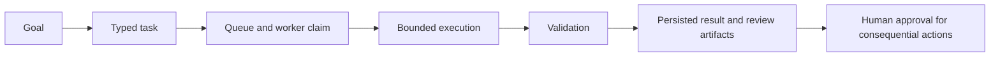

# ai-company-os

[](https://github.com/kashane1/ai-company-os/actions/workflows/tests.yml)


I built this system to coordinate AI coding agents across software projects.
It gives their work a task, a place to run, checks to pass, and a record I can
review before allowing consequential changes.

**Reviewing my work? Start with [For employers](docs/FOR-EMPLOYERS.md).**
It explains my role and points to the strongest evidence in two minutes.
The [evaluator walkthrough](docs/EVALUATOR-WALKTHROUGH.md) continues with code
and optional local checks. Both work entirely on GitHub.

## What I own

I choose the product direction, define the architecture and operating rules,
direct the agents, and review their output. AI agents contribute code, tests,
documentation, and iteration. This repository shows how I build and operate a
system with those tools; it does not imply that I wrote every line by hand.

The work spans a Python control plane, three iOS products, and business tooling.
The decisions worth reviewing are how tasks become inspectable, how completion
is checked, and where an agent's authority stops.

## Start with these implementation paths

| Question | Evidence |
|---|---|
| How does a goal become work? | [Control plane](apps/api/control_plane.py), [task schema](packages/schemas/task.py), and [service tests](tests/python/unit/test_control_plane_service.py) |
| What makes a run reviewable? | [Engineering runner](apps/worker-engineering/engineering/runner.py), [task-run schema](packages/schemas/task_run.py), and [runner tests](tests/python/unit/test_runner.py) |
| What prevents a false completion? | [Post-run validator](skills/canonical/post-run-validation/validator.py) and [integration tests](tests/python/integration/test_post_run_validation_skill.py) |
| How is approval enforced? | [Approval policies](packages/policies/approvals.py), [local endpoint](apps/api/approval_endpoint.py), and [token tests](tests/python/integration/test_approval_tokens.py) |
| How did this shape a product? | [Life Clock case study](docs/flagship-simulator-driven-polish.md) |

Engineering and iOS workers prepare isolated Git worktrees, execute through
Codex, validate changes, and persist review artifacts. The local control plane
owns task and approval records. The App Store lane prepares local release work;
Apple-side upload, submission, and release remain manual.



This is the shared lifecycle. The available operation and evidence requirements
depend on the worker lane. See the [architecture](docs/architecture.md) for
implementation boundaries and the [security policy](SECURITY.md) for the local
trust model.

## Try a bounded check

For a quick illustration, use Bash and Python 3.10 or newer:

```bash
./scripts/evaluator_check.sh
```

This checks the employer links and sample schemas, then regenerates three
**synthetic** JSON examples. It requires no credentials, third-party Python
packages, or network calls. It does not run a worker or approve a real action.

For a real local worker run and tests, use Python 3.11 or 3.12 and uv 0.9.22:

```bash
uv sync --frozen --extra test --group quality --python 3.12
.venv/bin/python scripts/worker_demo.py --exercise-failure
./scripts/evaluator_check.sh --with-tests
./scripts/test_python.sh
```

Installation downloads the locked dependencies. The worker command runs the
actual outreach ledger worker with synthetic inputs, injects a write failure,
and verifies recovery through a new task. It prints the isolated evidence
directory and blocks network calls and child processes. Tests also use
temporary runtime roots. Test and coverage reports go under `build/`. The
[walkthrough](docs/EVALUATOR-WALKTHROUGH.md) explains what each check proves and
how to inspect a failure.

## Products and other work

| Area | What is here | Current boundary |
|---|---|---|
| [Catchbook](products/catchbook-ios/README.md) | SwiftUI fishing logbook, trip/catch flows, weather enrichment, and tests | Source and release preparation; Apple-side release is not established here |
| [Life Clock](products/life-clock-ios/README.md) | SwiftUI/SwiftData health app, HealthKit integration, subscriptions, and deterministic development states | Pre-TestFlight preparation; health projections are product logic, not demonstrated clinical outcomes |
| [After Plans](products/after-plans-ios/README.md) | Social planning app, lifecycle/visibility rules, offline services, and an optional Supabase adapter | Local development; cloud rollout and store release remain separate work |
| [Better Business Web](docs/agency/README.md) | Website generation, prospecting, client lifecycle, billing integration, and operator tools | A mixture of executable tooling, example sites, and manual operations |
| [HomeFromWorking](docs/founder/printify-shirt-workflow.md) | Print-on-demand design and draft tooling | Operator workflow and experiments; outside the core runtime proof |

Each product README provides its own build path and status evidence. Source,
screenshots, and preparation checklists do not establish adoption, revenue,
or a public launch. The [registry](infra/products.json) identifies managed
products; example registrations are labeled.

## Repository map

| Path | Responsibility |
|---|---|
| [apps/](apps/) | API, supervisor, and worker entrypoints |
| [packages/](packages/) | Shared state, schemas, policy, queues, and tools |
| [products/](products/) | Product source, sites, and experiments |
| [skills/](skills/) | Versioned agent procedures, adapters, and validators |
| [docs/](docs/README.md) | Architecture, product records, and dated working notes |
| [scripts/](scripts/) and [infra/](infra/) | Operator commands, CI checks, and configuration |
| [state/](state/README.md) | Local ignored runtime data; only its contract and empty markers are tracked |

The [repository map](REPO_MAP.md) has the fuller operator orientation.
Historical plans and handoffs describe their own point in time. Current product
status and executable checks take precedence when assessing what works today.

## Limits to keep in view

- This is a solo development system, not evidence of operating a multi-tenant
  service or managing an engineering team.
- The API and approval flow assume a trusted local operator. Two P0 confirmations
  use the same token/device; they are not independent MFA.
- A skill document describes a procedure. Only executable code and run evidence
  establish whether a particular guardrail was enforced.
- External model execution needs separate tooling and credentials. The quick
  fixture and local tests do not demonstrate unattended production operation.
- Runtime records are private by default. Earlier Git history still contains
  operational artifacts; the current cleanup does not rewrite that history.

For development, use [CONTRIBUTING](CONTRIBUTING.md). For permitted evaluation
and other use, see the [license](LICENSE).
