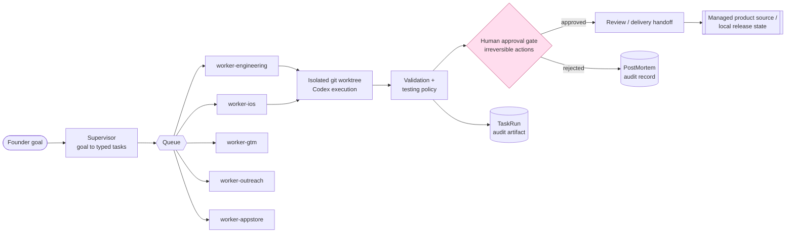

# ai-company-os

[](https://github.com/kashane1/ai-company-os/actions/workflows/tests.yml)


A personal engineering system for coordinating AI coding agents, with Python
workers, explicit task state, validation, and human approval policies.

> **Reviewing my work?** Start with **[For employers](docs/FOR-EMPLOYERS.md)**
> for a two-minute overview of the project and my role, then use the
> **[evaluator walkthrough](docs/EVALUATOR-WALKTHROUGH.md)** for code and optional
> local checks. Both can be read entirely on GitHub.

I choose the product direction and system boundaries, direct AI agents, and
review their output. Agents contribute code, tests, and documentation. The repo
contains platform code alongside three managed iOS source trees at different
stages of development. It began in March 2026; the commit history is available
for review, without treating commit volume as a measure of engineering quality.

## Overview

`ai-company-os` is a local-first, policy-driven platform for running a software business with persistent AI workers, explicit task state, approval gates, repo automation, and dedicated delivery lanes.

The intended runtime is an always-on Mac. The long-term goal is not a prompt bundle or a monolithic super-agent. It is a durable operating system for an AI-driven company with clear ownership boundaries:

- The platform is the brain.
- Codex is the engineer.
- Postgres is memory.
- Redis is the queue.
- GitHub is the delivery lane.
- OpenClaw is an optional interface, not the orchestration layer.

## Architecture at a glance



This diagram describes the intended workflow. Engineering and iOS workers
persist structured task-run records. Approval behavior is implemented in shared
policies and local API endpoints; the App Store lane currently models local
release state and leaves external submission manual. See the
[employer guide](docs/FOR-EMPLOYERS.md#scope-and-limitations) for the limits of
what the repository demonstrates.

## Repository orientation

| Path | What it is |
|---|---|
| `apps/` | Thin worker + API entrypoints (engineering, iOS, gtm, outreach, appstore, supervisor, approval-reviewer) |
| `packages/` | Shared platform code: `schemas` (typed contracts), `policies` (approval rules), `db`, `queue`, `tools`, `config`, `discovery` (opportunity find → score → validate), `agency` (Better Business Web fulfillment and advisory artifacts) |
| `products/` | Source roots for the iOS apps the system has produced |
| `docs/` | Platform docs **plus** the system's own run/spec output — read [`docs/README.md`](docs/README.md) first |
| `state/` | Runtime paths plus currently tracked operator artifacts; these are not needed for the employer review path |
| `todos/` | Per-task working tickets agents pick up; the system's backlog, not hand-maintained docs |
| `skills/` | Reusable, versioned agent capability definitions (`registry.yaml` + adapters) the workers compose |
| `infra/`, `scripts/` | Local infra notes and operator/CI scripts |

## Fast evaluation path

1. Read [For employers](docs/FOR-EMPLOYERS.md) for my role, implementation evidence,
   and product status.
2. Follow the [five-minute code path](docs/EVALUATOR-WALKTHROUGH.md#five-minutes-on-github).
3. Optionally run the offline fixture check below, then install dependencies
   for tests of actual approval behavior using the walkthrough.

## Offline fixture demo

Requires Bash and Python 3.10+; CI uses Python 3.12.

```bash
./scripts/evaluator_check.sh
```

The demo constructs synthetic task-run, approval, and failure records using
real schema classes. It prints an illustration and rewrites three JSON samples
in [docs/examples/](docs/examples/). It does not invoke Codex, execute workers,
obtain a human decision, or perform a release. No external services, API keys,
network calls, or third-party Python packages are needed for this check.

For just the illustration, run `./scripts/demo.sh` or `make demo`. For dependency
setup and the optional policy/endpoint tests, use the
[evaluator walkthrough](docs/EVALUATOR-WALKTHROUGH.md#fifteen-to-twenty-minutes-tests-and-one-design-decision).

## Architectural Rules

These are the design rules the platform aims to enforce:

1. The platform owns orchestration.
2. Codex writes code but does not own business logic or policy.
3. Workers execute tasks but do not define what is allowed.
4. Policies are explicit, shared, and versioned in code.
5. Runtime state lives in `state/`, not in source folders.
6. iOS engineering and App Store release handling are separate lanes.
7. OpenClaw is optional and external to orchestration.

The goal is intentionally boring architecture: readable, modular, safe to extend, and understandable without hidden prompt logic.

## Why This Exists

Most agent systems fail for predictable reasons:

- hidden orchestration inside prompts
- one oversized agent doing everything poorly
- unclear ownership between planning, execution, and approval
- unsafe repo mutations
- weak auditability
- runtime state mixed into source code
- delivery workflows collapsed into a single lane

This repo exists to avoid those failure modes from the start.

## Current Shape

The repo has moved past a paper scaffold. The current useful surface is:

- `apps/api`
- `apps/worker-supervisor`
- `apps/worker-engineering`
- `apps/worker-ios`
- `apps/worker-appstore`
- `products/`
- `packages/policies`
- `packages/tools`
- `packages/db`
- `packages/queue`
- `packages/schemas`
- `packages/config`
- `packages/discovery` (opportunity discovery → scoring → validation gate; see [docs/founder/discovery-guide.md](docs/founder/discovery-guide.md))
- `packages/agency` (Better Business Web catalog, client lifecycle, retainer ops, and Conversion Lab preflight reports)
- `infra`
- `state`
- `docs`

Current integration boundaries:

- The API includes dashboard endpoints, and operator tooling includes a local outreach dashboard. These are different surfaces from a complete platform-wide management UI.
- OpenClaw is documented as an optional future bridge, but there is no integration code yet. That keeps orchestration owned by this repo.

## End-to-End Shape

A healthy v1 should support this flow:

1. A founder creates a goal such as fixing an iOS onboarding bug or preparing an App Store submission.
2. The supervisor converts that goal into one or more typed tasks.
3. The platform routes each task to the appropriate worker lane.
4. The engineering or iOS worker creates a worktree, prepares a task packet, invokes Codex, validates output, and prepares a PR-ready result.
5. The App Store worker prepares metadata and release state, then pauses at human approval before irreversible submission steps.
6. The API exposes health, task state, approvals, and worker status.

This is the target flow; individual lane implementations and operator procedures
are at different stages. The App Store worker does not call App Store Connect.

## Managed Products

The repo contains three managed iOS source trees. Their presence does not establish a public release:

- [Catchbook](products/catchbook-ios/README.md) — a private fishing logbook (the first managed product)
- [Life Clock](products/life-clock-ios/README.md) — a health app with SwiftUI/SwiftData and HealthKit integration
- [After Plans](products/after-plans-ios/README.md) — a SwiftUI app with in-memory defaults and an optional Supabase adapter

Product registration lives in `infra/products.json`; development documents live in `docs/products/`. Runtime checkpoint paths are local state, not prerequisites for reviewing a clean checkout.

## What Each Layer Owns

### Apps

Worker and API entrypoints. These are thin runtime surfaces that depend on shared contracts and shared policy.

### Packages

Versioned shared code for configuration, task schemas, queue contracts, policy rules, database contracts, and operational tools.

Within `packages/tools/`, v1 already reserves distinct homes for Codex, GitHub, iOS, and App Store helpers. That keeps lane-specific integrations from dissolving into one generic utilities folder.

### Docs

Human-readable architectural anchors. `README.md` explains the system at a high level. `AGENTS.md` defines worker boundaries. `docs/architecture.md` bridges the docs to the code layout.

### Infra

Local infrastructure notes and future deployment helpers for Postgres, Redis, launch agents, and machine setup.

### State

Runtime paths include repos, worktrees, artifacts, checkpoints, and logs. The
current tree also tracks selected operator artifacts, especially under
`state/home-from-working/`; that legacy mixture remains a cleanup task. The
employer review path uses source, tests, and explicitly labeled fixtures.

## Python-First V1

V1 is Python-first unless a stronger reason emerges. That choice keeps the first pass easy to inspect and straightforward to run on macOS:

- simple worker entrypoints
- explicit task contracts
- clear local tooling
- easy process supervision

Framework choices should stay lightweight until the architecture proves itself.

## Current Priorities

**HomeFromWorking — updated September 2, 2026:** Start with an approved shirt
design and automate its preparation into a reviewed Printify draft and Etsy
payload preview. The [current design](docs/plans/2026-09-02-home-from-working-pod-design.md)
replaces the research-first commerce plans. The [operated shirt workflow](docs/founder/printify-shirt-workflow.md)
now uses native Printify Duplicate plus a reusable API command for artwork/copy
updates and preservation checks. Broader product research is deferred; Etsy
payload automation remains planned and live publication remains separately approved.

Working local-first control-plane slice with real product output.

The immediate priorities are:

- keep the employer/evaluator path truthful from top to bottom
- keep worker boundaries and shared policy encoded in code
- make recurring operator workflows independently verifiable
- keep iOS and App Store responsibilities separate
- keep runtime state out of source-controlled product and platform code
- keep expanding the real control-plane runtime only where daily use proves the need


## Testing

The repo now has a staged automated testing foundation for both the Python platform code and the iOS product.

Current stage:

- tests are required to pass in both lanes
- Python coverage is enforced at `55%`
- iOS coverage is reported but not gated (the iOS lane is UI-heavy; snapshot
  and end-to-end coverage are deferred — see "Testing policy" below)

Local commands:

```bash
python3 -m pip install -e ".[test]"
./scripts/test_python.sh
./scripts/test_ios.sh
```

Coverage model:

- Python coverage is measured across `apps/` and `packages/`
- iOS coverage is measured from the `Catchbook` target result bundle with `xccov`
- `PYTHON_COVERAGE_MIN` controls staged Python threshold enforcement without changing the scripts
- CI enforces `PYTHON_COVERAGE_MIN=55`; iOS coverage is measured and reported by `check_ios_coverage.sh` but not gated

Testing policy:

- deterministic logic gets unit tests first
- persistence and orchestration flows get integration tests
- UI-heavy snapshot testing and browser-style end-to-end flows are intentionally deferred for now
- logic-bearing Python changes under `apps/` or `packages/` must ship with created or modified tests under `tests/python/`
- logic-bearing iOS changes under `products/catchbook-ios/Sources/` must ship with created or modified tests under `products/catchbook-ios/Tests/`
- valid no-test exceptions must be declared explicitly with a machine-readable `no_test_reason_code`
- workers persist structured `testing_policy` and `failure_codes` data so missing tests fail as `VALIDATION_FAILED` with a specific reason such as `missing_tests_for_logic_change`

Runtime-state isolation:

- production code still writes to the repo `state/` tree by default
- Python tests set an isolated repo-root override so stateful tests write into a temporary `state/` tree instead of the real repo runtime directories

## Getting Started

This repo already provides a working local control-plane slice, lane worker
loops, and a thin runtime supervisor with a CLI operator surface.

Install the local Python surface when you want to run more than the zero-dependency demo:

```bash
python3 -m venv .venv
.venv/bin/python -m pip install -e ".[test]"
```

Local runtime operator workflow:

```bash
./scripts/runtime start
./scripts/runtime status
./scripts/runtime stop
```

Current runtime truth:

- `./scripts/runtime` is a thin wrapper around `apps/runtime-supervisor/cli.py`
- `start` launches the local runtime supervisor in the background
- `status` reads the persisted supervisor status file
- `stop` writes a stop-request file that the running supervisor honors for clean shutdown
- the runtime supervisor manages engineering, iOS, App Store, API, skill-evolution, billing-poller, outreach, and reply-sync processes; [the default specs](apps/runtime-supervisor/supervisor/specs.py) define the current list
- discovery runs are separate, operator-triggered CLIs: `scripts/discovery_run.py`, `scripts/discovery_score.py`

Operator command reference (discovery, validation, build lanes, agent prompts):
[docs/founder/operator-guide.md](docs/founder/operator-guide.md).

Likely next platform expansions:

1. Wire discovery into the supervisor queue only if daily on-demand runs prove the need.
2. Close the GTM content loop (Phase 2.2 task types are scaffolded, not autonomous).
3. OpenClaw bridge when an external chat interface is wanted — optional by design.
4. Enforce the iOS coverage gate in CI once the threshold is chosen deliberately.

## License

Proprietary. Prospective employers may clone the repository and run the
documented evaluator, demo, and tests locally to evaluate my work. Deployment,
redistribution, and product reuse are not included. See [LICENSE](LICENSE).

## Read Next

- [docs/FOR-EMPLOYERS.md](docs/FOR-EMPLOYERS.md) — **employers: start here**
- [docs/EVALUATOR-WALKTHROUGH.md](docs/EVALUATOR-WALKTHROUGH.md) — code and optional local checks
- [docs/founder/operator-guide.md](docs/founder/operator-guide.md) — operator commands for discovery, runtime, and agent work
- [docs/founder/discovery-guide.md](docs/founder/discovery-guide.md) — the discovery layer deep dive (find → score → validate)
- [docs/example_prompts.md](docs/example_prompts.md) — a menu of prompts to run in this repo + what each one activates
- [docs/flagship-simulator-driven-polish.md](docs/flagship-simulator-driven-polish.md) — a product-development case study with implementation limits
- [docs/recurring-approval-sweep.md](docs/recurring-approval-sweep.md) — recurring operator workflow traced against approval code
- [docs/reliability-lessons.md](docs/reliability-lessons.md) — reliability decisions + the tests behind them
- [CONTRIBUTING.md](CONTRIBUTING.md)
- [AGENTS.md](AGENTS.md)
- [docs/architecture.md](docs/architecture.md)
- [docs/implementation-phases.md](docs/implementation-phases.md)
- [docs/approval-policy.md](docs/approval-policy.md)
- [docs/local-dev.md](docs/local-dev.md)
- [docs/operating-model.md](docs/operating-model.md)
- [docs/codex-worker.md](docs/codex-worker.md)
- [docs/ios-lane.md](docs/ios-lane.md)
- [docs/engineering-flow.md](docs/engineering-flow.md)
- [docs/approval-flow.md](docs/approval-flow.md)
- [docs/decisions/0001-foundation.md](docs/decisions/0001-foundation.md)
