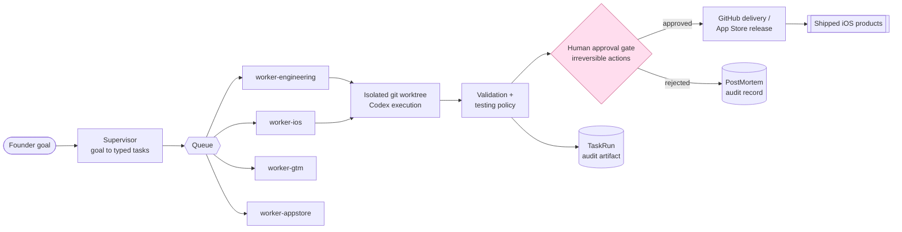

# ai-company-os

[](https://github.com/kashane1/ai-company-os/actions/workflows/tests.yml)


**An AI-first engineering system: I direct a fleet of AI coding agents to discover product niches, build apps, and ship them — inside a control plane with typed tool boundaries, human approval gates, and a replayable audit trail, so it can run unattended without me losing track of what it did or why.**

> **Evaluating this as a hiring signal?** Read **[docs/FOR-EMPLOYERS.md](docs/FOR-EMPLOYERS.md)** first — it has the honest framing, a claim→code map, and a five-minute verification path.

It is not a prompt bundle and not a single mega-agent. The platform owns orchestration; agents only execute within boundaries the platform defines. Built intensively over roughly two months (~565 commits, CI on every change); it has already produced three real iOS products (`products/`) and has recurring operator workflows designed around explicit approval gates. The high commit and branch count is the output of the parallel-agent pipeline working as designed — the velocity is the thesis, not noise. Everything here is checkable from `git log` in under a minute; nothing in this README claims a tenure or production soak it can't back.

## Overview

`ai-company-os` is a local-first, policy-driven platform for running a software business with persistent AI workers, explicit task state, approval gates, repo automation, and dedicated delivery lanes.

The intended runtime is an always-on Mac. The long-term goal is not a prompt bundle or a monolithic super-agent. It is a durable operating system for an AI-driven company with clear ownership boundaries:

- The platform is the brain.
- Codex is the engineer.
- Postgres is memory.
- Redis is the queue.
- GitHub is the delivery lane.
- OpenClaw is an optional interface, not the orchestration layer.

## Architecture at a glance



The platform owns orchestration; workers only execute within typed
boundaries; nothing irreversible happens without passing the human
approval gate; every run leaves a replayable audit artifact.

## Repository orientation

| Path | What it is |
|---|---|
| `apps/` | Thin worker + API entrypoints (engineering, iOS, gtm, appstore, supervisor, approval-reviewer) |
| `packages/` | Shared platform code: `schemas` (typed contracts), `policies` (approval rules), `db`, `queue`, `tools`, `config` |
| `products/` | Source roots for the iOS apps the system has produced |
| `docs/` | Platform docs **plus** the system's own run/spec output — read [`docs/README.md`](docs/README.md) first |
| `state/` | Runtime-owned data only (worktrees, artifacts, checkpoints, logs) — never source |
| `todos/` | Per-task working tickets agents pick up; the system's backlog, not hand-maintained docs |
| `skills/` | Reusable, versioned agent capability definitions (`registry.yaml` + adapters) the workers compose |
| `infra/`, `scripts/` | Local infra notes and operator/CI scripts |

## Demo (zero setup)

```bash
make demo        # or: ./scripts/demo.sh
```

Runs the control loop end to end — goal → typed task → worker execution →
validation → human approval gate → structured audit artifact — entirely
in-process. No Postgres, Redis, Codex, network, or Mac runtime required.
It writes schema-faithful sample artifacts to [`docs/examples/`](docs/examples/).

## Architectural Rules

These rules are non-negotiable:

1. The platform owns orchestration.
2. Codex writes code but does not own business logic or policy.
3. Workers execute tasks but do not define what is allowed.
4. Policies are explicit, shared, and versioned in code.
5. Runtime state lives in `state/`, not in source folders.
6. iOS engineering and App Store release handling are separate lanes.
7. OpenClaw is optional and external to orchestration.

The goal is intentionally boring architecture: readable, modular, safe to extend, and understandable without hidden prompt logic.

## Why This Exists

Most agent systems fail for predictable reasons:

- hidden orchestration inside prompts
- one oversized agent doing everything poorly
- unclear ownership between planning, execution, and approval
- unsafe repo mutations
- weak auditability
- runtime state mixed into source code
- delivery workflows collapsed into a single lane

This repo exists to avoid those failure modes from the start.

## Current Shape

The repo has moved past a paper scaffold. The current useful surface is:

- `apps/api`
- `apps/worker-supervisor`
- `apps/worker-engineering`
- `apps/worker-ios`
- `apps/worker-appstore`
- `products/`
- `packages/policies`
- `packages/tools`
- `packages/db`
- `packages/queue`
- `packages/schemas`
- `packages/config`
- `infra`
- `state`
- `docs`

Two deliberate choices are still true:

- The dashboard is described architecturally but not scaffolded yet. The API and runtime supervisor are enough to establish platform boundaries without adding speculative frontend code.
- OpenClaw is documented as an optional future bridge, but there is no integration code yet. That keeps orchestration owned by this repo.

## End-to-End Shape

A healthy v1 should support this flow:

1. A founder creates a goal such as fixing an iOS onboarding bug or preparing an App Store submission.
2. The supervisor converts that goal into one or more typed tasks.
3. The platform routes each task to the appropriate worker lane.
4. The engineering or iOS worker creates a worktree, prepares a task packet, invokes Codex, validates output, and prepares a PR-ready result.
5. The App Store worker prepares metadata and release state, then pauses at human approval before irreversible submission steps.
6. The API exposes health, task state, approvals, and worker status.

## Managed Products

The system has produced three iOS products, each with a managed source root under `products/`:

- `products/catchbook-ios/` — a private fishing logbook (the first managed product)
- `products/life-clock-ios/` — a health/longevity app
- `products/after-plans-ios/`

Each managed product has a product registry entry in `infra/products.json`, durable product artifacts under `docs/products/`, checkpoint-backed product and release records under `state/checkpoints/platform/`, and an iOS worker path that mirrors the engineering lane.

## What Each Layer Owns

### Apps

Worker and API entrypoints. These are thin runtime surfaces that depend on shared contracts and shared policy.

### Packages

Versioned shared code for configuration, task schemas, queue contracts, policy rules, database contracts, and operational tools.

Within `packages/tools/`, v1 already reserves distinct homes for Codex, GitHub, iOS, and App Store helpers. That keeps lane-specific integrations from dissolving into one generic utilities folder.

### Docs

Human-readable architectural anchors. `README.md` explains the system at a high level. `AGENTS.md` defines worker boundaries. `docs/architecture.md` bridges the docs to the code layout.

### Infra

Local infrastructure notes and future deployment helpers for Postgres, Redis, launch agents, and machine setup.

### State

Runtime-owned data only: repos, worktrees, artifacts, checkpoints, and logs.

## Python-First V1

V1 is Python-first unless a stronger reason emerges. That choice keeps the first pass easy to inspect and straightforward to run on macOS:

- simple worker entrypoints
- explicit task contracts
- clear local tooling
- easy process supervision

Framework choices should stay lightweight until the architecture proves itself.

## Current Status

Working local-first control-plane slice with real product output.

The immediate priorities are:

- keep the employer/evaluator path truthful from top to bottom
- keep worker boundaries and shared policy encoded in code
- make recurring operator workflows independently verifiable
- keep iOS and App Store responsibilities separate
- keep runtime state out of source-controlled product and platform code
- keep expanding the real control-plane runtime only where daily use proves the need

## Testing

The repo now has a staged automated testing foundation for both the Python platform code and the iOS product.

Current stage:

- tests are required to pass in both lanes
- Python coverage is enforced at `55%`
- iOS coverage is reported but not gated (the iOS lane is UI-heavy; snapshot
  and end-to-end coverage are deferred — see "Testing policy" below)

Local commands:

```bash
python3 -m pip install -e ".[test]"
./scripts/test_python.sh
./scripts/test_ios.sh
```

Coverage model:

- Python coverage is measured across `apps/` and `packages/`
- iOS coverage is measured from the `Catchbook` target result bundle with `xccov`
- `PYTHON_COVERAGE_MIN` controls staged Python threshold enforcement without changing the scripts
- CI enforces `PYTHON_COVERAGE_MIN=55`; iOS coverage is measured and reported by `check_ios_coverage.sh` but not gated

Testing policy:

- deterministic logic gets unit tests first
- persistence and orchestration flows get integration tests
- UI-heavy snapshot testing and browser-style end-to-end flows are intentionally deferred for now
- logic-bearing Python changes under `apps/` or `packages/` must ship with created or modified tests under `tests/python/`
- logic-bearing iOS changes under `products/catchbook-ios/Sources/` must ship with created or modified tests under `products/catchbook-ios/Tests/`
- valid no-test exceptions must be declared explicitly with a machine-readable `no_test_reason_code`
- workers persist structured `testing_policy` and `failure_codes` data so missing tests fail as `VALIDATION_FAILED` with a specific reason such as `missing_tests_for_logic_change`

Runtime-state isolation:

- production code still writes to the repo `state/` tree by default
- Python tests set an isolated repo-root override so stateful tests write into a temporary `state/` tree instead of the real repo runtime directories

## Getting Started

This repo currently provides a real local control-plane slice, lane worker loops, and a thin runtime supervisor with a CLI operator surface.

Install the local Python surface when you want to run more than the zero-dependency demo:

```bash
python3 -m venv .venv
.venv/bin/python -m pip install -e ".[test]"
```

Local runtime operator workflow:

```bash
./scripts/runtime start
./scripts/runtime status
./scripts/runtime stop
```

Current runtime truth:

- `./scripts/runtime` is a thin wrapper around `apps/runtime-supervisor/cli.py`
- `start` launches the local runtime supervisor in the background
- `status` reads the persisted supervisor status file
- `stop` writes a stop-request file that the running supervisor honors for clean shutdown
- the runtime supervisor manages the existing engineering, iOS, and App Store worker loops only

Suggested next implementation steps after this scaffold:

1. Point `AI_COMPANY_OS_DATABASE_URL` at Postgres to move the control-plane records off the default local SQLite file.
2. Replace the current durable queue table with Redis once worker daemons are running continuously.
3. Add a richer operator surface only after the local runtime loop proves stable in day-to-day use.
4. Expand approval persistence and enforcement from the current narrow task/release actions to more public workflows.

## License

Proprietary — all rights reserved. Publicly viewable for evaluation only.
See [LICENSE](LICENSE).

## Read Next

- [docs/FOR-EMPLOYERS.md](docs/FOR-EMPLOYERS.md)
- [docs/flagship-simulator-driven-polish.md](docs/flagship-simulator-driven-polish.md) — one workflow traced end to end
- [docs/recurring-approval-sweep.md](docs/recurring-approval-sweep.md) — recurring operator workflow traced against approval code
- [docs/reliability-lessons.md](docs/reliability-lessons.md) — reliability decisions + the tests behind them
- [CONTRIBUTING.md](CONTRIBUTING.md)
- [AGENTS.md](AGENTS.md)
- [docs/architecture.md](docs/architecture.md)
- [docs/implementation-phases.md](docs/implementation-phases.md)
- [docs/approval-policy.md](docs/approval-policy.md)
- [docs/local-dev.md](docs/local-dev.md)
- [docs/operating-model.md](docs/operating-model.md)
- [docs/codex-worker.md](docs/codex-worker.md)
- [docs/ios-lane.md](docs/ios-lane.md)
- [docs/engineering-flow.md](docs/engineering-flow.md)
- [docs/approval-flow.md](docs/approval-flow.md)
- [docs/decisions/0001-foundation.md](docs/decisions/0001-foundation.md)
