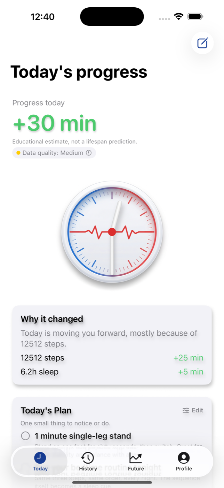

# Case study: making Life Clock reviewable on a simulator

[Life Clock](../products/life-clock-ios/README.md) is a SwiftUI/SwiftData health
app with an educational progress clock, habit plans, and local HealthKit
integration. This case follows one concrete engineering problem: making the
main product states reproducible and their controls addressable during review.

## The problem

The existing UI tests stalled during onboarding and could not address the
sparse Today heading in two health-access states. Parent accessibility
identifiers were obscuring child identifiers. Some test steps also described
an older onboarding sequence, and documentation still listed three tabs while
the app had four.

Those gaps made a simulator walkthrough difficult to repeat even though the
product source and many unit tests existed. The review needed actual execution
evidence alongside the design and session notes.

## My role and the implementation work

I own the product direction, operating rules, and review bar for this
repository. For this pass, the goal was a fresh-checkout experience with clear
inputs, inspectable results, and honest release status. AI agents investigated
the failing flows, changed the SwiftUI containers and test steps, ran the
simulator suites, and captured the evidence below.

The existing design choices that made the repair practical were:

- **Deterministic development state.** The
  [launch configuration](../products/life-clock-ios/Sources/App/LifeClockLaunchConfiguration.swift)
  selects mock health profiles, a fixed engine clock, and an in-memory store.
  Fixture controls are behind `#if DEBUG`; Release uses production defaults.
- **Inspect controls individually.** The repaired Today and onboarding
  containers use `.accessibilityElement(children: .contain)` so their child
  controls retain addressable identifiers.
- **Keep product behavior honest when data is missing.** The denied-health and
  returning-user tests verify sparse-state copy and retained History, without
  presenting today's unavailable health data as a precise result.

## What changed and what passed

| Initial failure | Change | Executed verification |
|---|---|---|
| Sparse Today heading could not be addressed | Put the content in a `VStack` that contains its child accessibility elements | Denied-health and returning-user cases passed |
| Onboarding stalled at sensitive consent and the engine dial | Preserve child controls; align the test with the current onboarding sequence | Full onboarding-to-paywall case passed |
| Three-tab documentation disagreed with the running app | Record Today, History, Future, and Profile; update the assertion | Four-destination assertion passed on the simulator |

The [UI tests](../products/life-clock-ios/UITests/LifeClockUITests.swift) expose
those cases by name. The full local run on September 9, 2026 recorded **450
passed, 3 skipped, 0 failed** across 453 tests, with **67.72% app line coverage**.
The three StoreKit skips are explained in the product README. A subsequent
run of the renamed four-tab assertion also passed.

## Actual product evidence



*The tested debug app's first-day Today screen, using a fixed date and synthetic
health inputs. The displayed minutes are educational product output, not a
measured health outcome.*

The [returning-user wrap-up](products/life-clock/screenshots/employer-2026-09-09/yesterday-wrap-up-day-7.png)
shows a second actual state after seven seeded days. The
[capture manifest](products/life-clock/screenshots/employer-2026-09-09/CAPTURE_MANIFEST.md)
records the source commit, device, build tools, fixture settings, and image
hashes. The screenshots were resized for display; their content was not edited.

## Reproduce and assess the boundary

On macOS with Xcode and XcodeGen, run from the repository root:

```bash
./scripts/test_ios.sh --product life-clock
```

The result bundle is `build/ios/life-clock.xcresult`. The product README explains
simulator selection, optional signing configuration, and fixture controls.
The same script selects Catchbook and After Plans explicitly; a Catchbook result
is not evidence that Life Clock passed.

This review exercised XCUITest accessibility-tree labels, values, identifiers,
and product flows. It did not include a manual spoken VoiceOver traversal,
clinical validation, or a public App Store release. The
[product status](products/life-clock/PHASE_STATUS.md) keeps the pre-TestFlight
work separate from local build and test evidence.

For the wider agent workflow, the
[simulator polish skill](../skills/canonical/simulator-driven-polish/skill.md)
and [operator guide](skills/simulator-driven-polish-guide.md) describe review
and iteration rules. Those are procedures; this case supplies the code, tests,
and real captures for this particular run. The
[App Store worker](../apps/worker-appstore/main.py) checks local release readiness
and records preparation state. Apple-side upload, submission, and release
remain manual.
