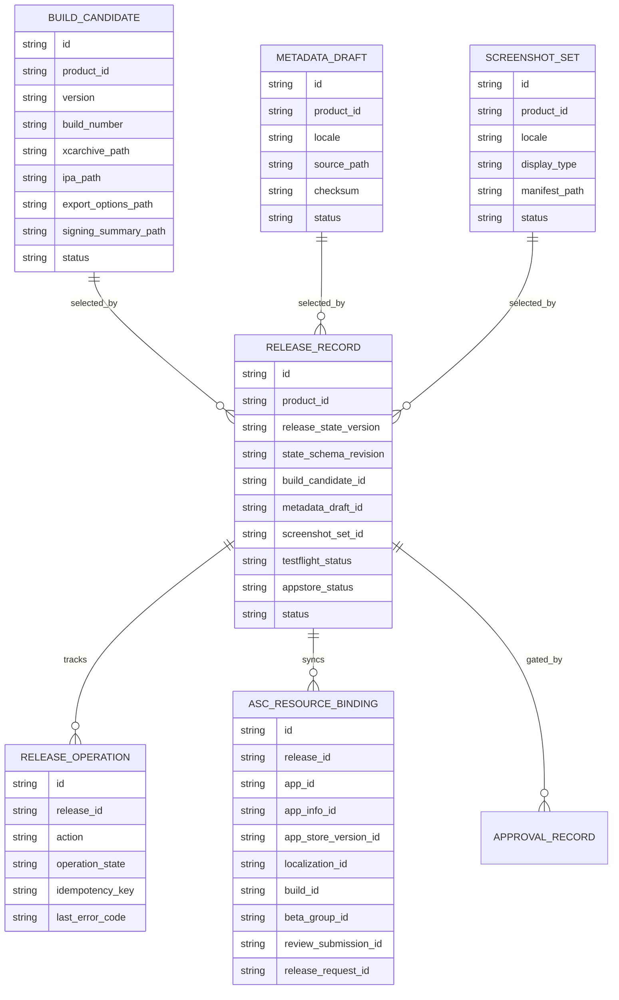

# feat: Fully automate Catchbook App Store submission

## Enhancement Summary

This deepening pass tightened the plan in five ways:

- **Bootstrap boundary is now explicit.** Recurring release automation starts only after Catchbook's one-time App Store Connect setup is complete. Unsupported web-only setup is modeled as a bootstrap blocker, not an implicit branch inside the recurring release lane.
- **Platform ownership is clearer.** The App Store worker performs bounded release actions, but canonical release state and polling/sync orchestration stay platform-owned.
- **Resumability is now a first-class concern.** The plan adds an append-only operation journal, manifest-driven resume state, deterministic idempotency keys, and crash-replay verification.
- **Apple-side coverage is more exact.** The plan now calls out review details, review attachments, optional beta review details for external TestFlight, reservation-style screenshot uploads, and `reviewSubmissions`-based review flow.
- **v1 scope is more disciplined.** Browser automation and webhook expansion are deferred unless the official recurring-release path proves insufficient. The first landing focuses on Catchbook recurring releases, not generic multi-product or bootstrap automation.

## Overview

This plan turns Catchbook's current partially automated release lane into a policy-bound, end-to-end submission system that can take a release-ready iOS build and push it through TestFlight, App Review submission, and public release with no manual Xcode Organizer or App Store Connect data-entry steps.

The target is not "zero human involvement." The repo's operating model explicitly keeps irreversible release actions approval-gated. The target is:

- zero manual Xcode/App Store Connect operational work for a normal Catchbook release
- founder interaction limited to approval-gated checkpoints and exceptional recovery
- recurring releases automated through official Apple APIs and CLI-supported tooling

Important platform constraint from current Apple documentation: App Store Connect API does **not** support creating a new app record, and Apple documents build upload through Xcode, Transporter, or related upload tooling rather than plain metadata endpoints. So this plan scopes "100% automated submission" to **existing managed app records** such as Catchbook. For recurring releases, automation covers only existing managed app records. First-time app creation, release-option setup, and any remaining web-only App Store Connect setup remain explicit bootstrap prerequisites unless Apple provides an API.

## Problem Statement

Catchbook is close to manual submission, but the release lane is not close to autonomous submission.

Current state:

- Catchbook's human-facing submission artifacts mostly exist under `docs/products/catchbook/`
- the App Store worker is still a local state transition shell that writes artifacts and updates JSON state, but does not execute real App Store Connect actions (`apps/worker-appstore/main.py:35`)
- the App Store tooling namespace is effectively a stub (`packages/tools/appstore_tools/asc_api.py:1`)
- release schemas are too thin for remote App Store Connect IDs, upload state, processing state, locale completeness, or resumable operations (`packages/schemas/release.py:33`)
- the iOS helper only knows how to produce a simulator build command, not a release-grade archive/export pipeline (`packages/tools/ios_tools/xcode.py:12`)
- release readiness policy correctly gates submission behind checklist + approval + release state, but it assumes the surrounding execution surface already exists (`packages/policies/release_readiness.py:1`)
- the current secret model correctly requires App Store Connect credentials to come from Keychain, which must remain true for any automation we add (`packages/config/secrets.py:1`)
- persisted Catchbook release state is stale and still points at the older `fishing-logbook` identity, which makes autonomous release execution unsafe

Without a real release automation layer, the system cannot:

- create or sync authoritative App Store Connect release state
- upload release binaries without a human using Xcode Organizer
- programmatically manage metadata, screenshots, TestFlight groups, review submissions, or release requests
- resume partial failures safely
- guarantee that approval-gated actions correspond to real App Store side effects

## Proposed Solution

Build a hybrid Apple-release automation lane that uses the **official path first**:

1. iOS lane owns archive/export/signing validation and produces a release artifact bundle.
2. App Store lane owns App Store Connect authentication, remote state sync, metadata updates, screenshot uploads, TestFlight coordination, review submission, status polling, and public release.
3. Shared policy and state layers become the durable source of truth for release progress, approvals, and remote IDs.
4. Unsupported Apple web-only setup tasks stay out of the default recurring release path and are modeled as one-time bootstrap prerequisites. Any future browser automation fallback would be isolated to bootstrap-only tasks and explicitly excluded from the normal recurring release lane.

Chosen implementation strategy:

- `xcodebuild` archive/export automation in the iOS lane
- Transporter/JWT-based build upload for binary delivery
- App Store Connect API for metadata, screenshots, review details, review attachments, beta groups, review submissions, age ratings, accessibility declarations, and release requests
- platform-scheduled polling for build processing and review-state tracking on first landing, with webhooks evaluated later
- existing approval-token + release-readiness policies reused as the enforcement boundary for P0 actions

## Technical Approach

### Architecture

The feature spans three layers:

1. iOS execution primitives
2. App Store Connect primitives
3. release orchestration + policy enforcement

The key design choice is to preserve the repo's lane boundary:

- iOS worker prepares the release artifact
- App Store worker performs distribution work
- platform-owned release services persist canonical state and schedule follow-up sync work
- shared policy validates whether distribution work may proceed

This avoids collapsing "build the app" and "ship the app" into one worker.

### V1 rollout boundary

The first landing deliberately optimizes for **Catchbook recurring release automation** rather than generic Apple bootstrap automation.

In scope for v1:

- release-state normalization for Catchbook
- headless archive/export
- Transporter-backed build upload
- metadata, screenshot, review-detail, and review-submission sync for an existing app record
- approval-gated submission and release request handling
- resumable operation tracking and cutover verification

Explicitly deferred unless the official recurring path proves insufficient:

- browser automation inside the recurring release path
- webhook-first orchestration
- generic multi-product abstractions beyond what Catchbook immediately needs
- automated first-time app creation or other website-only bootstrap tasks

### Proposed Data Model

Deepening notes:

- Phase 1 should land the **minimal useful subset** first: expanded `ReleaseRecord`, a release manifest, and an append-only operation journal. Additional abstractions should be added only when Catchbook proves they carry weight.
- The operation journal should live under `state/checkpoints/platform/releases/operations/` as an append-only platform artifact, separate from the canonical release snapshot.
- Canonical release state must not store secrets, JWTs, Apple API key material, reviewer emails, phone numbers, or other free-form sensitive fields. Detailed debug payloads belong in redacted artifacts under `state/artifacts/appstore/`.

### Phase 1: Normalize release state and contracts

Goals:

- make Catchbook's local release state trustworthy
- expand schemas to represent real remote release lifecycle
- define the exact recurring-release scope that "fully automated" means
- move canonical release-state ownership toward a platform-owned service instead of worker-local JSON mutations

Tasks:

- migrate stale `fishing-logbook` release/product checkpoints to `catchbook`
- extend `packages/schemas/release.py` with:
  - artifact paths for release-grade build outputs
  - remote ASC IDs
  - processing states
  - locale/display completeness status
  - resumable operation records
- extend `packages/db/release_store.py` with list/query helpers instead of load-only access
- add a platform-owned release service that becomes the source of truth for release-state writes; workers call this service instead of directly owning the canonical state machine
- add a release manifest format under `state/checkpoints/platform/releases/` that records:
  - `release_id`
  - build identity `(bundle_id, version, build_number)`
  - metadata checksum
  - screenshot manifest checksum
  - command hashes
  - tool versions
  - last synced ASC resource IDs
  - last HTTP status / correlation IDs
  - last successful operation
  - `source_task_run_id`
  - `source_commit_sha`
- add an append-only release operation journal with explicit states such as `pending`, `remote_committed`, `local_committed`, `failed`, and `reconciled`
- make idempotency deterministic: `hash(release_id, action, target_remote_resource, manifest_checksum)`
- treat the `fishing-logbook` cleanup as a two-phase migration:
  - write new `catchbook` records first
  - verify hashes and dependent records
  - only then mark old records deprecated
- add a migration journal with source files, destination files, source hashes, destination hashes, and verification result
- block reads on mixed identity state so old and new records cannot be combined accidentally during rollout
- replace a standalone bootstrap flag with a derived or transactionally updated platform checkpoint
- update product artifact validation so it checks the synced machine-readable release state, not just docs

Deliverables:

- schema expansion for build/upload/review/release state
- release-state migration for Catchbook
- release manifest spec
- append-only operation journal spec
- platform-owned release service contract
- tests covering migration and idempotent state reads/writes

Success criteria:

- no remaining `fishing-logbook` release state in active Catchbook flow
- one canonical release record can answer "what is ready, what is remote, what is blocked"
- rerunning migration is idempotent and does not recreate mixed identity state
- policy code no longer depends on stale doc-only state

Estimated effort: 1-2 days

### Phase 2: Add release-grade iOS archive/export automation

Goals:

- make the iOS lane produce deterministic release artifacts without Xcode Organizer
- keep signing and export concerns in the iOS lane

Tasks:

- extend `packages/tools/ios_tools/xcode.py` from simulator build commands to:
  - archive command generation
  - export command generation
  - derived data and result bundle locations
  - signing/provisioning introspection helpers
- add release export inputs:
  - `exportOptions.plist` template(s)
  - artifact manifest writer
  - archive/IPA checksum capture
- add iOS lane preflight checks:
  - Xcode version supported for uploads
  - project/scheme detection
  - signing identity present
  - provisioning profile/capability compatibility
  - version/build number consistency
- teach the iOS worker to persist a `BuildCandidate` with actual archive/export paths
- add a first-class dry-run mode that:
  - prints exact commands
  - validates prerequisites with zero remote mutation
  - emits a preview manifest for approval review
  - validates signing, scheme/version/build consistency, and artifact paths before any upload attempt

Deliverables:

- release-grade xcode tooling module
- archive/export script or primitive callable by the iOS worker
- `BuildCandidate` populated with real artifact paths
- failure-code taxonomy for archive/export/signing problems

Success criteria:

- a release candidate can be produced headlessly on the managed Mac
- App Store lane receives a ready artifact bundle instead of a conceptual build
- signing failures fail before upload, with actionable error codes

Estimated effort: 2-3 days

### Phase 3: Build an official App Store Connect client layer

Goals:

- replace placeholder App Store tooling with typed, testable Apple integrations
- prefer official APIs/CLI over browser automation

Tasks:

- implement `packages/tools/appstore_tools/asc_api.py` as a real client layer with:
  - API key loading from Keychain-only secrets
  - JWT generation
  - request signing
  - retry/backoff/rate-limit handling
  - paging helpers
  - typed error parsing
- implement read/write primitives for:
  - app lookup and version lookup
  - `appInfos`
  - `appInfoLocalizations`
  - `appStoreVersionLocalizations`
  - age rating declarations
  - accessibility declarations
  - app review details
  - app review attachments
  - screenshot sets and screenshot uploads
  - beta groups and build access
  - optional beta app review details and beta app review submissions when external testing is enabled
  - review submission creation and inspection via `reviewSubmissions` / `reviewSubmissionItems`
  - release requests
- implement asset-upload primitives based on Apple's reservation/upload/commit flow, persisting part state and checksums for resume
- add Transporter-based build upload helper using ASC JWT auth
- add status sync primitives for:
  - build processing
  - TestFlight readiness
  - review submission state
  - pending developer release / release complete
- add a strict error taxonomy and retry policy:
  - retry transport failures, `429`, and transient `5xx` with bounded exponential backoff and jitter
  - treat `401` / `403` as auth-permission failures
  - treat `409` / `422` as non-retryable validation-conflict failures unless local state changes
- add bounded polling state machines for build processing, beta review, App Review, and release request progress
- document webhooks as a later optimization only for Apple-exposed events; polling remains the first landing

Deliverables:

- typed ASC client module
- Transporter upload wrapper
- fixture-backed tests for request/response handling
- dry-run mode that resolves resources and validates auth without mutating production state

Success criteria:

- all recurring Catchbook release operations have an official API/CLI path
- secrets never come from `.env` for P0 actions
- remote errors are normalized into machine-readable failure codes
- the client covers review details / attachments and optional beta review details when external testing is enabled

Estimated effort: 3-4 days

### Phase 4: Turn the App Store worker into a real orchestration lane

Goals:

- replace local-only release-state transitions with real Apple side effects
- keep actions resumable, idempotent, and approval-aware

Tasks:

- split `apps/worker-appstore/main.py` actions into concrete workflows:
  - `prepare_testflight`
  - `submit_testflight`
  - `prepare_appstore_submission`
  - `submit_appstore`
  - `release_to_store`
  - `sync_remote_state`
- implement these workflows as bounded worker calls into platform-owned release services rather than letting the worker own the canonical release state machine directly
- add a deterministic operation runner that:
  - reads local manifest state
  - resolves remote IDs
  - performs exactly one remote mutation
  - records a preflight snapshot and postflight receipt
  - appends operation journal state separately from the canonical release snapshot
- wire preconditions into each action:
  - artifact exists
  - metadata draft synced
  - screenshot set synced
  - app/version is in an editable state before mutating metadata, localizations, screenshots, review details, or attachments
  - QA attestation present
  - release checklist complete
  - required approvals granted
- if external TestFlight is enabled, require beta app review details before `submit_testflight`
- keep submission and release actions blocked until `packages/policies/release_readiness.py` passes
- use `reviewSubmissions` / `reviewSubmissionItems`, not deprecated submission surfaces
- guard `release_to_store` so it only issues a release request when the version is already in the correct pending-release state; otherwise block
- add retry-safe behavior for partial failures:
  - screenshot upload resumed without duplicate ordering bugs
  - repeated review-submission attempts do not create double submissions
  - repeated beta-group linking is no-op safe
- persist operation artifacts under `state/artifacts/appstore/` with enough detail to debug failures, including `release_id`, `operation_id`, `build_id`, `app_store_version_id`, `asc_request_id`, `idempotency_key`, and remote resource IDs
- keep `sync_remote_state` as a platform-scheduled polling task, not a long-lived loop embedded in the worker

Deliverables:

- real App Store worker execution paths
- release operation journal
- action-specific validation layer
- task-result summaries that describe remote state, not just local placeholders

Success criteria:

- App Store worker no longer says "Keep App Store Connect submission manual for now"
- a single task packet can perform the real next release step and write durable output
- retries are safe after crashes or Apple-side transient failures

Estimated effort: 2-3 days

### Phase 5: Add policy, security, and unsupported-gap handling

Goals:

- make automation safe enough for real submission
- explicitly handle the places Apple's official automation surface still stops

Tasks:

- extend release-readiness checks to validate:
  - remote build selected and processed
  - metadata locales complete
  - screenshot sets satisfy current Apple-required platform display rules for the targeted platforms
  - age rating declaration complete
  - app review details present
  - optional beta app review details present when external TestFlight is enabled
  - QA attestation freshness
  - release artifact checksums match synced state
- ensure approval-token audits wrap every irreversible action
- add no-arg footgun protections to privileged submission CLIs, following the HMAC remediation lessons in `docs/solutions/security-issues/skill-self-evolution-hmac-gate-bypass-remediation.md`
- add a narrow "bootstrap required" status for unsupported official gaps such as:
  - first-time app record creation
  - release-option setup if still website-only
  - any remaining App Store Connect web-only settings with no supported API
- define the first landing boundary explicitly:
  - preferred: one-time manual bootstrap, then fully automated recurring releases
  - browser automation is not part of v1 recurring release automation
  - any future browser fallback must be isolated to bootstrap-only tasks and fail closed by default

Deliverables:

- upgraded release-readiness policy
- privileged CLI guardrails
- bootstrap-vs-recurring-release contract
- optional later browser-automation decision doc if official bootstrap gaps remain blocking

Success criteria:

- "fully automated" is defined honestly and enforced in code
- unsupported Apple gaps are surfaced as explicit bootstrap blockers, not silent TODOs
- P0 release automation inherits the repo's strongest secret and approval constraints

Estimated effort: 1-2 days

### Phase 6: Verification, live rehearsal, and cutover

Goals:

- prove the lane works on Catchbook before calling it complete
- leave the system easier to operate than the current manual docs-first flow

Tasks:

- add end-to-end test coverage using mocked ASC/Transporter clients for:
  - successful recurring release
  - expired approval token
  - partial screenshot upload retry
  - build-processing delay retry
  - crash after remote success but before local commit
  - duplicate submit no-op on rerun
  - review rejection / follow-up task creation
- run a live dry-run against Catchbook:
  - auth check
  - app/version/build lookup
  - metadata diff preview
  - screenshot manifest diff preview
  - no-op submission gating
- run a founder-supervised live rehearsal for:
  - upload build to TestFlight
  - attach internal beta group
  - sync remote build status
  - generate submission preview
- require rehearsal evidence before cutover:
  - live dry-run output is attached
  - the exact Catchbook release record and intended build number were used
  - no stale `fishing-logbook` identity remains in the path
  - founder confirms no manual Xcode Organizer or ASC data entry was required
  - approval token was fresh and bound correctly before any irreversible action
  - if any rehearsal step mutates remote state unexpectedly, stop and do not cut over
- after acceptance, update docs to make the automated path the default recurring-release path

Cutover:

- cut over only after rehearsal evidence is archived and the rehearsal report explicitly says `go`
- enable the autonomous recurring-release path for Catchbook only
- require release checklist completeness, remote ID bindings, and operation journal presence before the first autonomous submission
- block cutover if any P0 action still depends on human Xcode Organizer or ASC web work
- limit the first production run to one release packet with no parallel release attempts

Rollback:

- disable the autonomous release flag and route future packets back to manual or approval-only handling
- if submission has not been accepted yet, cancel or withhold the pending review or release request where supported; otherwise stop further automation and mark the release blocked
- preserve the operation journal, remote IDs, and artifact bundle for forensics
- create a follow-up task with the exact failure code and owner before retrying
- treat rollback as stopping further automation, not undoing already-published App Store effects

Post-cutover Monitoring:

- check status at `+15m`, `+1h`, `+4h`, and `+24h`
- confirm build processing, beta-group linkage, review state, and release-request state match the expected release record
- alert on duplicate upload attempts, duplicate submission attempts, stuck processing, auth failures, or approval mismatches
- verify the journal shows exactly one operation per step and no human intervention was needed after cutover
- founder explicitly signs off on the first post-cutover state sync before the lane is considered stable

Deliverables:

- integration tests
- rehearsal report
- updated operational docs
- launch checklist for autonomous recurring releases

Success criteria:

- Catchbook can be submitted by the system with approval clicks only
- no manual Xcode Organizer or ASC form entry is required for a standard update release
- failure recovery is documented and tested
- crash recovery, upload retry, build-processing polling, and duplicate-submit no-op behavior are all proven in rehearsal

Estimated effort: 1-2 days

## Alternative Approaches Considered

### 1. Fastlane-first automation

Why considered:

- fast to bootstrap
- well known in iOS release workflows

Why not chosen as the primary architecture:

- hides too much state inside external actions and conventions
- weak fit with this repo's explicit policy/state model
- would still require wrapping to preserve approval gates and durable release records

Best-fit use:

- optional helper for screenshot capture or export ergonomics later, not source of truth

### 2. Pure App Store Connect API for everything

Why considered:

- cleanest long-term integration surface

Why rejected:

- Apple documents app-record creation as website-only
- Apple documents build upload through Xcode/Transporter rather than plain app metadata endpoints
- forcing a pure API story would create brittle gaps or unsupported assumptions

### 3. Browser automation for the full release flow

Why considered:

- can cover unsupported website-only flows

Why rejected as the default:

- brittle against Apple UI changes
- harder to test and debug
- poorer fit for approval-gated, resumable, typed workflows

Best-fit use:

- tightly scoped bootstrap fallback only if an unsupported web-only step blocks true recurring-release automation

## System-Wide Impact

### Interaction Graph

Supervisor or operator-seeded control-plane action creates a release task.

That task routes to the iOS lane for archive/export work, which writes a `BuildCandidate`, result bundle, and artifact manifest under release state.

The App Store worker then loads the release record, resolves the selected build candidate, uses the ASC client to sync metadata/screenshots/build access, and persists remote IDs and operation results back into release state.

Deepening note:

- canonical release-state writes should occur through platform-owned release services; the worker performs bounded actions and emits artifacts, but does not become the hidden owner of policy/state transitions.

For irreversible steps:

- App Store worker requests approval
- approval token flow verifies the action/subject pair
- release-readiness policy confirms checklist + approval + release state
- worker executes the Apple-side operation
- remote status sync updates the release record and emits task artifacts/events

### Error & Failure Propagation

Expected error classes:

- local preflight failures: missing signing, missing artifact, stale checklist, missing secrets
- Apple auth failures: invalid key, expired JWT, unauthorized role
- Apple remote validation failures: invalid metadata, screenshot mismatch, build not ready
- Apple review-detail failures: missing review details, invalid attachments, missing beta review details when required
- transient remote failures: rate limits, processing delays, transport/upload interruptions

Handling rules:

- preflight failures should fail before any remote mutation
- transient remote failures should be resumable via operation journal state
- policy failures should return `blocked`, never partial success
- remote mutation success must be recorded atomically with the local operation state so retries are safe
- each remote action should log preflight snapshot, postflight receipt, correlation IDs, and retry metadata

### State Lifecycle Risks

Primary risks:

- stale local state causes duplicate uploads or wrong-release submission
- partial screenshot uploads leave remote sets inconsistent
- local release ID points to old product identity (`fishing-logbook`)
- approval granted for one release but used against another
- a crash occurs after remote mutation but before local state commit

Mitigations:

- explicit remote ID bindings per release
- operation journal with idempotency keys
- migration of stale Catchbook release state before feature cutover
- action/subject validation already present in approval-token audit path
- crash-replay tests proving reruns do not create duplicate remote effects

### API Surface Parity

Interfaces that must stay in sync:

- App Store worker CLI/task execution
- control-plane task seeding for release actions
- release-readiness policy
- release schemas/store
- docs/products/catchbook submission artifacts
- any future founder-facing "submit app" command surface

No interface should be able to trigger a live submission path that bypasses the shared policy helper.

### Integration Test Scenarios

1. Release archive exists, metadata/screenshots are complete, approval granted, and TestFlight upload succeeds. Expected result: remote build ID stored and release record updated.
2. Screenshot upload fails after reserving/uploading some assets. Expected result: rerun resumes safely without duplicate set corruption.
3. Submission approval token is expired or mismatched. Expected result: remote submission is never attempted and the task returns blocked.
4. Catchbook release state migration runs before recurring release execution. Expected result: no `fishing-logbook` IDs remain in active records.
5. A crash occurs after remote success but before local commit. Expected result: rerun reconciles from manifest/journal state and does not create a duplicate upload or duplicate submission.
6. App Review rejection arrives after submission. Expected result: App Store worker records remote status, drafts response context, and creates a new iOS follow-up task instead of mutating source directly.

## Acceptance Criteria

### Functional Requirements

- [ ] Catchbook recurring releases can archive/export headlessly from the iOS lane.
- [ ] Catchbook recurring releases can upload binaries without manual Xcode Organizer use.
- [ ] The App Store worker can sync localized metadata, screenshots, age rating declaration, and beta-group linkage through official Apple-supported interfaces.
- [ ] The App Store worker can create and maintain App Store review details and attachments, and optional beta app review details/submissions when external testing is enabled.
- [ ] The App Store worker can create and track review submissions and release requests.
- [ ] The worker can resume safely after crashes or Apple transient failures.
- [ ] The founder only needs to approve P0 release actions, not perform the operational steps manually.
- [ ] Unsupported web-only bootstrap tasks are modeled explicitly and do not silently block recurring release automation.

### Non-Functional Requirements

- [ ] P0 secrets are Keychain-only.
- [ ] Irreversible actions remain approval-gated.
- [ ] All remote mutations are logged to durable local release state.
- [ ] The recurring release path uses official Apple APIs/CLI first; browser automation is opt-in and isolated.

### Quality Gates

- [ ] Unit tests cover ASC client auth, request shaping, and error normalization.
- [ ] Integration tests cover end-to-end release orchestration with retries and blocked states.
- [ ] Live rehearsal succeeds for Catchbook.
- [ ] Rollback drill is documented and verified in dry-run form.
- [ ] Crash recovery and duplicate-submit no-op behavior are proven before cutover.
- [ ] Documentation is updated so the automated path is the default recurring-release playbook.

## Success Metrics

- Founder performs zero manual Xcode Organizer steps for a standard Catchbook release.
- Founder performs zero manual App Store Connect data-entry steps for a standard Catchbook release.
- Human interaction for a standard release is limited to approval events and optional QA sign-off.
- Time from release-ready code to TestFlight upload is under 20 minutes on the managed Mac.
- A failed run can be resumed without duplicate submission side effects.
- The first autonomous submission completes with approval clicks only and survives the 24-hour post-cutover monitoring window.
- Catchbook release state in `state/checkpoints/platform/releases/` answers the current remote status without consulting ad hoc docs.

## Dependencies & Prerequisites

- existing Catchbook app record in App Store Connect
- working Apple Developer team access for the managed Mac
- App Store Connect API key with sufficient role permissions
- local Xcode/Transporter tooling available on the release machine
- Catchbook signing configuration stable enough for headless export
- up-to-date Catchbook metadata and screenshot source artifacts

## Risk Analysis & Mitigation

| Risk | Severity | Likelihood | Mitigation |
| --- | --- | --- | --- |
| Apple API surface does not cover a required recurring release step | High | Medium | Keep official-first architecture, then isolate browser automation only for unsupported bootstrap or residual web-only actions |
| Build upload path is flaky or undocumented across environments | High | Medium | Choose Transporter/Xcode-supported upload path, persist upload operation state, add live rehearsal before cutover |
| Release state drift causes wrong submission target | High | Medium | Phase 1 migration + checksums + remote ID binding + idempotency keys |
| Approval gate accidentally wraps only local state and not remote effects | Critical | Low | Route all irreversible actions through shared policy + approval-token audit + operation journal |
| Secret handling regresses to `.env` or same-uid file leakage | Critical | Low | Reuse Keychain-only P0 secret enforcement and add tests on secret source |
| Browser automation becomes the de facto default | Medium | Medium | Keep it optional, feature-flagged, and only for unsupported bootstrap cases |

## Resource Requirements

- one macOS runner with Xcode and release credentials
- App Store Connect API key material stored in Keychain
- engineering time across platform, iOS, and release-lane code
- one founder-supervised live rehearsal window for final cutover

## Future Considerations

- genericize Catchbook-specific release logic into reusable multi-product release primitives after Catchbook proves the path
- optionally add screenshot-generation automation from simulator/UI-test flows
- add webhook-driven remote status sync if it materially improves reliability over polling
- consider a small ASC browser-automation adapter only if official gaps remain blocking for first-time product bootstrap

## Documentation Plan

- update `docs/appstore-lane.md` to describe the real automation path
- update `docs/ios-lane.md` to clarify archive/export ownership
- update `docs/products/catchbook/submission-checklist.md` so it distinguishes one-time bootstrap from recurring release checks
- update `docs/products/catchbook/asc-setup-guide.md` to remove recurring manual steps once automated
- update `docs/products/catchbook/appstore-readiness-audit.md` so it no longer contradicts live state
- add a dedicated release-automation runbook under `docs/runbooks/` only after the first live autonomous release proves the real recovery steps

## Sources & References

### Internal References

- `docs/products/catchbook/remaining-steps-before-ios-submission.md` — current audit baseline and identified stale release-state drift
- `docs/appstore-lane.md` — intended App Store lane boundary and workflow
- `apps/worker-appstore/main.py:35` — current local-only action handling and placeholder "manual for now" summary
- `packages/policies/release_readiness.py:157` — approval-gated release readiness enforcement
- `packages/config/secrets.py:116` — Keychain-only P0 secret enforcement
- `packages/schemas/release.py:33` — current thin release state model
- `packages/tools/ios_tools/xcode.py:12` — current build-only helper surface
- `packages/tools/appstore_tools/asc_api.py:1` — current stub
- `docs/solutions/security-issues/skill-self-evolution-hmac-gate-bypass-remediation.md` — security lessons to reuse for privileged release actions
- `docs/solutions/integration-issues/plan-deepening-apply-verify-loop-2026-04-15.md` — planning/reality-check lesson to preserve honest scope boundaries

### External References

- [App Store Connect API overview](https://developer.apple.com/documentation/appstoreconnectapi) — Apple's official statement of supported automation surfaces
- [Apps API collection](https://developer.apple.com/documentation/appstoreconnectapi/apps) — notes that new app records are created on the website, not through this API
- [Upload builds](https://developer.apple.com/help/app-store-connect/manage-builds/upload-builds/) — official build-upload guidance for Xcode, Transporter, JWT auth, and supported versions
- [Builds API collection](https://developer.apple.com/documentation/appstoreconnectapi/builds) — official build metadata and TestFlight/review management surface
- [Creating API keys for App Store Connect API](https://developer.apple.com/documentation/appstoreconnectapi/creating-api-keys-for-app-store-connect-api)
- [Generating tokens for API requests](https://developer.apple.com/documentation/appstoreconnectapi/generating-tokens-for-api-requests)
- [App Info Localizations](https://developer.apple.com/documentation/appstoreconnectapi/app-info-localizations) — app-level localized metadata such as name, subtitle, privacy policy URL
- [App Store Version Localizations](https://developer.apple.com/documentation/appstoreconnectapi/app-store-version-localizations) — version-level localized metadata such as description, keywords, support URL, what's new
- [Upload app previews and screenshots](https://developer.apple.com/help/app-store-connect/manage-app-information/upload-app-previews-and-screenshots)
- [App Screenshots](https://developer.apple.com/documentation/appstoreconnectapi/app-screenshots) — screenshot-set/upload flow
- [Uploading Assets to App Store Connect](https://developer.apple.com/documentation/appstoreconnectapi/uploading-assets-to-app-store-connect)
- [App Store review details](https://developer.apple.com/documentation/appstoreconnectapi/app-store-review-details)
- [App Store review attachments](https://developer.apple.com/documentation/appstoreconnectapi/app-store-review-attachments)
- [Beta App Review Submissions](https://developer.apple.com/documentation/appstoreconnectapi/beta-app-review-submissions)
- [Review submissions](https://developer.apple.com/documentation/appstoreconnectapi/review-submissions)
- [Webhook notifications](https://developer.apple.com/documentation/appstoreconnectapi/webhook-notifications)
- [Manually Release an App Store Approved Version of Your App](https://developer.apple.com/documentation/appstoreconnectapi/post-v1-appstoreversionreleaserequests)
- [Age Ratings](https://developer.apple.com/documentation/appstoreconnectapi/age-ratings)
- [Modify an Age Rating Declaration](https://developer.apple.com/documentation/appstoreconnectapi/patch-v1-ageratingdeclarations-_id_)
- [Accessibility declarations](https://developer.apple.com/documentation/appstoreconnectapi/accessibility-declarations)

### Related Work

- `docs/claude-orchestrator-readiness-plan.md` — prior architectural direction for approval, keychain, and release-readiness enforcement
- `infra/fastlane/README.md` — placeholder marker for future release helper integration

## Open Questions

1. Do we define "100% fully automated submission" as recurring releases only, or do we also want unsupported first-time ASC setup steps covered via browser automation?
2. Should Transporter be the permanent binary-upload path, or do we want to evaluate Apple's newer build-upload resources after the official integration is proven?
3. Do we want webhook setup in v1 of this automation, or is bounded polling sufficient for Catchbook's release volume?
