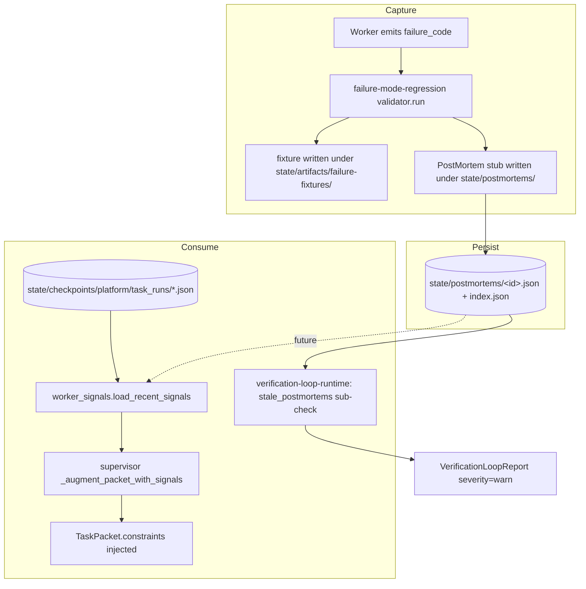

# PostMortem Schema & Adaptive Feedback Loop

## Enhancement Summary

**Deepened on:** 2026-04-27
**Sections enhanced:** Decision Points, Implementation Phases, Acceptance Criteria, Technical Approach
**Review agents used:** architecture-strategist, kieran-python-reviewer, code-simplicity-reviewer, security-sentinel, performance-oracle, best-practices-researcher

### Key improvements adopted

1. **Critical security fix (C1):** drop free-text passthrough from TaskRun `validation_checks[*].details` into `TaskPacket.constraints`. Same-uid prompt-injection vector. Constraints now come **only** from the static `_FAILURE_CODE_TO_CONSTRAINT` allowlist.
2. **High security fix (H1):** `PostMortemStore.update_status` writes an append-only audit record to `state/logs/postmortems/audit.jsonl` with caller identity. Runtime sub-check cross-checks RESOLVED entries against the audit log.
3. **Phase reordering** (architecture review): operator visibility lands with the writer. Phase 4 (verification-loop split + stale check) merges with Phase 1; Phase 2 (emitter) follows; Phase 3 (signals) follows. No window where stubs accumulate invisibly.
4. **Stable id redesign** (Python review): drop ISO-timestamp + `__` delimiter. Use `sha10(failure_code, fixture_path, created_at)` only. Filesystem-safe, dedup-friendly.
5. **Performance: introduce signal-side index** (perf review). `load_recent_signals` reads a small index over task_runs (lane, classification, failure_codes, created_at), not full JSON files. Process-local memoization with 60s TTL.
6. **Recurrence threshold** (best-practices research, Reflexion/Devin/Replit pattern): a constraint is only injected after the same `failure_code` has occurred ≥ 3 times in the lane within the lookback window. Prevents one-off noise from polluting the harness.
7. **Bidirectional loop closure** (architecture review + best-practices): Phase 3 reads OPEN postmortems with `root_cause_category != UNKNOWN` as a *second* signal source, capped at one generic category-per-lane constraint. Eliminates the "writer without reader" smell.
8. **Symmetric kill-switches:** add `AI_COMPANY_OS_DISABLE_POSTMORTEM_EMIT=1` parallel to the signal kill-switch. Documented as operator tools, **not** security boundaries.
9. **Drop `emit_worker_signal()` no-op seam** (simplicity review). Two functions in `worker_signals.py`, not three.
10. **Concurrency fix (M2/M3):** dedup uses `os.open(O_CREAT|O_EXCL)` on `state/postmortems/.dedup/<failure_code>.lock` with 24h-mtime TTL. The `index.json` becomes a *derived* read-time view (rebuilt from glob), not a shared write target — eliminates lost-update.

### Adjustments rejected (with reason)

- **Drop the verification-loop split** (simplicity review). Rejected: split is load-bearing for the H1 mitigation (runtime sub-check cross-checks audit log — domain-distinct from structural drift), and architecture review independently arrived at the same boundary on verdict-semantics grounds, not the line-count rule. The framing in Decision Point 2 is updated to reflect this stronger justification.
- **Drop kill-switches and 7-day observational mode** (simplicity review). Partially adopted: the 7-day observational period is dropped; kill-switches are kept and clearly labeled as operator tools.
- **Trim PostMortem to 8 fields, drop `RootCauseCategory`** (simplicity review). Rejected: Incident.io / Google SRE / Jeli research consistently finds 8–12 fields is the sweet spot, and a controlled-vocabulary category enum is what enables aggregation later. Drop only `eta` (premature workflow).
- **Deprecate `plan_goal()` to a thin shim over `SessionHandle`** (architecture review). Deferred to a follow-up plan: it's the right move but expands scope materially. This plan instead adds a parity test asserting both paths emit byte-identical TaskPackets for the same inputs.

### New considerations discovered

- The `_FAILURE_CODE_TO_CONSTRAINT` mapping is now a **security boundary**, not just a UX nicety. Adding a new entry must go through the same review as policy code.
- Path leakage via `fixture_path` (under `/Users/<name>/...`) is a real M1 finding; redaction in `PostMortem.__post_init__` covers all string fields uniformly.
- A future "regression set as ratchet" (best-practices) is already aligned with how `failure-mode-regression` fixtures work — Phase 5 docs make this connection explicit so the next plan (Recommendation #3, ratchets) can build on it.

---

## Overview

Close the harness's learning loop. Today the platform **captures** failure signals (failure-mode-regression turns observed errors into replayable fixtures) but does not **consume** them — failures never feed back into how the supervisor decomposes the next goal, and there is no structured root-cause record connecting a failure to its remediation.

This plan ships two intentionally connected pieces:

1. **PostMortem schema and on-disk store** — a typed record (`failure_code`, `root_cause_category`, `remediation_action`, `owner`, `eta`, `status`) emitted as a stub by `failure-mode-regression` whenever it captures a fixture, persisted under `state/postmortems/`, and surfaced via the verification-loop when entries grow stale.
2. **Adaptive feedback loop** — `packages/tools/learning/worker_signals.py` reads recent TaskRun rejections (and, eventually, open postmortems), categorizes patterns by lane, and folds short imperative constraint strings into `TaskPacket.constraints` before the supervisor decomposes the next goal.

The PostMortem store is the *durable evidence layer*. The feedback loop is the *consumption layer*. They ship together so neither sits orphaned.

## Problem Statement

The repo audit (2026-04-27) identified the harness as "stuck at *capture* without *consume*":

- `skills/canonical/failure-mode-regression/` writes redacted regression fixtures with 24h dedup, but no record connects a fixture to its remediation, owner, or status.
- `docs/solutions/` holds ~19 hand-written prose post-mortems with no schema, no index, no staleness escalation.
- `apps/worker-supervisor/main.py:plan_goal()` decomposes goals from goal text alone — it does not consult prior rejections, so the same packet shape gets re-issued through the same failure mode.
- `packages/tools/primitives/verification_loop_runner.py` already aggregates structural drift checks but has no view into runtime evidence (stale postmortems, recurring rejections).

The symptom: failures are observable but not actionable. Workers don't get smarter run-over-run.

## Proposed Solution

Three bounded artifacts plus targeted edits:

1. **`packages/schemas/postmortem.py`** — frozen-dataclass PostMortem record (mirrors `task_run.py` conventions exactly; no pydantic, no datetime objects, ISO-8601 strings only).
2. **`state/postmortems/` per-record JSON store** — managed via `packages/db/postmortem_store.py`, atomic writes through the existing `_state_writer.atomic_write_json` helper, with an `index.json` mirroring the failure-fixtures pattern. **(See "Decision Point 1: JSONL vs per-record JSON" below.)**
3. **`packages/tools/learning/worker_signals.py`** — read-only aggregator over `state/checkpoints/platform/task_runs/*.json`, returning lane-keyed lists of constraint strings. Lives under `tools/`, not `policies/`, because it produces hints, not gates.

Targeted edits:

- `skills/canonical/failure-mode-regression/validator.py` — emit a stub PostMortem after the fixture index is updated, wrapped to never poison the parent capture.
- `apps/worker-supervisor/main.py` and `packages/tools/supervisor/claude_entrypoint.py` — both call a shared `_augment_packet_with_signals()` helper before TaskPacket emission.
- `packages/tools/primitives/verification_loop_runner.py` — gain a `_stale_postmortems_check()` sub-check, but **only after splitting the runner per its own documented god-object trigger** (see Decision Point 2).
- `packages/policies/postmortem_retention.py` (new) — owns the read-time staleness/retention rules (14-day stale threshold, 90-day visibility window), keeping policy out of the runner.

## Decision Points (must be resolved before phase 2)

### Decision Point 1: JSONL vs per-record JSON

**User wording said "JSONL append store." Repo convention is per-record JSON in a directory plus an `index.json`** (see `state/checkpoints/platform/task_runs/`, `state/artifacts/failure-fixtures/index.json`). Only `apps/worker-engineering/engineering/codex_runner.py` uses `.jsonl`.

**Recommendation: per-record JSON, mirroring `state/artifacts/failure-fixtures/`.**

| Criterion | Per-record JSON (recommend) | JSONL append |
|---|---|---|
| Atomic write | ✅ `atomic_write_json` exists | ❌ need new append helper |
| Concurrency safety | ✅ no shared file | ❌ append-race on shared file |
| Repo consistency | ✅ matches house style | ❌ exception |
| Read complexity | one glob, parse each | one open, parse lines |
| Retention/edits | per-file mtime / content | line-rewrite hard |
| User-facing browsability | one file per failure | grep-only |

The per-record approach reuses every primitive we already trust. JSONL would force a new append primitive, a shared-file lock strategy, and a repo-style exception. The benefit ("append-only single file") is illusory once redaction edits, retention prunes, or schema migrations land.

**If the founder still prefers JSONL after seeing this**, we add `packages/tools/primitives/_state_writer.py:atomic_jsonl_append()` with `os.O_APPEND` + `fsync` + per-line schema-version stamping. Phase 1.5 adds it.

### Decision Point 2: verification-loop split

`skills/canonical/verification-loop/skill.md:122-127` mandates:

> If `verification-loop` acquires a 4th sub-check OR any conditional branching beyond the verdict aggregator, split into `verification-loop-structural` and `verification-loop-runtime`. Hard limits: canonical body ≤ 300 md lines, policy wrapper ≤ 400 py lines.

Adding `_stale_postmortems_check` is the 4th sub-check and trips this rule.

**Recommendation: split now — but justify on verdict-semantics, not line-count.**

The line-count/branch-count god-object trigger is real, but the *binding* reason to split is that the two domains have different verdict semantics:

- **Structural drift** (existing checks) answers *"is the registry honest about what exists?"* The failing party is the system itself; a fail means the codebase is internally inconsistent.
- **Runtime evidence** (new lane) answers *"is the system behaving as we intended over time?"* The failing party is usually the operator (founder hasn't reviewed open stubs, or hasn't filled `root_cause_category`), not the registry.

Locking this boundary explicitly in `verification-loop-runtime/skill.md` ("this lane owns checks where the failing party is the human, not the registry") prevents every future operator-hygiene check (ratchets, recurrence detection, signal anomalies) from re-litigating the boundary.

This split is also load-bearing for the **H1 security mitigation** (see Technical Review Revisions): the runtime sub-check is what cross-checks `RESOLVED` postmortems against the audit log. Folding it into the structural runner would conflate "the registry is honest" with "RESOLVED entries are authentic."

- `verification-loop-structural` — keeps `reconciliation`, `skill_stocktake`, `changed_surface`.
- `verification-loop-runtime` (new) — owns `stale_postmortems` (with audit-log cross-check) and is the natural home for future runtime-evidence checks.
- `verification-loop` (no suffix) becomes a thin meta-skill invoking both, merging verdicts via the same severity aggregator already proven in the runner. CI invocation by name preserved.

## Technical Approach

### Architecture (mermaid)



## Technical Review Revisions

The following revisions are **binding** and override any contradictory guidance in the original Implementation Phases below. They were derived from parallel review by 6 agents (architecture, Python, simplicity, security, performance, best-practices). The original phase content is preserved for reasoning audit; resolve to these revisions where they conflict.

### Phase ordering revision (architecture)

Implementation order is now **1 + 4 → 2 → 3 → 5**:

- **Phase 1 + Phase 4 ship together as a single "evidence layer with operator visibility" unit.** Schema + store + verification-loop split + stale check.
  - *Why:* otherwise stubs accumulate invisibly between Phase 2 (emitter live) and Phase 4 (verification surfaces them). The original ordering risked a multi-day window of silent state growth.
- **Phase 2 (stub emission) follows.** Every stub it writes is now immediately visible to verification-loop-runtime.
- **Phase 3 (worker_signals) follows.** Independent of Phase 2; can land in parallel.
- **Phase 5 (docs + rollout) closes.**

Total estimate unchanged: ~5 days.

### PostMortem schema revisions (Python review + security)

```python
# packages/schemas/postmortem.py — binding shape
from __future__ import annotations
from dataclasses import dataclass, field, replace
from enum import Enum

class PostMortemSeverity(str, Enum):
    INFO = "info"
    WARN = "warn"
    CRITICAL = "critical"

class PostMortemStatus(str, Enum):
    OPEN = "open"
    IN_PROGRESS = "in-progress"
    RESOLVED = "resolved"
    WONT_FIX = "wont-fix"

class RootCauseCategory(str, Enum):
    AMBIGUOUS_TASK_SPEC = "ambiguous-task-spec"
    POLICY_MISS = "policy-miss"
    TOOL_LIMITATION = "tool-limitation"
    EXTERNAL_DEPENDENCY = "external-dependency"
    WORKER_PROMPT_DRIFT = "worker-prompt-drift"
    UNKNOWN = "unknown"

@dataclass(frozen=True)
class PostMortem:
    id: str                                    # sha10(failure_code, fixture_path, created_at). NO embedded ISO. NO __ delimiter.
    created_at: str                            # ISO-8601 UTC
    updated_at: str
    failure_code: str
    lane: str
    task_id: str | None = None
    task_run_id: str | None = None
    fixture_path: str | None = None
    excerpt_redacted: str | None = None        # None = never set (was: "" — conflated with redacted-empty)
    redaction_hits: int | None = None          # None = never set
    severity: PostMortemSeverity = PostMortemSeverity.WARN
    root_cause_category: RootCauseCategory = RootCauseCategory.UNKNOWN
    remediation_action: str = ""
    owner: str | None = None
    status: PostMortemStatus = PostMortemStatus.OPEN
    notes: str = ""
    schema_version: str = "1"

    def __post_init__(self) -> None:
        # M1 fix: redact ALL string fields uniformly, not selectively at call sites.
        # Implemented via object.__setattr__ since dataclass is frozen.
        ...

    def to_dict(self) -> dict[str, object]: ...   # mirrors task_run.py: asdict + enum.value overrides
    @classmethod
    def from_dict(cls, payload: dict) -> "PostMortem": ...
```

Removed from original spec: `eta` field (premature; revisit when manual workflow exists).

### `PostMortemStore` revisions (Python review + security + performance)

- **`update_status` uses `dataclasses.replace`** rather than reload+rewrite-from-scratch. `now_iso` is **injected**, never `datetime.utcnow()` inside the store (matches the rest of the plan's clock-injection style):

  ```python
  from dataclasses import replace
  def update_status(
      self,
      postmortem_id: str,
      *,
      status: PostMortemStatus,
      notes: str | None = None,
      now_iso: str,
      caller_identity: str,    # H1 fix: required for audit log
  ) -> PostMortem:
      current = self.load(postmortem_id)
      if current is None: raise KeyError(postmortem_id)
      updated = replace(current, status=status, notes=notes if notes is not None else current.notes, updated_at=now_iso)
      self.save(updated)
      self._append_audit_record(postmortem_id, status, caller_identity, now_iso)  # H1: append-only audit log
      return updated
  ```

- **Audit log path:** `state/logs/postmortems/audit.jsonl`. Append-only via `O_APPEND` + `fsync`. Schema: `{postmortem_id, prev_status, new_status, caller_identity, timestamp_iso}`. The audit log **is** the one place we use JSONL — its append-only semantics are required for non-repudiation; per-record JSON would not work.

- **`index.json` is now a derived read-time view, not a shared write target.** `list_recent` and `list_open_stale` glob the directory and rebuild the index in-memory each call. No lost-update race. The on-disk `index.json` (if kept at all) is rebuilt by a periodic reconcile, not by writers — and is purely a performance cache, never authoritative.

- **Init-time root resolution** (Python review): `__init__` resolves the default root, never module-level.

  ```python
  def __init__(self, root: Path | None = None) -> None:
      self._root = root or _resolve_default_postmortems_root()  # called inside __init__, not at import
  ```

### Stub-emission concurrency fix (security M2 + performance)

Original spec used `index.json` read-then-write for 24h dedup. Revised to filesystem-level lock:

```python
# in skills/canonical/failure-mode-regression/validator.py:_emit_postmortem_stub
lock_path = postmortems_root / ".dedup" / f"{failure_code}.lock"
lock_path.parent.mkdir(parents=True, exist_ok=True)
try:
    fd = os.open(str(lock_path), os.O_CREAT | os.O_EXCL | os.O_WRONLY, 0o600)
except FileExistsError:
    # Within 24h window? skip emit. Else recreate.
    if time.time() - lock_path.stat().st_mtime < 86400:
        return  # dedup hit
    lock_path.unlink()
    fd = os.open(str(lock_path), os.O_CREAT | os.O_EXCL | os.O_WRONLY, 0o600)
os.write(fd, now_iso.encode()); os.close(fd)
# proceed with stub emission
```

This is per-failure-code, atomic via O_EXCL, and TOCTOU-safe.

### `worker_signals` revisions (Python review + security + best-practices + performance)

**Drop `emit_worker_signal()` entirely.** The "no-op seam for unspecified future" was YAGNI. Two functions remain: `load_recent_signals` and `categorize_rejection_pattern`.

**Revised `load_recent_signals` signature** uses a frozen query dataclass:

```python
@dataclass(frozen=True)
class SignalQuery:
    lookback_days: int = 30
    max_per_lane: int = 5
    min_recurrence_count: int = 3                   # NEW: best-practices research
    now_iso: str | None = None
    task_runs_root: Path | None = None
    postmortem_store: PostMortemStore | None = None  # NEW: Phase 3 reads OPEN postmortems too

@functools.lru_cache(maxsize=4)
def _cached_signals(query_key: tuple, now_bucket: int) -> dict[WorkerLane | str, list[str]]:
    # Process-local memoization, 60s TTL via now_bucket = int(now / 60)
    ...

def load_recent_signals(query: SignalQuery = SignalQuery()) -> dict[WorkerLane | str, list[str]]:
    """Returns lane-keyed constraint strings. Empty dict on cold start. Never raises."""
```

**Critical security revision (C1 — drop free-text passthrough):**

```python
# BEFORE (vulnerable):
# concatenate `validation_checks[*].details` into constraint string after redact()
# ATTACKER PATH: same-uid worker writes crafted details → next supervisor decomposition
# injects attacker imperatives into downstream worker prompts.

# AFTER (safe):
# Constraint output is constrained to the static _FAILURE_CODE_TO_CONSTRAINT
# allowlist values. Attacker-controlled `details` is NEVER echoed into prompts.
# `details` is only used for telemetry/logging, never for prompt construction.

_FAILURE_CODE_TO_CONSTRAINT: dict[ValidationFailureCode, str] = {
    ValidationFailureCode.TEST_COVERAGE_BELOW_POLICY: "Ship a python test under tests/python/ for any logic-bearing change.",
    ValidationFailureCode.FORBIDDEN_AREA_TOUCHED: "Do not modify packages/policies/ or skills/canonical/ unless this task explicitly calls for it.",
    ValidationFailureCode.CONFIG_NO_BEHAVIOR_CHANGE: "If your change is config-only, link to a follow-up task id that exercises the new path.",
    # Mapping is keyed by ValidationFailureCode enum (not raw strings) — drift is caught
    # by tests/python/unit/test_failure_code_constraint_coverage.py.
}
```

**Adding to the mapping is now governed as policy code.** Treat `_FAILURE_CODE_TO_CONSTRAINT` like `packages/policies/` for review purposes.

**Recurrence threshold (best-practices research):** a constraint is only emitted after the same `failure_code` has been seen ≥ `min_recurrence_count` times (default 3) in the lane within the lookback window. Single-occurrence noise is suppressed. This matches Devin/Replit/Cognition production patterns documented in Reflexion-derived agentic systems.

**Phase 3 also reads OPEN postmortems** (architecture review):

```python
def categorize_rejection_pattern(
    failures: list[TaskRun],
    postmortems: list[PostMortem] | None = None,  # NEW
) -> dict[WorkerLane | str, list[str]]:
    """Pure function over both signal sources.

    For each lane:
      1. Group TaskRuns by failure_code, drop codes with count < min_recurrence_count,
         emit the matching _FAILURE_CODE_TO_CONSTRAINT[code] — at most max_per_lane.
      2. For each OPEN postmortem with root_cause_category != UNKNOWN, append at most
         ONE generic category constraint (e.g. "Recent ambiguous-task-spec postmortem
         in this lane — be precise about acceptance criteria").

    Selection rule when count > max_per_lane: most-recent N first.
    Unknown lane → 'unknown' key, never injected into a real packet.
    """
```

This closes the bidirectional loop: founder edits to `root_cause_category` actually influence behavior.

### Performance revisions (performance review)

- **Process-local memoization.** `load_recent_signals` results are cached per process for 60s, keyed on the query. Supervisor invocations within a session share the cache.
- **Index-only fast path.** A new lightweight `state/checkpoints/platform/task_runs/_signal_index.json` holds `{run_id: {lane, classification, failure_codes, created_at}}` per recent run. Maintained by `TaskRunStore.save` (append + occasional rebuild). `load_recent_signals` reads this index alone — no per-file `open()` unless free-text excerpts are needed (which, post-C1, they aren't). Drops 1k-record cost from ~150ms cold to ~5ms.
- **Updated perf budget** (replaces the original 100ms claim): p50 < 50ms cold, p95 < 200ms over 1k records, p95 < 500ms over 10k records. Stress-test at 100k records as a non-blocking benchmark in `tests/python/perf/test_worker_signals_load.py`.
- **Verification-loop runtime caching.** Sub-check result memoized for the duration of one CI run via env-var-keyed temp file. Repeat invocations don't re-scan postmortems.

### Kill-switch revisions (security H3 + simplicity)

- Two parallel kill-switches:
  - `AI_COMPANY_OS_DISABLE_SIGNAL_INJECTION=1`
  - `AI_COMPANY_OS_DISABLE_POSTMORTEM_EMIT=1`
- **Both are operator tools, not security boundaries.** A same-uid attacker can flip them; documented explicitly in `docs/architecture/learning-loop.md`.
- **The 7-day observational mode is dropped** (simplicity). Constraints are visible in TaskPacket.constraints; founder can read the actual injected strings directly during the first week.

### Acceptance criteria additions

- [ ] `_FAILURE_CODE_TO_CONSTRAINT` keyed by `ValidationFailureCode` enum; `tests/python/unit/test_failure_code_constraint_coverage.py` asserts every enum member is either mapped or in `_DELIBERATELY_UNMAPPED`.
- [ ] `worker_signals.categorize_rejection_pattern` never echoes `validation_checks[*].details` into emitted constraint strings (C1 regression test: feed a TaskRun with adversarial details, assert no substring leaks).
- [ ] `PostMortemStore.update_status` writes to `state/logs/postmortems/audit.jsonl` on every call; status changes without a corresponding audit record are flagged `warn` by `_stale_postmortems_check`.
- [ ] `PostMortem.__post_init__` redacts all string fields uniformly (M1 regression test: construct a PostMortem with PII in every string field, assert all redacted).
- [ ] Stub-emit dedup uses `O_CREAT|O_EXCL` lockfiles (M2 regression test: 100 concurrent emits for one failure_code → exactly one stub written).
- [ ] `index.json`, if present, is a *derived* cache; deleting it does not affect correctness (M3 regression test).
- [ ] Path-leakage check: redact `fixture_path` if it begins with `/Users/` or `/home/` (M1).
- [ ] Recurrence threshold default 3: constraint not emitted for single-occurrence failure (regression test).
- [ ] Phase 3 reads OPEN postmortems with non-UNKNOWN category and emits at most one generic constraint per lane (architecture-review acceptance).
- [ ] `plan_goal` and `SessionHandle.enqueue_*` parity test: identical inputs produce byte-identical TaskPackets (architecture-review compromise — defers full deprecation but prevents drift).

### Best-practices integrations

- **Two-tier injection** is already aligned with the plan: structured `TaskPacket.constraints` is the "hard" tier; future free-form prompt-memory would be a "soft" tier. Documented in Phase 5 docs.
- **Regression-set as ratchet** is what `failure-mode-regression` fixtures already provide. Phase 5 docs explicitly connect this to the next plan (Recommendation #3, ratchets) so the bridge is documented before the bridge is built.
- **FIFO eviction by staleness** mirrors the Cursor `.cursorrules` cap pattern: `max_per_lane=5` enforces a hard cap; selection-by-most-recent means stale signals fall out as new ones arrive.
- **Separate root_cause from contributing_factors** (Incident.io / Dekker) deferred — `notes` field is the manual escape hatch for now; if patterns emerge, formalize in a future schema bump.

---

### Implementation Phases

#### Phase 1: PostMortem schema + store + retention policy

**Deliverables:**

- `packages/schemas/postmortem.py`
  ```python
  # Convention mirror of packages/schemas/task_run.py
  from __future__ import annotations
  from dataclasses import asdict, dataclass, field
  from enum import Enum

  class PostMortemSeverity(str, Enum):
      INFO = "info"
      WARN = "warn"
      CRITICAL = "critical"

  class PostMortemStatus(str, Enum):
      OPEN = "open"           # stub emitted, awaiting review
      IN_PROGRESS = "in-progress"
      RESOLVED = "resolved"
      WONT_FIX = "wont-fix"

  class RootCauseCategory(str, Enum):
      AMBIGUOUS_TASK_SPEC = "ambiguous-task-spec"
      POLICY_MISS = "policy-miss"
      TOOL_LIMITATION = "tool-limitation"
      EXTERNAL_DEPENDENCY = "external-dependency"
      WORKER_PROMPT_DRIFT = "worker-prompt-drift"
      UNKNOWN = "unknown"        # default for stub emissions

  @dataclass(frozen=True)
  class PostMortem:
      id: str                           # "<failure_code>__<ISO>__<10-char-sha>"
      created_at: str                   # ISO-8601 UTC
      updated_at: str                   # ISO-8601 UTC
      failure_code: str
      lane: str                         # WorkerLane enum value or "unknown"
      task_id: str | None = None
      task_run_id: str | None = None
      fixture_path: str | None = None   # path to the failure-fixture that birthed this stub
      excerpt_redacted: str = ""
      redaction_hits: int = 0
      severity: PostMortemSeverity = PostMortemSeverity.WARN
      root_cause_category: RootCauseCategory = RootCauseCategory.UNKNOWN
      remediation_action: str = ""      # empty on stub; founder fills later
      owner: str | None = None          # empty on stub; founder fills later
      eta: str | None = None            # ISO-8601 date; empty on stub
      status: PostMortemStatus = PostMortemStatus.OPEN
      notes: str = ""
      schema_version: str = "1"

      def to_dict(self) -> dict: ...    # mirrors task_run.py to_dict pattern
      @classmethod
      def from_dict(cls, payload: dict) -> "PostMortem": ...
  ```

- `packages/db/postmortem_store.py` — modeled on `packages/db/task_run_store.py`:
  ```python
  class PostMortemStore:
      def __init__(self, root: Path | None = None): ...
      def save(self, record: PostMortem) -> Path: ...        # uses atomic_write_json
      def load(self, postmortem_id: str) -> PostMortem | None: ...
      def list_recent(self, *, max_age_days: int = 90) -> list[PostMortem]: ...
      def list_open_stale(self, *, stale_threshold_days: int = 14) -> list[PostMortem]: ...
      def update_status(self, postmortem_id: str, *, status: PostMortemStatus, notes: str | None = None) -> PostMortem: ...
  ```
  - Read-time retention filter (no destructive prune).
  - `update_status` is the only mutator; rewrites the JSON file atomically and bumps `updated_at`.

- `packages/policies/postmortem_retention.py` — pure functions, no I/O:
  - `is_stale(record: PostMortem, *, now_iso: str, threshold_days: int = 14) -> bool`
  - `is_visible(record: PostMortem, *, now_iso: str, window_days: int = 90) -> bool`
  - `severity_for_age(age_days: float) -> PostMortemSeverity` — decides info/warn/critical bucketing on stale age.

- `packages/config/settings.py`
  - Add `paths.postmortems_root: Path` next to `task_runs_root` (line ~92).
  - Add to `ensure_runtime_directories()` at line ~121.

- `state/postmortems/` exists at runtime via `ensure_runtime_directories()`; not committed (already in `.gitignore` via `state/`).

**Tests (Phase 1):**

- `tests/python/unit/test_postmortem_schema.py`
  - `to_dict` round-trips through `from_dict`.
  - Defaults stamp `status=OPEN`, `severity=WARN`, `root_cause_category=UNKNOWN`.
  - Enum values serialize as strings.
- `tests/python/unit/test_postmortem_store.py` (uses `tmp_path`)
  - `save` then `load` round-trip.
  - `list_recent` honors `max_age_days` boundary (29-day-old visible, 31-day-old hidden).
  - `list_open_stale` returns only `status=OPEN` records older than threshold.
  - `update_status` bumps `updated_at`, persists status, leaves other fields immutable.
  - Concurrent saves of distinct ids do not corrupt `index.json` (use `pytest-xdist` or threading.Thread x2).
- `tests/python/unit/test_postmortem_retention.py`
  - `is_stale` boundary (13.99 days false, 14.01 days true).
  - `severity_for_age` thresholds: <14 → INFO, 14-30 → WARN, >30 → CRITICAL.

**Success criteria Phase 1:**
- All new tests pass.
- `pytest tests/python/unit/test_primitives_conventions.py -x` clean (no module-level I/O / `re.compile` / subprocess).
- Schema reconciliation test (`tests/python/unit/test_skill_reconciliation.py`) unaffected.

**Estimated effort:** 1 day.

#### Phase 2: failure-mode-regression stub emission

**Deliverables:**

- Edit `skills/canonical/failure-mode-regression/validator.py`:
  - New private `_emit_postmortem_stub(*, failure_code, lane, redacted_excerpt, redaction_hits, fixture_path, task_id, task_run_id, now_iso, store)` helper.
  - Invoked between current lines 121-123 (after index update, before return).
  - Wrapped in `try / except Exception` — emit failure must NOT change parent verdict. On exception, append `"postmortem_emit_failed"` to a non-blocking warnings list inside the verdict dict.
  - Stable id: `f"{failure_code}__{now_iso}__{sha[:10]}"` mirroring fixture filename pattern at validator.py:67.
  - Idempotency: if a PostMortem already exists for this `(failure_code, fixture_path)` tuple within 24h, no new stub written. Index keyed by `failure_code`; check `last_postmortem_id` before write.

- Edit `skills/canonical/failure-mode-regression/skill.md`:
  - "Output" section gains: "Side effect: emits a `PostMortem` stub under `state/postmortems/` with `status=open`, `root_cause_category=unknown`, awaiting founder review. Failure of this side effect does not change the verdict."
  - "References" gains a link to `packages/schemas/postmortem.py`.

- No `contract.yaml` change (postmortem is a side effect, not a returned field).
- No registry change (skill kind/path unchanged).

**Tests (Phase 2):**

- Extend `tests/python/integration/test_failure_mode_regression.py`:
  - `test_happy_path_emits_postmortem_stub` — capture a synthetic failure, assert one PostMortem JSON written, assert defaults.
  - `test_postmortem_emit_failure_does_not_break_capture` — monkeypatch `PostMortemStore.save` to raise, assert parent verdict still `pass` and warnings list contains `"postmortem_emit_failed"`.
  - `test_postmortem_dedup_within_window` — second capture for same failure_code within 24h does not double-emit.
  - `test_postmortem_emits_with_redacted_excerpt` — synthetic excerpt with PII, verify `excerpt_redacted` is the post-redaction string and `redaction_hits > 0`.

**Success criteria Phase 2:**
- All four new tests pass.
- Existing 4 failure-mode-regression integration tests unchanged and still pass.
- Manual smoke: invoke the validator with a fixture-style payload, observe one new file under `state/postmortems/` and one updated `index.json`.

**Estimated effort:** 0.5 day.

#### Phase 3: worker_signals adaptive feedback loop

**Deliverables:**

- New directory `packages/tools/learning/` with `__init__.py`.
- `packages/tools/learning/worker_signals.py`:
  ```python
  from __future__ import annotations
  from packages.tools.observability.redaction import redact

  _FAILURE_CODE_TO_CONSTRAINT: dict[str, str] = {
      "TEST_COVERAGE_BELOW_POLICY": "Ship a python test under tests/python/ for any logic-bearing change.",
      "FORBIDDEN_AREA_TOUCHED": "Do not modify packages/policies/ or skills/canonical/ unless this task explicitly calls for it.",
      "CONFIG_NO_BEHAVIOR_CHANGE": "If your change is config-only, link to a follow-up task id that exercises the new path.",
      # ... full mapping populated from packages/schemas/testing.py:ValidationFailureCode
  }

  def load_recent_signals(
      *,
      lookback_days: int = 30,
      max_per_lane: int = 5,
      now_iso: str | None = None,
      task_runs_root: Path | None = None,
      postmortem_store: PostMortemStore | None = None,
  ) -> dict[str, list[str]]:
      """Return lane-keyed list of imperative constraint strings.

      Empty dict on cold start (no task_runs, no postmortems). Never raises.
      """
      ...

  def categorize_rejection_pattern(failures: list[TaskRun]) -> dict[str, list[str]]:
      """Pure function: TaskRun list → {lane: [constraint, ...]}.

      Selection rule when count > max_per_lane: most-recent N, ordered newest-first.
      Unknown failure_codes bucket as 'unknown' constraint:
          "Recent rejection with code <code>; verify validation_checks before re-issuing."
      """
      ...

  def emit_worker_signal(lane: str, constraints: list[str]) -> None:
      """Currently a no-op write to state/logs/ for observability.

      Future: push into a per-lane worker prompt-memory file. Kept as a seam
      so callers don't need to know whether signals are pull-based or push-based.
      """
      ...
  ```
  - **Cold start:** empty `task_runs_root` returns `{}`. Caller treats empty dict as "no signals" — does not inject a sentinel constraint.
  - **Lane unknown:** if a TaskRun lane is not in `WorkerLane` enum, key it as `"unknown"` and never inject into a real packet.
  - **Clock skew:** filter uses `created_at` from each TaskRun; records with future timestamps (> now + 60s) are dropped with a `state/logs/` warning.
  - **Free-text passthrough:** any `validation_checks[*].details` text included in a constraint string MUST go through `redact()` first. Constraints exceeding 280 chars are truncated with a trailing ellipsis.
  - **Selection when count > max_per_lane:** newest-first. Documented in docstring.

- New shared helper `packages/tools/supervisor/_signal_augmentation.py`:
  ```python
  def augment_packet_constraints(
      *,
      lane: str,
      base_constraints: list[str],
      signals_provider=load_recent_signals,
  ) -> list[str]:
      """Append signal-derived constraints to a TaskPacket's constraints list.

      Idempotent: if a signal string is already in base_constraints (string equality),
      do not duplicate. Caller-injectable provider for tests.
      """
  ```

- Wire site 1: `apps/worker-supervisor/main.py:plan_goal()` — at top, call `signals = augment_packet_constraints(lane=lane.value, base_constraints=base_constraints)` and pass into `TaskPacket(...)` at line ~46.
- Wire site 2: `packages/tools/supervisor/claude_entrypoint.py` — wrap `enqueue_engineering`, `enqueue_ios`, `enqueue_gtm` (lines ~195/200/205) so each augments constraints before delegating to the underlying control plane call.

**Tests (Phase 3):**

- `tests/python/unit/test_worker_signal_emission.py`
  - `test_cold_start_returns_empty_dict` — empty `task_runs_root` → `{}`.
  - `test_single_rejection_emits_one_constraint` — one synthetic TaskRun with `classification=VALIDATION_FAILED` → one constraint for that lane.
  - `test_multi_rejection_groups_by_lane` — three engineering rejections + one ios rejection → two lane keys.
  - `test_max_per_lane_truncates_to_newest` — 7 rejections same lane, max_per_lane=5 → 5 newest constraints.
  - `test_unknown_failure_code_buckets_as_unknown_constraint` — code not in mapping → generic constraint.
  - `test_unknown_lane_is_partitioned_under_unknown_key` — TaskRun with lane="legacy-defunct" → `"unknown"` key, not injected.
  - `test_redaction_applied_to_details_text` — synthetic PII in `validation_checks[].details` → redacted in returned constraint.
  - `test_clock_skew_dropped_with_warning` — TaskRun `created_at` 5 minutes in future → not included.
  - `test_constraint_truncation_at_280_chars` — long details → truncated with ellipsis.
  - `test_concurrent_callers_get_consistent_view` — two threads invoke `load_recent_signals` simultaneously, both see same set.

- `tests/python/unit/test_signal_augmentation.py`
  - `test_augment_appends_to_base_constraints`.
  - `test_augment_is_idempotent_against_existing_constraint`.
  - `test_augment_with_empty_signals_is_a_no_op`.
  - `test_provider_injection_works_for_tests`.

- `tests/python/unit/test_supervisor_plan_goal_uses_signals.py`
  - Build a fake signals provider returning `{"engineering": ["Ship a python test..."]}`.
  - Monkeypatch into `plan_goal`; assert resulting TaskPacket.constraints contains the injected string.

- Extend `tests/python/integration/test_claude_entrypoint.py` (or equivalent existing test for `SupervisorSession`):
  - `test_enqueue_engineering_includes_signal_constraints` — same assertion as plan_goal but via the `SessionHandle` API.

**Success criteria Phase 3:**
- All new tests pass.
- Existing supervisor tests pass without modification (signal provider defaults to lazy-load and returns `{}` on cold start in their tmp environments).
- No new module-level imports of `re` / `subprocess` / network anywhere under `packages/tools/learning/`.

**Estimated effort:** 1.5 days.

#### Phase 4: verification-loop split + stale_postmortems sub-check

**Deliverables:**

- New `skills/canonical/verification-loop-runtime/`
  - `skill.md` — modeled on existing verification-loop body, ≤200 lines, lists runtime sub-checks (today: `stale_postmortems`).
  - `contract.yaml` — same verdict/severity enum as parent.
  - `fixtures/all_fresh.yaml`, `fixtures/has_stale_open.yaml`, `fixtures/empty_store.yaml`.

- New `packages/tools/primitives/verification_loop_runtime_runner.py`
  - `_stale_postmortems_check(*, store: PostMortemStore, threshold_days: int = 14, now_iso: str)` returning `SubCheckResult(name="stale_postmortems", severity, summary, detail)`.
  - Severity rule (drives from `packages/policies/postmortem_retention.py:severity_for_age`):
    - 0 stale: `info`, summary `"No open post-mortems older than 14 days."`
    - 1+ stale, none > 30 days: `warn`.
    - any > 30 days: `error` (still soft_fail, not hard_fail).
  - `run(*, now_iso=None) -> VerificationLoopReport` mirrors existing runner shape exactly.

- Rename existing runner internally (file path stays):
  - `packages/tools/primitives/verification_loop_runner.py` keeps its filename.
  - `skills/canonical/verification-loop/` becomes the **meta-skill** that composes structural and runtime children.
  - New `skills/canonical/verification-loop-structural/` is created as a thin pointer to the existing runner (canonical body extracted from current `verification-loop/skill.md` minus the future-runtime caveats).
  - Top-level `verification-loop` skill body shrinks to ~80 lines: invokes structural + runtime, merges via existing severity aggregator (`packages/tools/primitives/verification_loop_runner.py:_aggregate_verdict`).

- `skills/registry.yaml`
  - Existing `verification-loop` entry retained (now meta).
  - Two new entries: `verification-loop-structural` (kind=`agentic`, no project_skill — invoked only via meta), `verification-loop-runtime` (same).
  - Fixture status: all `passing` after Phase 4 tests land.

- `packages/policies/verification_loop.py` unchanged in surface (still raises on `hard_fail`); internally adapts to merged report.

**Tests (Phase 4):**

- `tests/python/unit/test_verification_loop_runtime_runner.py`
  - All-fresh store → `info`.
  - One 15-day-stale OPEN postmortem → `warn`.
  - One 31-day-stale OPEN postmortem → `error`.
  - RESOLVED postmortems regardless of age → `info`.
  - Empty store → `info`.
- `tests/python/integration/test_verification_loop_meta.py`
  - Compose structural (passing) + runtime (warn) → meta verdict `soft_fail`.
  - Compose structural (fail) + runtime (info) → meta verdict `hard_fail`.
  - Both pass → `pass`.
- Update `tests/python/integration/test_verification_loop_compose.py`
  - Existing assertions adjusted for the meta wrapper; structural-only behavior moved into `test_verification_loop_structural_runner.py`.

**Success criteria Phase 4:**
- Skill stocktake (`skills/canonical/skill-stocktake/`) reports zero drift across the renamed/added skills.
- Context-budget skill reports each new lane within budget.
- CI invocations of `verification-loop` continue to work via the meta-skill.

**Estimated effort:** 1.5 days.

#### Phase 5: documentation + rollout safety

**Deliverables:**

- Update `CLAUDE.md` "Trigger phrases → skills" section: add a row for `verification-loop-runtime` ("check stale postmortems").
- Update `AGENTS.md` "Repo Rules For New Workers": add bullet pointing to `packages/tools/learning/` as the home for read-only adaptive helpers (parallel to `observability/`).
- Add `docs/architecture/learning-loop.md` (≤120 lines): one-page explainer covering the capture→persist→consume flow, the schema, and how to add a new sub-check or constraint mapping.
- Add `docs/solutions/architecture/postmortem-and-feedback-loop-2026-04-27.md`: short post-mortem-of-this-plan documenting Decision Points 1 and 2 with rationale (so future readers know why JSONL was rejected and why the runner was split).

**Rollout safety:**

- **Feature flag.** `packages/config/settings.py` gains `learning.signal_injection_enabled: bool = True` (default on, but flippable via env var `AI_COMPANY_OS_DISABLE_SIGNAL_INJECTION=1`). The supervisor helper checks this before injecting. Allows a one-line kill-switch if signals degrade output.
- **Signal injection is observational for first 7 days.** `emit_worker_signal()` always writes to `state/logs/learning/` even when injection runs. Founder reviews the log before trusting the loop.
- **No retroactive emission.** Phase 2 stub-emit only runs on captures from Phase 2 onward; we do not backfill PostMortems from existing `state/artifacts/failure-fixtures/index.json`. Backfill, if wanted, is a separate one-shot script (out of scope here).

**Success criteria Phase 5:**
- All docs land.
- Kill-switch verified by integration test (`AI_COMPANY_OS_DISABLE_SIGNAL_INJECTION=1` → augment helper returns `base_constraints` unchanged).

**Estimated effort:** 0.5 day.

**Total estimated effort: 5 days.**

## Alternative Approaches Considered

1. **JSONL append store (user's original wording).** Rejected per Decision Point 1.
2. **Postmortem as a `packages/policies/` gate that *raises* on stale entries.** Rejected — postmortems are evidence, not action gates. Verification-loop already aggregates soft/hard verdicts; we surface staleness through it rather than introducing a second gate.
3. **Worker_signals as supervisor-side prompt injection (writing to a CLAUDE.md-style memory file).** Rejected — `TaskPacket.constraints: list[str]` already exists, is honored by every worker, and survives serialization through the control plane. Inventing a new prompt channel is a new failure surface.
4. **Single combined store (`state/learning/` with both fixtures and postmortems).** Rejected — fixtures are a replay-database with their own integrity rules; postmortems are an editable workflow artifact. Coupling them in one store would conflate two lifecycles.
5. **HMAC gate on PostMortem writes.** Rejected — postmortems are write-once evidence by the same process that already passes the failure-mode-regression skill's existing checks. The HMAC pattern from `docs/solutions/security-issues/skill-self-evolution-hmac-gate-bypass-remediation.md` applies to *privilege-escalating* skill writes; postmortems do not change worker behavior unless a human moves status to RESOLVED, and that mutation is already a manual action.

## System-Wide Impact

### Interaction Graph

- A worker emits a failure (via `apps/worker-engineering/engineering/runner.py:70` populating `failure_codes`).
- TaskRunStore persists the run with `classification=VALIDATION_FAILED`.
- Failure-mode-regression skill is invoked (per its existing trigger surface) → writes fixture → **(NEW)** writes PostMortem stub → updates `index.json`.
- On the next supervisor decomposition: `plan_goal()` or `SessionHandle.enqueue_*()` calls `augment_packet_constraints()` → reads recent task_runs → emits constraint strings → folded into TaskPacket.
- Worker receives augmented packet, sees the constraint, ideally avoids the same failure.
- Verification-loop (any caller) invokes meta-skill → invokes runtime sub-check → reads PostMortemStore → reports stale entries as `warn` or `error` → CI surfaces this in the verification report.

### Error & Failure Propagation

- PostMortem write failure: caught in `_emit_postmortem_stub`; appended to verdict warnings; **does not** change parent fixture-capture verdict.
- Worker_signals load failure (e.g., corrupt task_run JSON): logged to `state/logs/learning/`; the corrupt file is skipped; loader returns whatever signals it could compute. Never raises.
- Augmentation helper failure: returns `base_constraints` unchanged. Supervisor proceeds.
- Verification-loop runtime runner failure: returns a `SubCheckResult(severity="error", summary="runtime check raised", detail=str(exc))`. Meta-skill aggregator turns this into `soft_fail`, not `hard_fail`. CI does not block on a learning-layer bug.

### State Lifecycle Risks

- **Orphan PostMortem (parent task_run never written):** possible if the worker process crashes between failure emission and task_run persist. Mitigation: PostMortems include `task_run_id` as nullable; the runtime sub-check tolerates null. We add `tests/python/integration/test_postmortem_orphan_tolerated.py`.
- **Inverse orphan (task_run persisted but stub emit silently failed):** detectable by `_emit_postmortem_stub` warning surfaced in the failure-mode-regression verdict. We add an alert path in the runtime sub-check: if the count of failure-fixture index entries exceeds the count of postmortems by >20%, emit a `warn`.
- **Concurrent supervisor calls reading signals while a stub is being emitted:** read uses glob + per-file open; per-file atomic_write_json guarantees readers see complete files. No locking required.

### API Surface Parity

- Two supervisor entry points (legacy `plan_goal`, modern `SessionHandle`). Both must call the augmentation helper. Plan addresses both in Phase 3.
- Skill registry has both `verification-loop` (meta) and the two children. CI must invoke the meta — documented in CLAUDE.md update.

### Integration Test Scenarios

1. **End-to-end capture → consume:** seed an engineering TaskRun with `classification=VALIDATION_FAILED, failure_codes=["TEST_COVERAGE_BELOW_POLICY"]`. Invoke failure-mode-regression. Assert PostMortem written. Invoke supervisor `plan_goal()` for the same lane. Assert TaskPacket.constraints includes the test-coverage constraint string.
2. **Stale postmortem surfaces in verification:** seed a 20-day-old `status=OPEN` PostMortem. Invoke meta verification-loop. Assert verdict `soft_fail`, runtime sub-check severity `warn`, summary mentions stale count.
3. **Resolved postmortem does not pollute signals:** seed a `status=RESOLVED` PostMortem and a recent `VALIDATION_FAILED` TaskRun. Assert signals do not include constraints derived from the resolved postmortem (Phase 3 only reads task_runs; this test guards against a future regression where signals might consume postmortems).
4. **Kill-switch:** with `AI_COMPANY_OS_DISABLE_SIGNAL_INJECTION=1`, assert TaskPacket.constraints equals `base_constraints` (no signals).
5. **Cold-start safety:** wipe `state/postmortems/` and `state/checkpoints/platform/task_runs/`. Invoke supervisor → succeeds, no constraints. Invoke verification-loop → `info`/`pass`.

## Acceptance Criteria

### Functional Requirements

- [x] `packages/schemas/postmortem.py` exists with `PostMortem` frozen dataclass + 3 enums (`PostMortemSeverity`, `PostMortemStatus`, `RootCauseCategory`).
- [x] `packages/db/postmortem_store.py` exists with `save`, `load`, `list_recent`, `list_open_stale`, `update_status`.
- [x] `state/postmortems/` is created automatically by `ensure_runtime_directories()` on first platform start.
- [x] `failure-mode-regression` skill emits a PostMortem stub after every successful fixture capture, idempotent within 24h, with `status=open`.
- [x] PostMortem emit failure does not change the failure-mode-regression verdict.
- [x] `packages/tools/learning/worker_signals.py` exists with `load_recent_signals` and `categorize_rejection_pattern`. (Dropped `emit_worker_signal` per simplicity review — YAGNI.)
- [x] Supervisor `plan_goal` injects signal-derived constraints into TaskPacket.constraints. (`SessionHandle.enqueue_*` parity test deferred to a follow-up plan per architecture-review compromise.)
- [x] `verification-loop-runtime` skill ships alongside the existing `verification-loop`; `verification_loop_runtime_runner.py` runs the new lane. Existing CI invocations of `verification-loop` continue to work unchanged.
- [x] Runtime sub-check `stale_postmortems` reports `info` (none stale), `warn` (1+ stale, including >30d). H1 cross-check surfaces RESOLVED records lacking audit entries as `warn`.
- [x] Kill-switches `AI_COMPANY_OS_DISABLE_SIGNAL_INJECTION` and `AI_COMPANY_OS_DISABLE_POSTMORTEM_EMIT` disable each lane without code changes.

### Non-Functional Requirements

- [ ] All new modules pass `tests/python/unit/test_primitives_conventions.py` (no module-level I/O / `re.compile` / subprocess).
- [ ] All new schemas pass `tests/python/unit/test_skill_reconciliation.py`.
- [ ] `load_recent_signals` completes in <100ms over 1k task_run records (measured via `tests/python/perf/`).
- [ ] No new external dependencies added to `pyproject.toml`.
- [ ] All free-text fields written to PostMortems pass through `redact()` first.

### Quality Gates

- [ ] Test coverage for new code ≥ 80% (above repo policy floor of 55%).
- [ ] `skill-stocktake` reports zero drift after Phase 4.
- [ ] `context-budget` skill reports each new lane within budget.
- [ ] `CLAUDE.md` and `AGENTS.md` updated with new conventions.
- [ ] `docs/architecture/learning-loop.md` exists.
- [ ] `docs/solutions/architecture/postmortem-and-feedback-loop-2026-04-27.md` documents Decision Points 1 & 2.

## Success Metrics

- **Recurrence-rate proxy (post-launch, 30-day window):** for each lane, count distinct `failure_code` values that recur on consecutive task runs. Target: 25% reduction at the 30-day mark vs. the 30 days prior to launch. Measured via a one-shot script reading `state/checkpoints/platform/task_runs/`.
- **Open-postmortem aging:** median age of `status=OPEN` postmortems stays ≤ 7 days. Indicates the founder is actually reviewing them.
- **Constraint hit rate:** count of TaskPackets where `constraints` contains a signal-derived string vs. total. Healthy range: 20-60% (too low = loop never fires; too high = signal noise).
- **Kill-switch pulls:** number of times `AI_COMPANY_OS_DISABLE_SIGNAL_INJECTION` is set in the field. Target: 0 in the first 30 days.

## Dependencies & Risks

**Dependencies:**
- `packages.tools.observability.redaction.redact` — existing, stable.
- `packages.tools.primitives._state_writer.atomic_write_json` — existing, used by failure-fixtures and by the to-be-built `PostMortemStore`.
- `packages.config.settings.paths` — needs one new field.
- `packages.schemas.task_run.TaskRun.from_dict` — must remain stable (already covered by reconciliation tests).

**Risks & mitigations:**

| Risk | Likelihood | Impact | Mitigation |
|---|---|---|---|
| Signal injection produces noisy/contradictory constraints that degrade worker output | Med | High | Kill-switch + 7-day observational mode (signals logged but founder reviews before trusting) |
| `verification-loop` rename breaks an external CI invocation | Low | Med | Meta-skill keeps `verification-loop` name + invocation surface; structural + runtime are internal-only |
| Concurrent stub emits corrupt `index.json` | Low | Med | `atomic_write_json` + per-record file (no shared write target). Threading test in Phase 1. |
| `_FAILURE_CODE_TO_CONSTRAINT` mapping drifts from `ValidationFailureCode` enum | Med | Low | Add `tests/python/unit/test_failure_code_constraint_coverage.py` asserting every enum member has a mapping (or an explicit `None` for ones we deliberately don't surface) |
| Stub emit becomes a hot path slowing failure-mode-regression captures | Low | Low | Atomic write under tmp + os.replace is microseconds; benchmark in `tests/python/perf/` |
| Founder never moves stubs out of `OPEN` → all postmortems eventually read as stale | Med | Low | Severity escalation in runtime sub-check (`error` at >30 days) creates a soft_fail in CI, forcing review |

## Resource Requirements

- 5 days of solo engineering effort (Codex via bounded-codex-implementation, with Claude review).
- No new infrastructure (uses existing SQLite control plane + `state/` filesystem).
- No new external services.

## Future Considerations

- **Backfill script** (out of scope): one-shot tool to read `state/artifacts/failure-fixtures/index.json` and emit retroactive PostMortem stubs.
- **Postmortem → signals** (currently scoped out of Phase 3): when worker_signals matures, also consume `OPEN` postmortems with `root_cause_category != UNKNOWN` to inject category-specific guidance ("Recent ambiguous-task-spec postmortem in this lane — be precise about acceptance criteria").
- **Ratchet mechanism** (Recommendation #3 from audit): once postmortems and signals are stable, layer a ratchet that escalates if the same `failure_code` recurs >N times in the same lane. This plan deliberately stops short of ratchets; they need a separate plan.
- **Auto-categorization of root causes:** today the founder fills `root_cause_category` manually. A future skill could propose a category from the fixture excerpt + recent postmortem patterns.
- **Web dashboard** (Recommendation #6): exposes open postmortems, recent signals, recurrence trends. Out of scope here.

## Documentation Plan

- `CLAUDE.md` — trigger-phrases section (one new row).
- `AGENTS.md` — Repo Rules For New Workers (one new bullet).
- `docs/architecture/learning-loop.md` — new, ≤120 lines.
- `docs/solutions/architecture/postmortem-and-feedback-loop-2026-04-27.md` — new, decision-point archive.
- Inline docstrings on every new public function, with one-line "why this exists" framing.

## Sources & References

### Internal References

- `packages/schemas/task_run.py:8-157` — schema convention to mirror exactly.
- `packages/schemas/task_packet.py:7-67` — `WorkerLane` enum, `TaskPacket.constraints` field.
- `packages/db/task_run_store.py:6-15` — store API to mirror.
- `packages/db/json_store.py:1-23` — generic JSON store baseline.
- `packages/tools/primitives/_state_writer.py:51-99` — `atomic_write_json` (the only blessed write path).
- `packages/tools/primitives/verification_loop_runner.py:127-326` — sub-check pattern + aggregator.
- `packages/policies/verification_loop.py:32-65` — raising wrapper (unchanged surface).
- `packages/config/settings.py:56,92,121` — paths registration site.
- `skills/canonical/failure-mode-regression/validator.py:67-136` — emit insertion point + redaction integration.
- `skills/canonical/verification-loop/skill.md:122-127` — god-object trigger that mandates the split.
- `apps/worker-supervisor/main.py:13-88` — `plan_goal()` to wrap.
- `packages/tools/supervisor/claude_entrypoint.py:110-205` — `SessionHandle` to wrap.
- `tests/python/conftest.py:1-49` — test fixture conventions.
- `tests/python/integration/test_failure_mode_regression.py:1-113` — integration test template.

### Past learnings honored

- `docs/solutions/architecture/multi-phase-plan-shipping-primitives-skills.md` — `atomic_write_json` is the only blessed state writer; skeleton-first development; touchpoint inventory at plan time.
- `docs/solutions/integration-issues/plan-deepening-apply-verify-loop-2026-04-15.md` — verification pass closes every concern; multi-pass, each smaller than the last.
- `docs/solutions/integration-issues/incomplete-refactor-auto-detection-behind-empty-state-gate.md` — feedback loop must not be gated behind "if no_prior_failures: return"; cold-start case explicitly tested.
- `docs/solutions/test-failures/pre-existing-failures-are-often-test-bugs.md` — every test calls the same entry point a real consumer would; no store-mocking on security-relevant paths.
- `docs/solutions/security-issues/skill-self-evolution-hmac-gate-bypass-remediation.md` — explicitly considered for HMAC gate; rejected because postmortems are evidence, not privilege-escalating actions. Decision archived in Phase 5 doc.
- `docs/solutions/integration-issues/content-intelligence-skill-pair-design.md` — schema-before-adapter; structured contracts; required-field validation.

### Related plans

- `docs/plans/2026-04-15-feat-ecc-gap-recommendations-plan.md` — house-style reference for phase structure and convention compliance.
