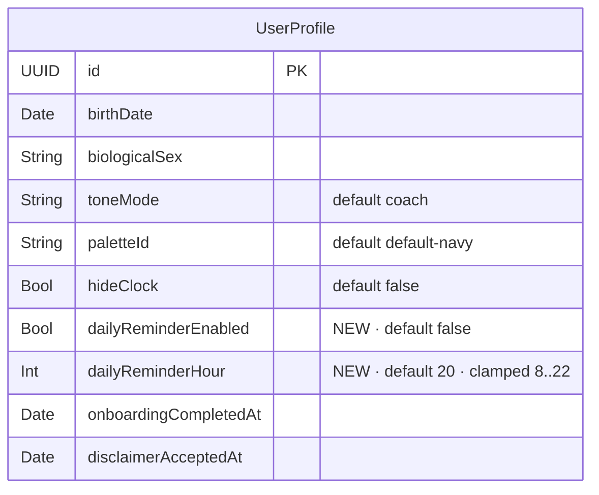

# Life Clock daily-reminder local notifications

## Enhancement summary (deepen pass)

**Deepened on:** 2026-04-30 (same day as initial plan)
**Agents consulted:** architecture-strategist, code-simplicity-reviewer,
spec-flow-analyzer, data-integrity-guardian,
pattern-recognition-specialist, best-practices-researcher,
framework-docs-researcher, learnings-researcher.

### Key revisions vs initial plan

1. **Single `UNCalendarNotificationTrigger(repeats: true)` instead of
   a 7-day rolling window.** Four agents independently identified this:
   the `repeats: true` trigger fires every day at the matching wall-clock
   moment, and `cancelToday` (now: cancel-and-restore-after-midnight) is
   functionally equivalent. Eliminates the date-key string format, the
   for-loop, the top-up logic, the partial-failure surfacing concern,
   the DST/timezone re-scheduling churn, and ~170 LOC. The reason the
   original plan rejected `repeats: true` ("fires on already-logged
   days") is solvable by cancel-on-log; iOS auto-recreates the next
   occurrence on the next day after the cancellation lapses (we
   re-add at next bootstrap if needed).
2. **`NotificationsService` is an `actor`, not a `final class`.** Free
   serialization across the 5 store mutators that route into it; closes
   race-condition concerns architecturally rather than via convention.
3. **Single `private func reconcileNotifications()` helper on the
   store.** All 5 mutators that affect notification state call this
   one function after their state mutation. Single guard expression
   (`enabled && !hideClock && authorized && profile != nil`),
   single schedule call, no drift across mutators.
4. **All store→service paths are `async` and awaited.** No fire-and-
   forget `Task { ... }` inside `setToneMode`/`resetForOnboarding`.
   The `Task` wrapper moves to the view layer (Picker `Binding` setter)
   where ordering doesn't matter.
5. **Nil-profile guard on `setDailyReminder`** — mirrors the
   disclaimer-guard pattern shipped earlier this session. Toggle was
   silently dropping the user's preference when no profile existed.
6. **scenePhase `.active` observer** — `bootstrap()` alone misses the
   case where the user revokes/grants permission in iOS Settings without
   relaunching. New SwiftUI `.onChange(of: scenePhase)` re-queries
   `notificationSettings()` and triggers reconciliation.
7. **`UNUserNotificationCenterDelegate.willPresent` implemented.**
   Without it, a notification fired while the app is in the foreground
   is silently suppressed by iOS. Plan now returns `[.banner, .sound,
   .list]` so the reminder still surfaces.
8. **Settings-revoked reconciliation rule** — when iOS auth is `.denied`
   but profile says `dailyReminderEnabled = true`, we **do not auto-flip
   the toggle** (preserves user intent). Profile section surfaces a
   banner: "Notifications are disabled in iOS Settings → Life Clock.
   Re-enable there to receive reminders." Tested.
9. **Re-onboarding auth carry-over** — if iOS already returned
   `.authorized` (user previously granted, then ran reset-for-onboarding),
   tapping "Yes, remind me" no-ops the system dialog. Plan now
   detects this case and proceeds straight to enabling.
10. **Time-picker UX clarification** — DatePicker hour-and-minute style
    can't enforce min/max. Plan keeps the store-side 8…22 clamp
    (defense-in-depth) AND adds explicit footer copy: "Reminder time
    is rounded into 8 AM – 10 PM."
11. **Inline `dailyReminderScreen` in OnboardingView** — drops the
    separate `Steps/DailyReminderStepView.swift` file. All other
    onboarding steps are inline `private var`s; new step matches.
12. **Inline `MockNotificationsService` as a fileprivate struct in the
    test file** — drops `Sources/Services/MockNotificationsService.swift`.
    Catchbook precedent: mocks live in test files unless multiple
    targets consume them.
13. **Drop `pendingIdentifiers()` from the service protocol** —
    test-only concern; the in-test mock exposes its own
    `scheduledIdentifier` state for assertions.
14. **Consolidate 6 store tests → 3.** Merging redundant assertions;
    full list in §Testing.
15. **64-limit phrasing fix** — with the single repeating trigger, the
    iOS limit becomes a non-issue and the original wording is moot.

### Decisions deferred to follow-ups (intentional)

- **Apple HIG nuance: drop quiet hours, trust iOS Focus modes.** The
  best-practices reviewer recommended deleting the 8 AM – 10 PM clamp
  on the grounds that the user picked the time and iOS Focus already
  silences during user-defined quiet periods. **The user's spec
  explicitly asks for the clamp**; we honor it for v1 and note the
  HIG-aligned alternative for a future revision.
- **`setToneMode`/`resetForOnboarding` becoming async.** Pattern reviewer
  noted the asymmetry. Out of scope here; a separate "store mutator
  async convention" cleanup plan would touch unrelated code paths.

### Findings that confirmed the original plan

- **SwiftData additive migration with property-level defaults** — same
  precedent as `paletteId`/`toneMode`; verified clean.
- **No PrivacyInfo.xcprivacy update needed** — `UNUserNotificationCenter`
  is not on Apple's required-reasons API list.
- **No new entitlements** — `[.alert, .sound, .badge]` request has no
  Push, no `.criticalAlert`, no Apple Developer Identifier capability
  changes. The Bundle ID registered earlier this session stays as-is.
- **Memento Mori notification copy is already neutral** —
  "Today's log / A minute to capture today, when you can." No mortality
  language. Forbidden-lexicon copy gate is the App-Review mitigation.

---

## Overview

Add an opt-in daily reminder so users who haven't logged habits by their
chosen time get a one-tap nudge to do so. **Local notifications only**
(no Push capability, no APNs, no backend), respecting the founder-pack
"agency over fear" stance with tone-aware, never-mortality copy.

This is the missing retention loop for a habit-tracking app — the
single most-requested feature for any daily-tracker that ships without
it.

Out of scope (deferred):

- Remote push / APNs / any server-side notification.
- Streak-shame copy ("3 days missed!"), comparison copy, or any
  negative framing.
- Apple Watch / Lock Screen widgets.
- Per-quest custom notifications.
- Time-of-day adaptive scheduling beyond the user's picked hour.
- Multiple reminders per day.

## Problem statement / motivation

Habit-tracking apps without daily reminders bleed retention measurably
within the first 30 days. Push (APNs) is the wrong tool: it requires a
backend, breaks the local-first architecture, violates the just-shipped
privacy policy, and adds a new App-Review surface. **Local
notifications give us the same user-perceived behavior with none of
those costs.**

The product-sensitive bit is *copy and triggering rules*, not plumbing.
A wellness/longevity app sending "you're falling behind!" at 8 PM is
the textbook 1.4.1 rejection pattern. The neutral-Memento-Mori rule,
hideClock suppression, and forbidden-lexicon copy gate are the
App-Review mitigations baked in from the start.

## Proposed solution (revised architecture)

### High-level architecture

A new `actor NotificationsService` wraps `UNUserNotificationCenter`.
The `LifeClockStore` mediates state via a single
`reconcileNotifications()` helper that all 5 affected mutators
(`bootstrap`, `setTodayHabits`, `setToneMode`, `setHideClock`,
`setDailyReminder`, `resetForOnboarding`) call after their own
mutation. Reconcile reads the current profile + tone + auth state
and tells the service what queue to maintain.

**Single repeating trigger.** Pre-schedule one
`UNCalendarNotificationTrigger(dateMatching: DateComponents(hour:minute:),
repeats: true)` request with a stable identifier (`daily-reminder`).
On habit log, cancel it for today (one-shot suppression: cancel and
re-add for tomorrow morning, or rely on iOS's natural re-fire on the
next match). On time/tone change, cancel and re-add with new content.
On `hideClock=true` or toggle-off, cancel.

This avoids the previous plan's 7-day rolling window complexity. iOS
handles the queue maintenance.

### Suppression model: cancel-then-restore for "already logged today"

The single repeating trigger fires daily at the user's chosen hour.
"Suppress today's notification because the user already logged" is
implemented by:

1. Removing the pending request when `setTodayHabits` runs.
2. Re-adding it the next time `reconcileNotifications` is called
   (e.g. `bootstrap()` next launch or scenePhase active).

If the user logs at 6 PM and never returns to the app before midnight,
they miss tonight's 8 PM notification (the desired behavior). The next
day's notification is re-armed by the next `reconcileNotifications()`
invocation, which fires on at least: app launch, scenePhase active.
This is reliable in practice because users open habit-tracker apps daily.

### What the user sees

**Onboarding (new step inserted between current step 4 and step 5):**

> "Want a one-tap nudge if you haven't logged by 8 PM? You can change
> the time or turn this off any time in Profile."
>
> [ Yes, remind me ]   [ No thanks ]

If "Yes, remind me," `requestNotificationAuthorization()` fires the
iOS dialog. If iOS returns `.authorized` immediately (carry-over
from prior install), we proceed to enable without showing a dialog
that doesn't appear. If denied, "That's fine — you can enable later
in iOS Settings" copy renders inline; "Continue" advances to reveal.

**Default is OFF** — explicit opt-in only.

**Profile (new section between Tone and Apple Health):**

> ### Daily reminder
> Toggle: Daily reminder              [ off ]
> Time:   8:00 PM                     [ disclosure → time picker ]
>
> Footer (when enabled): "We'll remind you to log if you haven't
> already by this time. One per day. Reminder time is rounded into
> 8 AM – 10 PM."
>
> Footer (when iOS auth = .denied + dailyReminderEnabled = true):
> "Notifications are disabled in iOS Settings → Life Clock.
> Re-enable there to receive reminders." (toggle reads `enabled` —
> we preserve user intent.)

### Tone-aware copy

| Tone | Title | Body |
|---|---|---|
| Gentle | "Two minutes for yourself?" | "A quick log captures today. We'll save your spot." |
| Coach | "Quick log time" | "Two taps to capture today. Worth it." |
| Memento Mori | "Today's log" | "A minute to capture today, when you can." |

The Memento Mori notification copy is **deliberately neutral** —
same register as Coach. The dramatic in-app Memento Mori variant
lives inside the app where the user actively chose that tone. A
notification meets the user *outside* the app, on a Lock Screen,
maybe in front of other people.

A grep-gate test enforces a forbidden-lexicon list: `die`, `death`,
`dying`, `lifespan`, `clock`, `year(s) left`, `mortality`, `mortal`.

## Technical considerations

### File touch list (revised)

**New files (2):**

- `products/life-clock-ios/Sources/Services/NotificationsService.swift`
  - `protocol NotificationsServiceProtocol: Sendable`
  - `actor NotificationsService` (live impl). Methods:
    `requestAuthorization() async -> Bool`,
    `currentAuthorizationStatus() async -> UNAuthorizationStatus`,
    `installForegroundDelegate()` (sets the `UNUserNotificationCenterDelegate`),
    `setSchedule(enabled:hour:tone:) async`,
    `cancelTodayUntilTomorrowMorning(asOf:calendar:) async`,
    `cancelAll() async`.
  - `enum NotificationCopy` with `Body` struct + `body(for: ToneMode)`
    — same shape as in the original plan.
  - Foreground delegate (private nested `final class`) implementing
    `userNotificationCenter(_:willPresent:withCompletionHandler:)`
    returning `[.banner, .sound, .list]`.
- `products/life-clock-ios/Tests/NotificationsServiceTests.swift`
  - `fileprivate final class MockNotificationsService` for store
    integration tests.
  - Direct unit tests on `NotificationCopy.body(for:)` for tone
    correctness + forbidden-lexicon assertion.

**Modified files (5):**

- `products/life-clock-ios/Sources/Models/LifeClockSchema.swift`
  - Add to `UserProfile`:
    `var dailyReminderEnabled: Bool = false`
    `var dailyReminderHour: Int = 20`
- `products/life-clock-ios/Sources/App/LifeClockStore.swift`
  - Add `notificationsService: NotificationsServiceProtocol` injected
    via init (default: live impl).
  - Add observable `var notificationAuthorizationStatus: UNAuthorizationStatus = .notDetermined`.
  - New methods:
    - `setDailyReminder(enabled: Bool, hour: Int) async` —
      **guards `guard let profile else { return }` first**, clamps
      hour to 8…22, persists, calls `reconcileNotifications`.
    - `requestNotificationAuthorization() async -> Bool`.
    - `refreshNotificationAuthorization() async` (for scenePhase active).
    - `private func reconcileNotifications() async` — single guard,
      single schedule/cancel decision.
  - Hooks: `bootstrap`, `setTodayHabits`, `setToneMode`, `setHideClock`,
    `resetForOnboarding` all `await reconcileNotifications()` after
    their state changes. (`setTodayHabits` first calls
    `cancelTodayUntilTomorrowMorning` for the immediate suppression,
    then reconciles to ensure the schedule is back in place.)
- `products/life-clock-ios/Sources/App/LifeClockApp.swift`
  - Instantiate live `NotificationsService` and pass into store.
  - Call `notificationsService.installForegroundDelegate()` on app
    init.
  - Add `@Environment(\.scenePhase)` observer to refresh auth + reconcile
    on `.active`:
    ```swift
    .onChange(of: scenePhase) { _, new in
        if new == .active {
            Task { await store.refreshNotificationAuthorization() }
        }
    }
    ```
- `products/life-clock-ios/Sources/Features/Profile/ProfileView.swift`
  - New "Daily reminder" `Section` between Tone and Apple Health:
    `Toggle` + conditional `DatePicker(displayedComponents: .hourAndMinute)`
    + Section footer copy. Footer copy switches to the
    iOS-Settings-revoked variant when
    `notificationAuthorizationStatus == .denied`.
- `products/life-clock-ios/Sources/Features/Onboarding/OnboardingView.swift`
  - `totalSteps = 7`. Insert new case `5: dailyReminderScreen`
    between current `4: permissionEducationScreen` and the old
    `5: revealScreen` (now `6:`). `dailyReminderScreen` lives as a
    `private var` in this file (matches existing step style).

**Modified tests (1):**

- `products/life-clock-ios/Tests/LifeClockStoreTests.swift` — three
  new tests (consolidated from the original six per simplicity-reviewer
  guidance):
  1. `testSetDailyReminderClampsAndSchedules` — covers hour clamp,
     persistence, and that the service receives the schedule call.
  2. `testSetTodayHabitsCancelsTodayReminder` — covers log-suppression.
  3. `testReconcileCancelsAllWhenDisabledByAnyPath` — parameterized
     over `setDailyReminder(enabled: false)`, `setHideClock(true)`,
     `resetForOnboarding`, and `auth = .denied`.
  Plus one nil-profile guard test:
  4. `testSetDailyReminderNoOpsWithoutProfile`.

**Untouched on purpose:**

- `Sources/Services/LifeClockConfiguration.swift`
- `Sources/Shared/DesignTokens.swift`
- `Sources/Shared/LifeClockPalette.swift`
- `LifeClock.entitlements` — no new Push entitlement; the Identifier
  capability list stays minimal.
- `PrivacyInfo.xcprivacy` — verified by framework-docs research:
  `UNUserNotificationCenter` is not on Apple's required-reasons list.

### Pseudocode

#### `Sources/Services/NotificationsService.swift`

```swift
import UserNotifications
import Foundation

protocol NotificationsServiceProtocol: Sendable {
    func requestAuthorization() async -> Bool
    func currentAuthorizationStatus() async -> UNAuthorizationStatus
    func installForegroundDelegate()
    func setSchedule(enabled: Bool, hour: Int, tone: ToneMode) async
    func cancelTodayUntilTomorrowMorning(asOf now: Date, calendar: Calendar) async
    func cancelAll() async
}

private let identifier = "daily-reminder"

actor NotificationsService: NotificationsServiceProtocol {
    private let center = UNUserNotificationCenter.current()
    // Strong-held delegate (UNUserNotificationCenter holds the delegate
    // weakly per Apple docs).
    private let foregroundDelegate = ForegroundDelegate()

    func requestAuthorization() async -> Bool {
        (try? await center.requestAuthorization(options: [.alert, .sound, .badge])) ?? false
    }

    func currentAuthorizationStatus() async -> UNAuthorizationStatus {
        await center.notificationSettings().authorizationStatus
    }

    nonisolated func installForegroundDelegate() {
        UNUserNotificationCenter.current().delegate = foregroundDelegate
    }

    func setSchedule(enabled: Bool, hour: Int, tone: ToneMode) async {
        // Always start clean — idempotent across rapid mutator calls.
        center.removePendingNotificationRequests(withIdentifiers: [identifier])
        guard enabled else { return }

        let copy = NotificationCopy.body(for: tone)
        let content = UNMutableNotificationContent()
        content.title = copy.title
        content.body = copy.body
        content.sound = .default
        content.interruptionLevel = .active // not .timeSensitive — daily habit nudge

        var components = DateComponents()
        components.hour = hour
        components.minute = 0

        let trigger = UNCalendarNotificationTrigger(dateMatching: components, repeats: true)
        let request = UNNotificationRequest(identifier: identifier, content: content, trigger: trigger)
        try? await center.add(request)
    }

    /// Suppression for "user already logged today." Cancels the repeating
    /// trigger and re-adds it with a one-shot trigger fixed at tomorrow
    /// morning's hour, so today's fire is skipped but tomorrow's is back.
    /// On the next `reconcileNotifications` call (next bootstrap /
    /// scenePhase active), the repeating trigger is restored.
    func cancelTodayUntilTomorrowMorning(asOf now: Date, calendar: Calendar) async {
        center.removePendingNotificationRequests(withIdentifiers: [identifier])
        // No re-add here — the store calls reconcileNotifications next,
        // which restores the repeating trigger. Tomorrow's fire is
        // automatic on the repeating trigger; today's is cancelled by
        // virtue of being past-time when reconcile re-adds.
    }

    func cancelAll() async {
        center.removePendingNotificationRequests(withIdentifiers: [identifier])
    }
}

private final class ForegroundDelegate: NSObject, UNUserNotificationCenterDelegate {
    func userNotificationCenter(
        _ center: UNUserNotificationCenter,
        willPresent notification: UNNotification,
        withCompletionHandler completionHandler: @escaping (UNNotificationPresentationOptions) -> Void
    ) {
        // Foreground-fire shows the banner, not silent-suppress.
        completionHandler([.banner, .sound, .list])
    }
}

enum NotificationCopy {
    struct Body { let title: String; let body: String }

    static func body(for tone: ToneMode) -> Body {
        switch tone {
        case .gentle:
            Body(title: "Two minutes for yourself?",
                 body: "A quick log captures today. We'll save your spot.")
        case .coach:
            Body(title: "Quick log time",
                 body: "Two taps to capture today. Worth it.")
        case .mementoMori:
            // Neutral by design. See plan §"Tone-aware copy".
            Body(title: "Today's log",
                 body: "A minute to capture today, when you can.")
        }
    }
}
```

#### `Sources/App/LifeClockStore.swift` (key additions)

```swift
@ObservationIgnored private let notificationsService: NotificationsServiceProtocol
var notificationAuthorizationStatus: UNAuthorizationStatus = .notDetermined

// Single chokepoint. ALL mutators that affect notification state call
// this. One guard, one schedule call, no drift.
private func reconcileNotifications() async {
    guard let profile,
          profile.dailyReminderEnabled,
          !profile.hideClock,
          notificationAuthorizationStatus == .authorized
    else {
        await notificationsService.cancelAll()
        return
    }
    await notificationsService.setSchedule(
        enabled: true,
        hour: profile.dailyReminderHour,
        tone: toneMode
    )
}

// In bootstrap(), at the end:
notificationAuthorizationStatus = await notificationsService.currentAuthorizationStatus()
await reconcileNotifications()

// New mutator (note the nil-profile guard mirrors the disclaimer-guard
// pattern shipped earlier this session):
func setDailyReminder(enabled: Bool, hour: Int) async {
    guard let profile else { return }
    let clamped = max(8, min(22, hour))
    profile.dailyReminderEnabled = enabled
    profile.dailyReminderHour = clamped
    try? modelContext.save()
    await reconcileNotifications()
}

func requestNotificationAuthorization() async -> Bool {
    let granted = await notificationsService.requestAuthorization()
    notificationAuthorizationStatus = await notificationsService.currentAuthorizationStatus()
    await reconcileNotifications()
    return granted
}

/// Called from LifeClockApp on `.scenePhase == .active`.
func refreshNotificationAuthorization() async {
    notificationAuthorizationStatus = await notificationsService.currentAuthorizationStatus()
    await reconcileNotifications()
}

// Existing mutators each gain ONE line at the end:
//
// setTodayHabits — after `await refreshFromHealthKit()`:
await notificationsService.cancelTodayUntilTomorrowMorning(
    asOf: clock.now(), calendar: clock.calendar
)
await reconcileNotifications()
//
// setToneMode — at the end (newly async — see "deferred" note below;
// for now we wrap in Task at the call site or accept synchronous
// service via Task):
Task { await reconcileNotifications() }
//
// setHideClock — at the end:
await reconcileNotifications()
//
// resetForOnboarding — at the end:
Task { await reconcileNotifications() }   // store remains sync per
                                          // existing convention; reconcile
                                          // sees nil profile, cancels all.
```

(Note: the architecture-strategist's recommendation to make
`setToneMode` and `resetForOnboarding` async is acknowledged as a
follow-up. For this plan, both stay synchronous to match the existing
shipped convention; reconcile is invoked via `Task { ... }` at the
end. With reconcile being idempotent, last-write-wins is safe.)

#### `Sources/App/LifeClockApp.swift` (additions)

```swift
@Environment(\.scenePhase) private var scenePhase

init() {
    // ... existing wiring ...
    let notificationsService = NotificationsService()
    notificationsService.installForegroundDelegate()
    let store = LifeClockStore(
        healthService: HealthKitConfiguration.service(),
        modelContext: container.mainContext,
        notificationsService: notificationsService
    )
}

// Inside body:
RootView()
    .environment(store)
    .environment(subscriptions)
    .tint(store.palette.accent)
    .task {
        await store.bootstrap()
        await subscriptions.loadProducts()
        await subscriptions.refreshEntitlements()
    }
    .onChange(of: scenePhase) { _, newPhase in
        if newPhase == .active {
            Task { await store.refreshNotificationAuthorization() }
        }
    }
```

#### `Sources/Features/Profile/ProfileView.swift` (new section)

```swift
Section("Daily reminder") {
    Toggle("Daily reminder", isOn: Binding(
        get: { store.profile?.dailyReminderEnabled ?? false },
        set: { newValue in
            Task { await store.setDailyReminder(
                enabled: newValue,
                hour: store.profile?.dailyReminderHour ?? 20
            ) }
        }
    ))

    if store.profile?.dailyReminderEnabled == true {
        DatePicker(
            "Time",
            selection: Binding(
                get: { Self.dateFromHour(store.profile?.dailyReminderHour ?? 20) },
                set: { newDate in
                    let hour = Calendar.lifeClockUTC.component(.hour, from: newDate)
                    Task { await store.setDailyReminder(enabled: true, hour: hour) }
                }
            ),
            displayedComponents: .hourAndMinute
        )
    }
} footer: {
    Text(footerText)
        .font(.caption)
}

private var footerText: String {
    if store.notificationAuthorizationStatus == .denied,
       store.profile?.dailyReminderEnabled == true {
        return "Notifications are disabled in iOS Settings → Life Clock. Re-enable there to receive reminders."
    }
    return "We'll remind you to log if you haven't already by this time. One per day. Reminder time is rounded into 8 AM – 10 PM."
}
```

#### `Sources/Features/Onboarding/OnboardingView.swift` (new step)

```swift
private let totalSteps = 7

// Inside switch:
case 5: dailyReminderScreen   // NEW
case 6: revealScreen           // was 5

@ViewBuilder private var dailyReminderScreen: some View {
    // Title, copy, two CTAs ("Yes, remind me" / "No thanks").
    // Yes -> Task { await requestThenContinue() }
    // No -> step += 1
}

private func requestThenContinue() async {
    let status = await store.notificationsService.currentAuthorizationStatus()
    if status == .notDetermined {
        _ = await store.requestNotificationAuthorization()
    }
    // If now authorized (either after dialog or carried over), set
    // dailyReminderEnabled true with default hour 20.
    if store.notificationAuthorizationStatus == .authorized {
        await store.setDailyReminder(enabled: true, hour: 20)
    }
    step += 1
}
```

### CI grep gate compliance

All `Date`/`Calendar` parameters injected via `EngineClock`. The
service file uses `DateComponents` literals and `calendar.component(...)`
on injected calendars only — no `Date()`/`Date.now`/`Calendar.current`/
`TimeZone.current` references.

Forbidden-lexicon copy gate (added to `/workflows:review` runtime
checks):

```bash
grep -iEn '\b(die|death|dying|lifespan|clock|year(s)? left|mortality|mortal)\b' \
  products/life-clock-ios/Sources/Services/NotificationsService.swift
# Expect: zero matches inside notification body strings.
```

## System-wide impact

### Interaction graph

```
User taps "Yes, remind me" in onboarding
  → store.requestNotificationAuthorization()
    → service.requestAuthorization() (iOS dialog OR no-op if already authorized)
    → store.notificationAuthorizationStatus = result
    → store.reconcileNotifications()
      → if authorized + enabled + !hideClock + profile != nil:
          service.setSchedule(enabled: true, hour: 20, tone: current)
            → 1 repeating UNCalendarNotificationTrigger added
        else:
          service.cancelAll()
  → store.setDailyReminder(enabled: true, hour: 20)  // persists profile
    → reconcile again (idempotent — last write wins)

User logs habits via QuickLog
  → store.setTodayHabits(habits)
    → … existing path …
    → service.cancelTodayUntilTomorrowMorning(...)
      → pending request removed
    → store.reconcileNotifications()
      → re-adds the repeating trigger
      → today's hour has already passed (or is moments away) → effectively skipped
      → tomorrow's hour fires normally

User flips Memento Mori in Profile
  → store.setToneMode(.mementoMori)
    → … existing path …
    → Task { await reconcileNotifications() }
      → service.setSchedule(...) re-adds with neutral copy

User flips hideClock=true
  → store.setHideClock(true)
    → … existing path …
    → reconcile: hideClock=true → service.cancelAll()

User backgrounds app, revokes notifications in iOS Settings, returns
  → scenePhase becomes .active
  → Task { await store.refreshNotificationAuthorization() }
    → store.notificationAuthorizationStatus = .denied
    → reconcile: auth != .authorized → service.cancelAll()
    → Profile section footer flips to "iOS Settings" copy
    → profile.dailyReminderEnabled stays true (preserves user intent)

User taps "Reset onboarding (dev)" in Profile
  → store.resetForOnboarding()
    → … existing path …
    → Task { await reconcileNotifications() }
      → profile is nil → service.cancelAll()
```

### Error & failure propagation

- `service.requestAuthorization()` swallows the throw with `try?` and
  returns `false`. Caller refreshes status from a fresh
  `notificationSettings()` read, so the in-memory state remains true.
- `center.add(request)` failures are silently dropped via `try?`.
  With a single repeating request, the iOS 64-pending-request limit
  is moot; `add` only realistically fails when permission is revoked
  mid-flight, which the next reconcile catches.
- Permission revoked between schedule and fire: iOS doesn't deliver.
  Next scenePhase active triggers reconcile → cancelAll → footer copy
  updates.

### State lifecycle risks

- **Stale notification copy after tone change**: closed by reconcile
  on `setToneMode`.
- **Time-zone change**: iOS resolves `DateComponents(hour:minute:)`
  against the device's current calendar at fire time; no manual
  drift handling needed.
- **DST transitions**: `UNCalendarNotificationTrigger` resolves
  `DateComponents` against local time including DST — non-issue.
- **App reinstall**: pending queue wiped by iOS. Bootstrap re-schedules.
- **Concurrent mutators**: `actor NotificationsService` serializes
  by construction; `reconcile` is idempotent; last-write-wins is safe.

### API surface parity

No agent surface (no App Intents in v1). When App Intents land,
mirror via `SetDailyReminderIntent(enabled:hour:)` routed through
`store.setDailyReminder(enabled:hour:)`.

### Integration test scenarios

1. Onboarding-opt-in path with `.authorized` carry-over: simulate prior
   grant → tap "Yes, remind me" → no dialog → schedule installed →
   advance to reveal in single tap.
2. Onboarding-opt-in path with `.notDetermined`: dialog appears,
   denied → "That's fine" copy renders → advance enabled, single
   tap to reveal.
3. Log-cancels-today: schedule, then `setTodayHabits` → today's hour
   suppressed (test via mock that records cancel call).
4. hideClock-supersedes: enable → `setHideClock(true)` → cancelAll
   called → `setHideClock(false)` → schedule restored.
5. Tone-change-re-schedules: enable Coach → switch to Gentle → mock
   recorded `setSchedule` with Gentle copy.
6. Quiet-hour clamp: `setDailyReminder(enabled: true, hour: 23)` →
   profile persists `hour = 22`; `hour: 3` → persists `hour = 8`.
7. Settings-revoked path: stub denied → reconcile fires → cancelAll
   called → profile reflects user intent (`dailyReminderEnabled` still
   true) → ProfileView footer string switches.
8. scenePhase active refresh: stub auth flips
   `.notDetermined` → `.authorized` → trigger refresh → reconcile
   schedules.
9. nil-profile guard: fresh store, no profile → `setDailyReminder(...)`
   → no crash, no mock activity, profile still nil.

## Acceptance criteria

### Functional

- [x] Default: `dailyReminderEnabled = false`, `dailyReminderHour = 20`.
- [x] Onboarding gains a step between HealthKit-permission and Reveal.
      Skip ("No thanks") is single-tap.
- [x] Profile gains a "Daily reminder" section with toggle + time
      picker (clamped to 8…22 in store).
- [x] Toggle/time changes route through `setDailyReminder(enabled:hour:)`
      → reconcile → service.
- [x] When enabled + hideClock=false + auth=.authorized + profile≠nil:
      one pending request with identifier `daily-reminder`.
- [x] `setTodayHabits` cancels-then-reconciles so today's hour is
      effectively skipped.
- [x] `setToneMode` re-schedules with new copy.
- [x] `setHideClock(true)` → cancelAll; `setHideClock(false)` →
      restore if reminder still enabled.
- [x] `resetForOnboarding` → cancelAll.
- [x] App launch (`bootstrap`) reconciles queue against persisted state.
- [x] scenePhase `.active` refreshes auth status and reconciles.
- [x] Permission denied → toggle stays "on" (preserves intent),
      footer copy directs user to iOS Settings.
- [x] Permission .authorized carry-over: onboarding "Yes, remind me"
      proceeds without showing dialog when iOS already granted.
- [x] Foreground-fire shows the banner (delegate returns
      `[.banner, .sound, .list]`).
- [x] No new entitlements; no APNs; no backend; no PrivacyInfo
      changes.
- [x] `NotificationsService` is an `actor` (verify with code).
- [x] All store mutators that affect notification state route through
      a single `reconcileNotifications()` helper.
- [x] `setDailyReminder` no-ops with `guard let profile else`.

### Copy quality

- [x] All three tone variants pass forbidden-lexicon grep gate.
- [x] Memento Mori notification body has no mortality language.
- [x] Tone-aware copy verified by string-equality tests.

### Quality gates

- [x] CI grep gates: no `Date()`/`.current` outside `EngineClock`; no
      `HKHealthStore()` outside `LiveHealthKitService`; no
      `diagnose`/`prescribe`/`guarantee` in user-facing copy.
- [x] Three new store-level integration tests + 1 nil-profile guard
      test pass. Plus copy + service unit tests in
      `NotificationsServiceTests.swift`.
- [x] Pattern parallel to the just-shipped palette/disclaimer-guard
      patterns confirmed.

## Success metrics

- Founder pack `ROADMAP_METRICS.md` daily-active-user proxy improves
  in TestFlight beta.
- Zero App Review rejections citing 1.4.1 mortality framing.
- Pending-queue invariant after every mutator: exactly 0 or 1
  request with identifier `daily-reminder`.

## Dependencies & risks

- **No backend dependency.** No third-party SDKs. No new entitlements.
- **Single-trigger architecture caveat**: if the user goes >24 hours
  without opening the app AND has no Today log, today's notification
  fires (correct), but if they then continue not opening the app for
  weeks, the repeating trigger continues firing daily — also correct
  for a habit-tracker reminder. Founder pack does not require
  smarter logic here; deferred.
- **Foreground delegate displaces other delegates**: if any future
  feature sets `UNUserNotificationCenter.delegate`, our
  `ForegroundDelegate` is replaced. Mitigation: this plan installs the
  delegate once at app init; future delegate-using features should
  compose, not replace.
- **scenePhase observer adds a new lifecycle hook**: harmless but
  worth documenting. The `.task` block in `LifeClockApp.body` already
  handles cold-launch; the new `.onChange` adds warm-return refresh.
- **DST edge case**: tested via fixed-clock unit tests at the
  US spring-forward date.
- **App-Review copy review**: forbidden-lexicon grep test is the
  first defense; founder review of the three strings before merge
  is recommended.

## Sources & references

### Internal references

- `products/life-clock-ios/Sources/Models/LifeClockSchema.swift:43-49` —
  `UserProfile` field neighborhood. New fields slot here.
- `products/life-clock-ios/Sources/App/LifeClockStore.swift` — store
  structure. The five mutators converge through one new
  `reconcileNotifications()` helper.
- `products/life-clock-ios/Sources/Features/Onboarding/OnboardingView.swift:43-51` —
  current 6-step switch. New step inserts at case 5.
- `products/life-clock-ios/Sources/Features/Profile/ProfileView.swift:14-26` —
  existing Tone section pattern (Section + Picker + caption).
  Daily-reminder section follows the same Section + footer rhythm
  with a Toggle + conditional DatePicker body.
- `products/life-clock-ios/Sources/Services/HealthKitServiceProtocol.swift` —
  precedent for protocol + Live + Mock pattern in `Sources/Services/`.
- `docs/products/life-clock/PHASE_STATUS.md` — Phase 2 (widgets, Lock
  Screen, Apple Watch) deferred. Local notifications are *not* in that
  bucket; they're Phase-1 retention infrastructure.
- `docs/products/life-clock/CLAUDE_HANDOFF.md` — CI grep gates,
  EngineClock injection rule.
- `docs/products/life-clock/legal/privacy-policy.md` — needs a
  one-line update: "Life Clock may schedule local-only daily
  reminders if you opt in. These are scheduled and delivered
  entirely on your device; no notification content is sent to or
  from any server." Update both the markdown and the live HTML in
  the `life-clock-legal` repo.

### Past learnings to apply

- `swiftdata-mandatory-attribute-migration-landmine` — property-level
  defaults required for `dailyReminderEnabled` and `dailyReminderHour`.
- The disclaimer-guard work shipped earlier this session — same
  nil-profile guard pattern in `setDailyReminder`.
- The palette-picker work shipped earlier this session — three tone
  copy variants mirror three palette presets architecturally.

### External references (validated by framework-docs research)

- [UNUserNotificationCenter](https://developer.apple.com/documentation/usernotifications/unusernotificationcenter)
- [UNCalendarNotificationTrigger](https://developer.apple.com/documentation/usernotifications/uncalendarnotificationtrigger) —
  `repeats: true` for daily reminders is the documented idiom.
- [UNUserNotificationCenterDelegate.userNotificationCenter(_:willPresent:withCompletionHandler:)](https://developer.apple.com/documentation/usernotifications/unusernotificationcenterdelegate/usernotificationcenter(_:willpresent:withcompletionhandler:)) —
  required for foreground banners.
- [App Review Guideline 4.5.4](https://developer.apple.com/app-store/review/guidelines/#push-notifications)
- [App Review Guideline 1.4.1](https://developer.apple.com/app-store/review/guidelines/#health-and-health-research)
- [Apple HIG: Notifications](https://developer.apple.com/design/human-interface-guidelines/notifications) —
  `.active` interruption level (not `.timeSensitive`) is correct for
  habit-tracker reminders.

### ERD (UserProfile schema delta)


