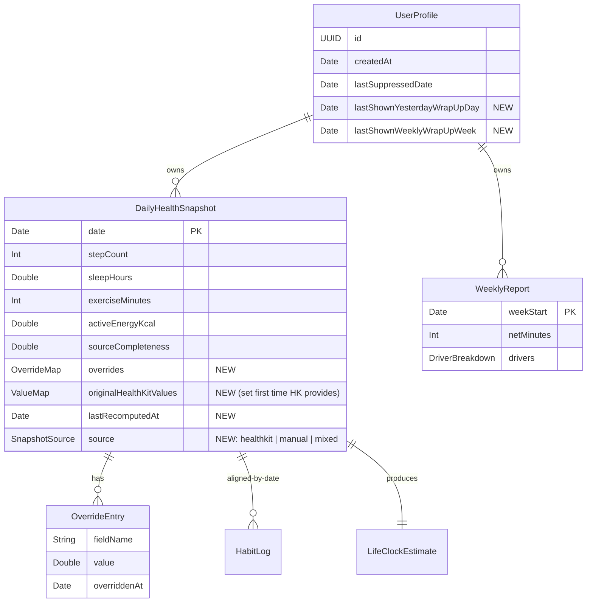

# History Tab, Daily/Weekly Wrap-Ups, and HealthKit Overrides

## Enhancement Summary

**Deepened on:** 2026-04-30
**Sections enhanced:** all
**Research agents used:** framework-docs-researcher, best-practices-researcher, architecture-strategist, performance-oracle, code-simplicity-reviewer, data-integrity-guardian

### Key improvements applied
1. **HealthKit import**: switch from per-day chunking to a single `HKStatisticsCollectionQuery` per metric → 4 queries instead of ~364.
2. **SwiftData V2 field types tightened**: `Date? = nil` (not sentinel) for new `UserProfile` dates; `overrides`/`originalHealthKitValues` stored as `Data = Data()` (encoded), not Swift dictionaries; `source: String = "healthkit"` (not Swift enum).
3. **Atomicity**: `OverrideService.applyOverride` builds the new `LifeClockEstimate` in memory, then mutates snapshot + inserts estimate + sets `lastRecomputedAt` in a single `context.save()`; `rollback()` on throw.
4. **`SnapshotPersister.upsert` is override-aware**: HK refresh writes field-by-field, skipping overridden fields — prevents background-refresh from clobbering corrections.
5. **`EngineClock.live` recomputes calendar/timezone per access** (not at instance creation) — fixes mid-flight timezone bug.
6. **`WrapUpCoordinator` takes DTOs + explicit `now: Date`** — keeps it pure, doesn't leak SwiftData `@Model` types into decision logic; placed in `Sources/Engines/`.
7. **Reinstall guard**: gate on `profile.createdAt + 1 logical day`, not a wallclock 24h window.
8. **Animation primitives**: `withAnimation` + `.rotationEffect`; `@Environment(\.accessibilityReduceMotion)` for the SwiftUI-native fallback; no `TimelineView`/`Canvas` for V1.
9. **Cache simplification**: drop `(dayKey, overrideHash)` key; invalidate by row-change publisher; bounded `NSCache` (count limit 14) instead of unbounded dict.
10. **Phase rollout safety**: split Phase 1 into 1a (start writing V1 rows) and 1b (V2 schema + new fields), each independently revertable.
11. **UX**: `.sheet` with `.presentationDetents([.medium, .large])` + drag indicator; "Adjusted" affordance via `Label(_:systemImage:"pencil.circle.fill")`; background (not modal) historical import with skeleton rows that resolve as data lands.
12. **Foreground refresh short-circuit**: skip HK fetch when today's snapshot age < 300s.

### New considerations discovered
- `cloudKitDatabase: .none` can be silently overridden by a stray `ModelConfiguration` elsewhere — add DEBUG-only runtime assertion.
- `NSCalendarDayChanged` only fires once on multi-day wake — handler must always recompute "today" via `EngineClock`, not assume "yesterday = day before last fire."
- Pure lightweight migration is sufficient — every new field has a property-level default; do not reach for `MigrationStage.custom`.
- `Transaction.updates` listener should be `Task.detached` with stored handle for `.cancel()` on deinit; re-hydrate from `currentEntitlements` on `scenePhase == .active` to catch out-of-band downgrades.

### Tradeoff flagged for human review
The simplicity reviewer recommended cutting `WrapUpCoordinator`, `SnapshotPersister`, `originalHealthKitValues`, the wrap-up cache, the `AppTab.weekly` alias, and merging Phase 3 into Phase 2. The architecture and data-integrity reviewers both keep these as separate concerns for testability and revert semantics. **Resolution chosen**: keep `WrapUpCoordinator` and `OverrideService` as small isolated units (decision logic and atomicity are non-trivial); inline `SnapshotPersister` as a free function on `LifeClockStore` (single caller, no reuse); cut the wrap-up cache entirely (recompute is cheap); cut the `AppTab.weekly` alias (pre-TestFlight, no external callers); keep `originalHealthKitValues` for revert semantics; keep Phase 3 separate so animation can be polished after the gating UX is verified.

## Overview

Evolve the existing **`Weekly`** tab into a permanent **`History`** surface that hosts:

1. A lightweight **Yesterday Wrap-Up** presented on first open of a new day when prior-day data exists.
2. A **Weekly Wrap-Up** (existing functionality) that now also lives inside History and can be revisited.
3. A **Pro-gated 90-day historical browser** with day/week drilldowns.
4. **App-level overrides** that let Pro users correct HealthKit-derived values without modifying Apple Health.

The wrap-up moments share a single ceremonial UI primitive: a **clock-hand animation** from 12:00 to the signed minute change for the period (clockwise positive, counterclockwise negative). This is the first animation investment in the codebase and the brand motion that turns a number into the score.

(see brainstorm: [docs/brainstorms/2026-04-30-history-wrapups-brainstorm.md](docs/brainstorms/2026-04-30-history-wrapups-brainstorm.md))

## Problem Statement

Today, reflection moments in Life Clock are scattered or missing:

- The `Weekly` tab is useful only once a week and has no archive.
- There is **no Yesterday Wrap-Up surface in code** — `TodayView` shows current-day delta, but no prior-day reflection exists ([Sources/Features/Today/TodayView.swift](products/life-clock-ios/Sources/Features/Today/TodayView.swift)).
- HealthKit's read-only nature (and platform-trust concerns) means users have no way to correct obviously wrong inputs (e.g. a forgotten phone causing zero steps), making the Life Clock score feel arbitrary on bad data days.
- `MONETIZATION.md:106-110` already specifies a Pro story around "browsing depth and correction power" with no implementation behind it.
- `PHASE_STATUS.md:54-55` flags both wrap-ups and the first animation investment as recommended pre-TestFlight work.

Evolving Weekly into History gives wrap-ups a long-term home, makes the tab valuable every day, gives the Pro tier a meaningful and emotionally relevant value distinction, and seeds the brand's first piece of motion design.

## Proposed Solution

A **single integrated slice** that ships in three sequential phases — schema and engine first, then UI and gating, then animation polish — but lands in one PR train so the feature is internally consistent at merge.

### High-level shape

- **Tab rename**: `AppTab.weekly` → `AppTab.history`, title `"History"`, icon `clock.arrow.circlepath`. Old enum case kept as a one-release alias if tests reference it.
- **`WrapUpCoordinator`**: new platform-thin object owned by `LifeClockStore` that decides when a wrap-up should be presented. Pure decision logic; no UI; takes injected `EngineClock`.
- **`DailyHealthSnapshot` persistence**: start actually writing snapshots to SwiftData (currently the schema exists but is never written — every read goes back to HealthKit). This unlocks deterministic wrap-ups across launches and gives overrides a place to live.
- **V2 schema (`LifeClockSchemaV2`)**: extend `DailyHealthSnapshot` with `overrides`, `originalHealthKitValues`, `lastRecomputedAt`. Add `lastShownYesterdayWrapUpDay` and `lastShownWeeklyWrapUpWeek` to `UserProfile`. Property-level defaults required to avoid the documented SwiftData migration landmine (see `docs/solutions/integration-issues/swiftdata-mandatory-attribute-migration-landmine.md`).
- **`HistoryView`**: replaces `WeeklyReportView`. Sectioned list (this week → last week → … 90 days). Free users see Yesterday + current week preview; older rows blurred with paywall CTA.
- **Wrap-up sheet**: minimalist clock-face with hand animation, signed delta, tone-aware copy; reduce-motion variant cross-fades.
- **Override editor**: bottom sheet from a per-day detail view (Pro only). Validates input, writes override, recomputes that day's score, invalidates wrap-up cache for that day.
- **90-day import**: lazy/on-demand for Pro on first History tab visit; chunked, idempotent, resumable.

## Technical Approach

### Architecture

```
                 ┌────────────────────────────────┐
                 │    SubscriptionStore (existing) │
                 │      isPro: Bool (StoreKit 2)   │
                 └──────────────┬──────────────────┘
                                │ observed
                                ▼
┌──────────────┐  bootstrap() ┌──────────────────────┐  shows  ┌──────────────────┐
│ LifeClockApp │─────────────▶│   LifeClockStore     │────────▶│   WrapUpSheet    │
│   .scenePhase│              │  - WrapUpCoordinator │         │  (clock anim)    │
└──────────────┘              │  - SnapshotPersister │         └──────────────────┘
                              │  - OverrideService   │
                              └──────────┬───────────┘
                                         │ reads/writes
                                         ▼
                              ┌──────────────────────┐         ┌──────────────────┐
                              │   SwiftData (V2)     │◀────────│  HistoryView      │
                              │  DailyHealthSnapshot │         │  - DayDetailView  │
                              │  WeeklyReport        │         │  - OverrideSheet  │
                              │  UserProfile (+keys) │         └──────────────────┘
                              └──────────┬───────────┘
                                         │
                                         ▼
                              ┌──────────────────────┐
                              │ ClockEngine (pure)   │
                              │  - calculateDayWrapup│  ◀── NEW
                              │  - calculateDailyDelta│
                              │  - calculateWeeklyTrend│
                              └──────────────────────┘
```

All time math stays pinned to `EngineClock` (CI grep gates `Date()`/`Calendar.current` outside [Sources/Engines/EngineClock.swift](products/life-clock-ios/Sources/Engines/EngineClock.swift)).

### Data model (Mermaid ERD)



### Implementation Phases

#### Phase 1 — Foundation (schema, persistence, day-change)

**Tasks:**

1. **Bump schema to `LifeClockSchemaV2`** in [Sources/Models/LifeClockSchema.swift](products/life-clock-ios/Sources/Models/LifeClockSchema.swift). Add `overrides`, `originalHealthKitValues`, `lastRecomputedAt`, `source` to `DailyHealthSnapshot`; `lastShownYesterdayWrapUpDay`, `lastShownWeeklyWrapUpWeek` to `UserProfile`. Every new non-optional property gets a property-level default (the SwiftData landmine).
2. **Create `LifeClockMigrationPlan` V1→V2 stage** with snapshot-test fixture (open V1 store → migrate → assert defaults).
3. **Create `SnapshotPersister`** ([Sources/Services/SnapshotPersister.swift](products/life-clock-ios/Sources/Services/SnapshotPersister.swift)) that upserts a `DailyHealthSnapshot` keyed by `dayKey` after each `LiveHealthKitService.dailySnapshot(for:)` call. Idempotent, takes a `ModelContext`. Wire into `LifeClockStore.refreshFromHealthKit()` ([Sources/App/LifeClockStore.swift:109-142](products/life-clock-ios/Sources/App/LifeClockStore.swift)).
4. **Create `EngineDayKey`** helper on `EngineClock` so "logical day" is computed in one place; honor `Calendar.current.firstWeekday` and `TimeZone.current` via the injected clock.
5. **Create `WrapUpCoordinator`** ([Sources/Services/WrapUpCoordinator.swift](products/life-clock-ios/Sources/Services/WrapUpCoordinator.swift)) — pure decision object. API:
   ```swift
   func pendingWrapUp(profile: UserProfile, snapshots: [DailyHealthSnapshot], weeks: [WeeklyReport]) -> PendingWrapUp?
   ```
   Returns one of `.yesterday(snapshot)`, `.weekly(report)`, or `nil`. Yesterday has precedence; only one wrap-up per app open.
6. **Day-change handling**: subscribe to `UIApplication.significantTimeChangeNotification` and `NSCalendarDayChanged`, plus a foreground timer that fires at next `Calendar.startOfDay(for:)`. Always recompute via `EngineClock`.
7. **Fix the `weekly` regression**: `LifeClockStore.swift:139` currently passes `habits: []` to `calculateWeeklyTrend`. Change to actual habit logs and add a regression test.
8. **Schema test**: assert `cloudKitDatabase: .none` for the V2 container (HK-derived data must never sync per `CLAUDE_HANDOFF.md:43-44`).

**Deliverables:**
- `Sources/Models/LifeClockSchema.swift` (V2 + migration plan)
- `Sources/Services/SnapshotPersister.swift` (new)
- `Sources/Services/WrapUpCoordinator.swift` (new)
- `Sources/Engines/EngineClock.swift` (add `dayKey` helper)
- `Tests/Models/SchemaMigrationV1ToV2Tests.swift` (new)
- `Tests/Services/WrapUpCoordinatorTests.swift` (new)
- `Tests/Services/SnapshotPersisterTests.swift` (new)
- `Tests/Engines/ClockEngineWeeklyHabitsRegressionTests.swift` (new)

**Success criteria:** All tests green; V2 store opens cleanly on a V1 fixture with zero existing snapshot rows; coordinator returns nil on first install, returns `.yesterday` on day 2 with data, returns nil on second open same day.

**Estimated effort:** 1.5 days.

#### Phase 2 — UI, gating, override editor

**Tasks:**

1. **Rename tab**: `AppTab.weekly` → `AppTab.history` in [Sources/App/AppTab.swift](products/life-clock-ios/Sources/App/AppTab.swift); update `LifeClockApp.swift:103-105`. Keep `static let weekly = AppTab.history` alias for one release. Add `tab.history.title` localized string. Update accessibility identifier.
2. **`HistoryView`** ([Sources/Features/History/HistoryView.swift](products/life-clock-ios/Sources/Features/History/HistoryView.swift)): replaces `WeeklyReportView`. Sectioned list — "Yesterday", "This Week", "Last Week", older weeks (collapsible). NavigationStack with day-detail and week-detail destinations.
3. **Free vs Pro gating** inside `HistoryView`:
   - Free: Yesterday card (full), This Week summary card (no per-day drilldown), older rows visually blurred with `.blur(radius: 6)` + paywall CTA tap target.
   - Pro: full drilldown, per-day tap → `DayDetailView`.
4. **`DayDetailView`** ([Sources/Features/History/DayDetailView.swift](products/life-clock-ios/Sources/Features/History/DayDetailView.swift)): metric rows (steps, sleep, exercise, active energy). Each row shows current value; if an override exists, displays an `Adjusted` chip whose tap reveals the original HealthKit value and a Revert button. Pro-only.
5. **`OverrideSheet`** ([Sources/Features/History/OverrideSheet.swift](products/life-clock-ios/Sources/Features/History/OverrideSheet.swift)): bottom sheet, single field, validated input (e.g. 0-100k steps; 0-24h sleep). Save → `OverrideService.applyOverride(field:value:date:)` writes to SwiftData and triggers recompute.
6. **`OverrideService`** ([Sources/Services/OverrideService.swift](products/life-clock-ios/Sources/Services/OverrideService.swift)): owns override CRUD + invalidation. On save: persist override, set `originalHealthKitValues[field]` if first time, call `ClockEngine.calculateDailyDelta` for that day, persist new `LifeClockEstimate`, invalidate wrap-up cache for `dayKey`.
7. **Pro-downgrade behavior**: overrides remain stored but engine ignores them while `!isPro` (read-time gate, not delete). One-time banner: "Your adjustments are paused."
8. **90-day import**: triggered lazily on first History tab open for Pro user. Chunked by week (13 weeks). Per-day status surfaced in UI; cancellable; idempotent on retry.
9. **Paywall trigger sites**: tap on blurred History row, tap "Adjust" while free. Reuse `PaywallSheet` from [Sources/Features/Paywall/PaywallSheet.swift](products/life-clock-ios/Sources/Features/Paywall/PaywallSheet.swift).
10. **Tone-aware copy**: every wrap-up string, "Adjusted" affordance, paused-banner copy must have `gentle` and `coach` variants in [Sources/App/ToneMode.swift](products/life-clock-ios/Sources/App/ToneMode.swift).

**Deliverables:**
- `Sources/App/AppTab.swift` (rename)
- `Sources/Features/History/HistoryView.swift` (replaces WeeklyReportView)
- `Sources/Features/History/DayDetailView.swift`
- `Sources/Features/History/OverrideSheet.swift`
- `Sources/Services/OverrideService.swift`
- `Sources/Services/HistoricalImportCoordinator.swift`
- `Sources/App/ToneMode.swift` (new copy keys)
- `Tests/Services/OverrideServiceTests.swift`
- `UITests/HistoryFreeUserTests.swift`
- `UITests/HistoryProUserTests.swift`
- Delete or reduce `Sources/Features/WeeklyReport/WeeklyReportView.swift` (subsumed).

**Success criteria:** Free user sees blurred rows + paywall trigger on tap; Pro user can drilldown to a day, edit a value, see the score recompute; downgrade leaves overrides in store but inert.

**Estimated effort:** 2-3 days.

#### Phase 3 — Wrap-up presentation + animation

**Tasks:**

1. **`ClockHandView`** ([Sources/Features/WrapUp/ClockHandView.swift](products/life-clock-ios/Sources/Features/WrapUp/ClockHandView.swift)): pure SwiftUI — minute hand at 12:00 → final position. Driven by `Animation.timingCurve(0.4, 0.0, 0.2, 1.0, duration: 1.4)` for daily, 2.2s for weekly. Visual sweep capped at ±720° (numeric Δ is source of truth).
2. **Reduce-Motion variant**: when `UIAccessibility.isReduceMotionEnabled`, replace rotation with cross-fade between 12:00 frame and final frame.
3. **`WrapUpSheet`** ([Sources/Features/WrapUp/WrapUpSheet.swift](products/life-clock-ios/Sources/Features/WrapUp/WrapUpSheet.swift)): hosts ClockHandView, signed-minute readout, tone-aware copy, dismiss action. VoiceOver announces "Yesterday: plus 14 minutes" before animation starts.
4. **Presentation wiring**: `LifeClockApp` observes `store.pendingWrapUp` and presents the sheet on `.scenePhase == .active` after coordinator returns non-nil. On dismiss, write `lastShownYesterdayWrapUpDay = currentDay` (or `lastShownWeeklyWrapUpWeek`).
5. **Zero-day behavior**: skip rotation; brief pulse only; copy reflects "no change" with tone variants.
6. **Interruption**: tapping outside sheet dismisses → animation snaps to final frame, never mid-rotation.
7. **Forbidden-vocab grep**: extend CI grep to all new copy strings (`diagnose|prescribe|guarantee`).
8. **Wrap-up cache**: in-memory `[DayKey: WrapUpRender]` invalidated by override changes (Phase 2 hooks already publish change events).

**Deliverables:**
- `Sources/Features/WrapUp/ClockHandView.swift`
- `Sources/Features/WrapUp/WrapUpSheet.swift`
- `Sources/Features/WrapUp/WrapUpStrings.swift` (tone-aware copy table)
- Wiring in `Sources/App/LifeClockApp.swift`
- `Tests/UI/ClockHandViewSnapshotTests.swift` (positive, negative, zero, reduce-motion)
- `UITests/WrapUpFlowTests.swift` (first-open trigger, single-show-per-day)

**Success criteria:** Wrap-up appears once per local day on first open; clockwise/counterclockwise/zero variants render correctly; Reduce Motion variant verified by snapshot test; VoiceOver reads delta before animation.

**Estimated effort:** 1.5-2 days.

## Resolved decisions (deferred during planning)

The SpecFlow analysis surfaced 9 open questions. Pipeline-mode resolutions:

1. **Long absence**: show only most recent qualifying day's wrap-up. History tab surfaces gap days as "No data" rows.
2. **Minimum-data threshold**: ≥1 of {steps > 0, sleep > 0, exercise > 0} AND HK authorization granted for that type.
3. **Downgrade semantics**: overrides remain *stored but inert* (engine ignores while `!isPro`). One-time banner notifies user.
4. **Wrap-up cache invalidation**: cache by `(dayKey, overrideHash)`; invalidate on override write.
5. **Week-start source**: `Calendar.current.firstWeekday` (locale-driven).
6. **Overridable field list (V1)**: steps, sleep hours, exercise minutes, active energy kcal. Workouts/HRV deferred.
7. **Backfill on first launch post-V2**: 7 days for free users (so wrap-ups don't appear empty); 90 days lazy for Pro on first History open.
8. **Wrap-up queueing**: yesterday first, weekly behind it; never both at once.
9. **HK update after override**: silent; user's override always wins. Tapping "Adjusted" reveals HK's latest value alongside the override.

## Alternative Approaches Considered

- **Keep narrow Weekly tab + Yesterday inline on Today**: Rejected. Scatters reflection; wrap-ups are easier to miss inline; tab loses utility (see brainstorm §"Why This Approach").
- **Edit Apple Health directly**: Rejected. Trust and platform-boundary problems; HKObjectType is largely read-write but writing back muddies the source of truth and may surprise other apps.
- **Unlimited historical import**: Rejected for V1. 90 days is "enough to feel substantial" without overcomplicating the first pass.
- **Heavy ritual transitions everywhere**: Rejected. Animation is reserved for wrap-ups so motion stays meaningful.
- **Fully recompute on every open vs cache**: Cache by `(dayKey, overrideHash)` chosen — recomputation is cheap but predictable rendering matters for UI tests and avoids flicker.

## System-Wide Impact

### Interaction Graph

`scenePhase → .active` triggers `LifeClockStore.refreshFromHealthKit()` → `LiveHealthKitService.dailySnapshot(for:)` returns `DailyHealthSnapshot` → `SnapshotPersister.upsert(snapshot)` writes to SwiftData → store recomputes `WrapUpCoordinator.pendingWrapUp(...)` → if non-nil, `LifeClockApp` presents `WrapUpSheet` → on dismiss, store writes `lastShownYesterdayWrapUpDay` to `UserProfile` and saves context.

Override path: user taps metric in `DayDetailView` → opens `OverrideSheet` → save calls `OverrideService.applyOverride` → upserts override into snapshot → calls `ClockEngine.calculateDailyDelta` → persists new `LifeClockEstimate` → publishes change → `HistoryView` and any open `WrapUpSheet` re-render → wrap-up cache invalidated for `dayKey`.

### Error & Failure Propagation

- **HK authorization denied**: `HealthKitServiceProtocol.authorizationKnown == false` → snapshot has zero values → coordinator returns nil; History shows "No data" rows; never present an empty wrap-up.
- **HK fetch failure** (mid-import): per-day status persisted; partial week renders gracefully; retry button per day.
- **SwiftData write failure**: log + tone-aware in-app banner; in-memory state still reflects user intent; retry on next save.
- **Coordinator returns wrap-up but data was deleted**: defensive nil-check before sheet presentation; no crash.
- **Override save then engine recompute fails**: surface error in `OverrideSheet`; do not write the override (atomicity).

### State Lifecycle Risks

- **Partial 90-day import**: per-day rows succeed/fail independently; idempotent on retry by `dayKey`. Risk: stale `lastRecomputedAt` if engine fails after snapshot write — mitigated by transactional `applyOverride`.
- **Day rolls over mid-import**: import keyed by absolute calendar dates, not "yesterday/today" — safe.
- **Reinstall**: `lastShown…` lost; mitigation = "new install grace window" of 24h before any wrap-up presents.
- **Time travel (manual clock change backward)**: `lastShown…` is monotonic — only advance, never regress.

### API Surface Parity

- Engine APIs (`calculateDailyDelta`, `calculateWeeklyTrend`) remain pure functions; new wrap-up rendering is a thin formatter, not a new engine.
- `SubscriptionStore.isPro` remains the single gate; no new entitlement product IDs.
- `EngineClock` remains the single time source; no `Date()` outside that file.

### Integration Test Scenarios

1. **Day rollover while foregrounded**: app launched at 23:55 with no wrap-up due, midnight passes, on next foreground we present yesterday's wrap-up.
2. **TZ change mid-day**: app launched in NYC, traveled to LA mid-flight, "yesterday" recomputes from LA's perspective; wrap-up still shows once.
3. **Free → Pro upgrade mid-session**: blurred History rows un-blur reactively; user taps a day, edits an override, sees recompute.
4. **Pro → Free downgrade with prior overrides**: engine output reverts to HK raw; banner shown once; overrides persist for re-upgrade.
5. **V1 → V2 migration with zero rows**: cold-launch on upgrade build; container opens; backfill runs for last 7 days; first wrap-up appears next morning.

## Acceptance Criteria

### Functional Requirements

- [ ] `Weekly` tab renamed to `History` with new icon; old `AppTab.weekly` alias kept one release.
- [ ] First open of new day with prior-day data presents a Yesterday Wrap-Up sheet; never twice the same local day.
- [ ] Yesterday Wrap-Up animates clock hand from 12:00 to signed Δ minutes (CW positive, CCW negative, no rotation if zero).
- [ ] Weekly Wrap-Up presents on first open of week-start day with ≥3 days of data; queued behind Yesterday if both due.
- [ ] History list shows: Yesterday, This Week, Last Week, prior weeks (collapsible) up to 90 days.
- [ ] Free users see Yesterday + current week summary unblurred; older rows blurred with paywall CTA.
- [ ] Pro users browse all 90 days; tap day → DayDetail with override controls.
- [ ] Override applies to {steps, sleep hours, exercise minutes, active energy kcal} for V1.
- [ ] Override displays "Adjusted" chip; tap reveals original HK value + Revert button.
- [ ] Override write recomputes that day's score and invalidates wrap-up cache for that day.
- [ ] Pro → Free downgrade: overrides persist in store but engine ignores them; one-time banner shown.
- [ ] 90-day import is lazy, chunked, idempotent; per-day status surfaced; cancellable.

### Non-Functional Requirements

- [ ] All time math via injected `EngineClock`; CI grep continues to pass.
- [ ] V2 schema migration succeeds on V1 fixture with zero rows; property-level defaults present on every new field.
- [ ] HK-derived models opt out of CloudKit (`cloudKitDatabase: .none` asserted in test).
- [ ] No occurrences of `diagnose`/`prescribe`/`guarantee` in new copy (CI grep).
- [ ] Reduce Motion: clock hand animation falls back to cross-fade.
- [ ] VoiceOver announces signed-minute delta before animation starts.
- [ ] Dynamic Type: wrap-up sheet legible at XXL.
- [ ] No `Date()`, `Date.now`, `Calendar.current`, `TimeZone.current` outside `EngineClock.swift`.
- [ ] All tone-aware strings have both `gentle` and `coach` variants.

### Quality Gates

- [ ] Unit tests: `WrapUpCoordinator`, `OverrideService`, schema migration, weekly habits regression.
- [ ] Snapshot tests: `ClockHandView` (positive, negative, zero, reduce-motion).
- [ ] UI tests: free-user blurred-rows + paywall trigger; Pro-user override flow; first-open wrap-up; single-show-per-day.
- [ ] Forbidden-vocab grep extended to new files.
- [ ] Manual TestFlight smoke: install fresh, day-2 open, override flow, downgrade, upgrade.

## Success Metrics

- **Activation**: % of users who see Yesterday Wrap-Up on day 2 (target ≥80% of users with HK auth).
- **Retention**: 7-day retention lift vs Weekly-only baseline (target +5pp).
- **Pro conversion**: % of free users tapping a blurred History row (target ≥15%) and conversion-to-Pro from those taps (target ≥3%).
- **Override adoption**: % of Pro users editing at least one value in first 14 days (target ≥25%).
- **Quality**: zero crashes attributable to V2 migration; zero "ghost wrap-up" reports (presented twice same day).

## Dependencies & Prerequisites

- StoreKit 2 / `SubscriptionStore` already in place ([Sources/Services/SubscriptionStore.swift](products/life-clock-ios/Sources/Services/SubscriptionStore.swift)).
- `EngineClock` injection pattern already in place; new code follows same pattern.
- SwiftData schema versioning conventions documented in [Sources/Models/LifeClockSchema.swift](products/life-clock-ios/Sources/Models/LifeClockSchema.swift).
- `PaywallSheet` reusable.
- `ToneMode` reusable.

No new dependencies, no new third-party SDKs, no new entitlement product IDs.

## Risk Analysis & Mitigation

| Risk | Severity | Mitigation |
|---|---|---|
| SwiftData V2 migration silently fails (NSCocoaErrorDomain 134110) | High | Property-level defaults on every new non-optional field; explicit migration test with V1 fixture; verified in `docs/solutions/integration-issues/swiftdata-mandatory-attribute-migration-landmine.md`. |
| Wrap-up presented twice same day after reinstall | Medium | 24h "new install grace window" + monotonic `lastShown…` advancement. |
| Day rollover during foreground misses wrap-up | Medium | `significantTimeChangeNotification` + `NSCalendarDayChanged` + scheduled timer to next `startOfDay`. |
| Override deletion crash via SwiftData child-sheet pattern (see `swiftdata-deleting-model-from-child-sheet.md`) | Medium | Pass deletion callbacks to child sheets so parent dismisses before object becomes invalid. |
| Forbidden vocab leaks into copy | Low | CI grep on all new strings files. |
| `weekly` habits regression goes unnoticed | Low | Add explicit regression test in Phase 1. |
| 90-day HK fetch hits rate limits | Medium | Chunk by week; per-day idempotent retry; cancellable. |
| Free user feels gated out of core value | Medium | Yesterday + weekly preview stays free; emotional core is free per brainstorm decision. |
| First animation introduces motion sickness | Low | Reduce Motion variant; capped sweep magnitude; calm easing. |

## Resource Requirements

- 1 iOS engineer (Codex local + Claude review). 5-7 calendar days end-to-end across the three phases.
- Founder review at the end of Phase 2 (gating UX) and after Phase 3 (animation feel) before TestFlight cut.

## Future Considerations

- **180-day or unlimited import**: gated behind a higher tier or future feature.
- **Deep links** (`lifeclock://history/<dayKey>`): reserve scheme now; not implemented in V1.
- **Watch complication / widget**: surface "minutes today" with hand orientation; reuses `ClockHandView`.
- **Export**: CSV of overrides + scores for power users.
- **Multi-device sync**: deliberately not in scope (HK-derived data can never leave the device per `CLAUDE_HANDOFF.md`).
- **Workouts / HRV overrides**: deferred from V1 field list.

## Research Insights & Refinements

These insights are the synthesized output of the deepening pass. They refine — they do not replace — the phase tasks above. Conflicts between agents are explicitly resolved in the Enhancement Summary at the top.

### V2 schema migration (refinements to Phase 1b)

**Use pure lightweight migration.** Every new field has a property-level default → `MigrationStage.lightweight(fromVersion: LifeClockSchemaV1.self, toVersion: LifeClockSchemaV2.self)` is sufficient. Do NOT reach for `MigrationStage.custom` — Apple's validator runs *before* `didMigrate`, so a missing property default cannot be rescued there.

**Optional vs sentinel — use optional.** New `UserProfile` fields must be `Date? = nil`, not `Date = .distantPast`. A sentinel falsely indicates a wrap-up was shown at epoch and breaks the monotonic-advancement guard.

**Stored types for SwiftData safety.** Swift dictionaries (`[String: Double]`) on `@Model` types have inconsistent SwiftData representation across iOS versions. Use either:
- **Encoded `Data = Data()`** (preferred) — store the override map as a `Codable` struct encoded to `Data`. Cheap, deterministic, lightweight-migration-safe.
- Or a separate `@Model OverrideEntry` with a to-many relationship — more rows but easier to query individually.

The plan adopts the encoded-`Data` approach; field declarations:
```swift
var overridesData: Data = Data()           // encoded [String: Double]
var originalHealthKitValuesData: Data = Data()
var lastRecomputedAt: Date? = nil
var source: String = "healthkit"          // raw string, not Swift enum
var lastShownYesterdayWrapUpDay: Date? = nil   // on UserProfile
var lastShownWeeklyWrapUpWeek: Date? = nil     // on UserProfile
```

**CloudKit opt-out hardening.** Add a DEBUG-only assertion at container init:
```swift
#if DEBUG
assert(container.configurations.allSatisfy { $0.cloudKitDatabase == .none },
       "HK-derived store must not sync to CloudKit")
#endif
```

**Migration test cases (add to Phase 1b):**
1. V1 store with **only** `UserProfile` rows (typical existing user) → migration adds nil wrap-up dates.
2. V1 store with `HabitLog` + `WeeklyReport` + `Quest` + `TimeLedgerEntry` rows but zero `DailyHealthSnapshot` rows → all rows survive.
3. V1 store with rows that have nil-defaulted `questSlug` — confirm the existing landmine doesn't re-trip.
4. Migrate, write a V2 snapshot with overrides, close, reopen → overrides round-trip.
5. Migrate, write a `lastShownYesterdayWrapUpDay`, simulate clock going backward (timezone change), confirm monotonic guard holds.
6. Migrate on a store where `UserProfile.createdAt` is unset/nil → grace-window logic still safe.
7. CloudKit assertion on V2 specifically.

**Sources:** [Apple — MigrationStage.custom](https://developer.apple.com/documentation/swiftdata/migrationstage), [Donny Wals — Deep dive into SwiftData migrations](https://www.donnywals.com/a-deep-dive-into-swiftdata-migrations/), [Anton Begehr — Testing SwiftData migrations](https://medium.com/@abegehr/testing-swiftdata-migrations-7a612da2c91c), [Hacking with Swift — Stop SwiftData syncing with CloudKit](https://www.hackingwithswift.com/quick-start/swiftdata/how-to-stop-swiftdata-syncing-with-cloudkit).

### HealthKit 90-day backfill (refinements to Phase 2)

**Use one `HKStatisticsCollectionQuery` per metric over the full 90-day range.** Per-day fan-out (the original plan's implication) would be ~364 individual `HKStatisticsQuery` round-trips into `healthd`. Switch to:
```swift
let query = HKStatisticsCollectionQuery(
    quantityType: stepCountType,
    quantitySamplePredicate: nil,
    options: .cumulativeSum,
    anchorDate: clock.startOfDay(ninetyDaysAgo),
    intervalComponents: DateComponents(day: 1)
)
query.initialResultsHandler = { _, results, _ in
    results?.enumerateStatistics(from: ninetyDaysAgo, to: now) { stat, _ in
        // upsert one DailyHealthSnapshot per stat.startDate
    }
}
```
**Do NOT set `statisticsUpdateHandler`** — without it, the query is ephemeral and stops after delivering. Setting both makes it long-lived and consumes resources.

**Targets:** 4 queries total (steps, sleep, exercise, active energy); < 1s wall-clock; < 5MB peak heap delta.

**Memory hygiene during backfill.** Don't load all 90 snapshots into one `ModelContext`. Use a child context per week chunk, save, drop the context. Keep per-week chunking strictly for **cancel UX** (user can stop after week N), not for HK efficiency.

**Authorization-revoked-mid-fetch.** `HKError.errorAuthorizationDenied` on next callback. Catch, persist what already succeeded (idempotency by `dayKey` makes this safe), surface a tone-aware banner.

**Sources:** [Apple — HKStatisticsCollectionQuery](https://developer.apple.com/documentation/healthkit/hkstatisticscollectionquery), [Apple — Executing statistics collection queries](https://developer.apple.com/documentation/healthkit/executing-statistics-collection-queries).

### Day-change handler (refinements to Phase 1a)

**Subscribe to all three signals; coalesce with a 500ms debounce.** Each covers a non-overlapping case:

| Signal | Fires when |
|---|---|
| `NSCalendarDayChanged` | System midnight crosses, or device wakes after midnight |
| `UIApplication.significantTimeChangeNotification` | DST flip, manual clock change, automatic timezone change after travel |
| Scheduled `Timer` to next `Calendar.startOfDay(for: now).addingTimeInterval(86400)` | Belt-and-suspenders for very long foreground sessions |

**Critical**: `NSCalendarDayChanged` fires **only once** on wake even after multiple sleeping days. The day-change handler must always *recompute* current day from `EngineClock`, never assume "yesterday is the day before the last fire."

**On `significantTimeChange`: invalidate the existing timer and reschedule against the new `Calendar.startOfDay`.** Foreground `Timer` was scheduled in NYC — after travel to LA the fire is 3 hours late vs LA midnight.

**Coalesce**: all signals route through a single `presentWrapUpIfNeeded()` actor method, debounced 500ms, guarded by `lastShownYesterdayWrapUpDay` *and* a `presentationInFlight: Bool` flag cleared on sheet dismissal.

**`EngineClock.live` must rebuild calendar/timezone per access** — the current implementation captures `TimeZone.current` once at instance creation, which goes stale on travel. Either compute `cal` per-access, or rebuild `EngineClock.live` and reinject on `significantTimeChangeNotification`.

**`dayKey` should be `String` `"yyyy-MM-dd"` in current TZ**, not `Date`. Date comparisons are timezone-sensitive at boundaries.

**Sources:** [Apple — NSCalendarDayChanged](https://developer.apple.com/documentation/foundation/nsnotification/name/1408062-nscalendardaychanged), [Apple — applicationSignificantTimeChange](https://developer.apple.com/documentation/uikit/uiapplicationdelegate/1622992-applicationsignificanttimechange).

### `WrapUpCoordinator` shape (refinements to Phase 1)

**Move to `Sources/Engines/WrapUpCoordinator.swift`** — pure decision logic, no I/O, belongs with engines. Pass DTOs (not `@Model` types) so tests don't need a live `ModelContainer`. Pass explicit `now: Date` so the decision is fully a function of inputs.

```swift
struct ProfileSnapshot {
    let createdAt: Date
    let lastShownYesterdayWrapUpDay: Date?
    let lastShownWeeklyWrapUpWeek: Date?
}
struct DaySnapshot {
    let dayKey: String        // yyyy-MM-dd in profile TZ
    let stepCount: Int
    let sleepHours: Double
    let exerciseMinutes: Int
    let activeEnergyKcal: Double
    let hasMinimumData: Bool  // ≥1 metric > 0 AND HK auth granted
}

struct WrapUpCoordinator {
    let clock: EngineClock
    func pendingWrapUp(profile: ProfileSnapshot,
                       snapshots: [DaySnapshot],
                       weeks: [WeeklySnapshot],
                       now: Date) -> PendingWrapUp? { ... }
}
```

**Reinstall guard tightened**: require `clock.dayKey(now) > clock.dayKey(profile.createdAt) + 1` (at least one full local day post-install). Stricter than wallclock 24h, immune to time-travel.

### Override flow atomicity (refinements to Phase 2)

`OverrideService.applyOverride(field:value:dayKey:)`:
1. Decode current `overridesData` into `[String: Double]`.
2. Build new `LifeClockEstimate` in memory by calling `ClockEngine.calculateDailyDelta` against the snapshot with the candidate override applied.
3. Open a single `context.transaction { ... }` block:
   - Mutate `snapshot.overridesData` to encoded new map.
   - If `originalHealthKitValuesData[field]` is nil for this field, set it from current snapshot raw (write-once-per-field).
   - Insert/replace `LifeClockEstimate` for `dayKey`.
   - Set `snapshot.lastRecomputedAt = now`.
4. Single `context.save()`. On throw → `context.rollback()`, surface tone-aware error in `OverrideSheet`.
5. Publish a row-change event keyed by `dayKey` so views re-render.

**Override-aware `SnapshotPersister.upsert`**: when HK refresh writes into a snapshot row that has overrides, write field-by-field. Overridden fields are skipped; non-overridden fields take the HK update. Add regression test in `Tests/Services/SnapshotPersisterTests.swift`.

**`originalHealthKitValuesData` is captured-at-time-of-override, not a live mirror.** Document this in the field comment. On revert, write the captured original back into the live field, clear the override, then let the next persister upsert reconcile if HK has moved.

### Animation primitives (refinements to Phase 3)

**Use `withAnimation` + `.rotationEffect` — NOT `TimelineView` or `Canvas`.** One-shot rotation; cheapest path; safest to interrupt.

**Use `@Environment(\.accessibilityReduceMotion)`** (SwiftUI-native, auto-invalidates on toggle), not `UIAccessibility.isReduceMotionEnabled`. `withAnimation` itself does NOT auto-honor Reduce Motion — you must branch yourself.

**Curve choice**: `.timingCurve(0.2, 0.8, 0.2, 1.0, duration: 1.4)` for daily, `2.2` for weekly. Calm ease-out, no overshoot, no spring. Counterclockwise (negative) uses the same curve, no color change — direction carries meaning.

**Single haptic on settle**: `.sensoryFeedback(.selection, trigger: rotated)`.

**Reduce-motion variant**: cross-fade between 12:00 and final frame over 250ms.

**Safe interruption**: bind animation to a single `@State var rotated: Bool`. On dismiss, set `rotated = true` *without* a `withAnimation` block (or wrap dismiss in `.transaction { $0.animation = nil }`) so the hand snaps to final.

**Zero-day**: detect `finalAngle == .zero`, skip rotation, render brief opacity pulse only.

```swift
struct ClockHandView: View {
    let finalAngle: Angle
    let duration: Double
    @Environment(\.accessibilityReduceMotion) private var reduceMotion
    @State private var rotated = false

    var body: some View {
        HandShape()
            .rotationEffect(rotated ? finalAngle : .degrees(0))
            .opacity(reduceMotion ? (rotated ? 1 : 0) : 1)
            .sensoryFeedback(.selection, trigger: rotated)
            .onAppear {
                if reduceMotion {
                    withAnimation(.easeInOut(duration: 0.25)) { rotated = true }
                } else if finalAngle == .zero {
                    rotated = true
                } else {
                    withAnimation(.timingCurve(0.2, 0.8, 0.2, 1.0, duration: duration)) {
                        rotated = true
                    }
                }
            }
    }
}
```

**Sources:** [Apple — accessibilityReduceMotion env value](https://developer.apple.com/documentation/swiftui/environmentvalues/accessibilityreducemotion), [WWDC23 — Wind your way through advanced animations](https://developer.apple.com/videos/play/wwdc2023/10157/), [Use Your Loaf — Reducing motion of animations](https://useyourloaf.com/blog/reducing-motion-of-animations/).

### StoreKit 2 entitlement pattern (no plan change; confirmation)

Existing `SubscriptionStore` is correct in shape. Confirmed best practice for 2026:
- Cache `isPro: Bool`; never call `Transaction.currentEntitlements` on hot paths.
- `Task.detached` listener for `Transaction.updates`; store handle; `.cancel()` on deinit.
- Re-hydrate from `currentEntitlements` on `scenePhase == .active` to catch out-of-band downgrades.
- Subscription downgrade detection: rely on `Product.SubscriptionInfo.RenewalInfo` — a downgrade doesn't fire a new transaction until renewal lands. Plan's "engine ignores overrides while `!isPro`" semantics make this a non-issue once `isPro` flips.

**Sources:** [Apple — Transaction.updates](https://developer.apple.com/documentation/storekit/transaction/updates), [Apple — Transaction.currentEntitlements](https://developer.apple.com/documentation/storekit/transaction/currententitlements), [Swift with Majid — Mastering StoreKit 2](https://swiftwithmajid.com/2023/08/01/mastering-storekit2/).

### HistoryView query pattern (refinements to Phase 2)

- Use `@Query` with `FetchDescriptor` and `fetchLimit` set to the visible window (~30) plus `sortBy: [SortDescriptor(\.date, order: .reverse)]`. SwiftUI's `List` is lazy, but `@Query` materializes everything matched.
- Keep `overrides` as encoded `Data` on the snapshot row (above), NOT as a relational `OverrideEntry` to-many — avoids 1+N on list rendering.
- 13 `WeeklyReport` rows fetched once in viewmodel; pass via `@State` so override writes don't trigger global re-fetches across all 90 snapshots.

### Wrap-up cache decision (refinement)

**Cut the wrap-up cache.** Wrap-up render is a formatted string + a signed int; recomputation is microseconds. Cache invalidation by `(dayKey, overrideHash)` is invented complexity. The performance reviewer suggested bounded `NSCache (countLimit: 14)` if any caching is needed; the simplicity reviewer recommended cutting entirely. **Resolution**: cut entirely for V1; revisit if profiling shows compositor cost in History list.

### Foreground refresh short-circuit (refinement to Phase 1a)

`LifeClockStore.refreshFromHealthKit()` is currently called on every `.active` transition. With persistence, short-circuit when `today's snapshot.lastRecomputedAt > now - 300s`. Hard refresh path remains for `significantTimeChangeNotification` and explicit pull-to-refresh.

Saves 100-400ms of HK fetch on every foreground (typical user foregrounds 10-30×/day) — real battery + latency win.

### UX patterns (refinements to Phase 2 and Phase 3)

**Wrap-up sheet**: `.sheet(isPresented:) { WrapUpSheet(...) }.presentationDetents([.medium, .large]).presentationDragIndicator(.visible)`. Closest analog: AutoSleep / Sleep Cycle's morning summary modal.

**Long-absence behavior** (>3 days): suppress the wrap-up entirely; show a "Picking up where you left off" card in `HistoryView` instead. Replay queues feel punishing.

**"Adjusted" affordance**: `Label("Adjusted", systemImage: "pencil.circle.fill").foregroundStyle(.secondary)`. Tap reveals a footer: "Adjusted from Health: <original> → <override>" with a "Revert to Health data" button. VoiceOver announcement: "Steps: 8,420, adjusted from 0."

**Free-tier preview pattern**: show last 7 days fully unblurred (yesterday + this week). Days 8-90 render with **real row scaffolding** (date, day-of-week, blurred score chip via `.blur(radius: 6)`), tappable → soft paywall. Footer card: "See all 90 days — Pro" with a single tap-to-unlock. Use `.overlay(.ultraThinMaterial)` for native feel. Avoid stacking multiple lock affordances.

**Historical import UX**: background, NOT modal. Kick off `Task.detached(priority: .background)` on first History tab visit for Pro users. Show **per-day skeleton rows** in `HistoryView` that resolve as snapshots land (use SwiftUI `.redacted(reason: .placeholder)`). Slim header progress: `ProgressView(value:)` "Importing 90 days... 34 of 90." Dismissible. Cancellable via swipe on the progress banner; resumable next session (idempotent chunks). Toast on completion: "All 90 days ready" + `.success` haptic.

**HIG references:** [Modality](https://developer.apple.com/design/human-interface-guidelines/modality), [Motion](https://developer.apple.com/design/human-interface-guidelines/motion), [Loading](https://developer.apple.com/design/human-interface-guidelines/loading), [Onboarding](https://developer.apple.com/design/human-interface-guidelines/onboarding).

### Phase rollout safety (refinements to phase ordering)

**Split Phase 1 into 1a and 1b.** Each independently revertable.

- **Phase 1a**: V1 schema unchanged; start writing `DailyHealthSnapshot` rows; add foreground refresh short-circuit; ship `WrapUpCoordinator` (pure, doesn't depend on V2 fields). Validates the persister in production with zero schema risk.
- **Phase 1b**: V2 schema bump (override fields + wrap-up date fields); migration plan + 7 test cases; CloudKit-off DEBUG assertion. Ships only after 1a is stable on TestFlight for at least one cycle.

This separates "we now persist snapshots" from "we add new fields" — two changes that can each break independently.

### Acceptance-criteria refinements

Add to Functional Requirements:
- [ ] Long-absence behavior (>3 days): no wrap-up presented; History shows "Picking up where you left off."
- [ ] Reinstall guard: no wrap-up until `clock.dayKey(now) > clock.dayKey(profile.createdAt) + 1`.
- [ ] `SnapshotPersister.upsert` is override-aware (HK refresh skips overridden fields).

Add to Non-Functional Requirements:
- [ ] `HKStatisticsCollectionQuery` used for backfill (≤4 HK queries total).
- [ ] Backfill peak heap delta < 5MB; wall-clock < 1s.
- [ ] Foreground refresh skips HK when snapshot age < 300s.
- [ ] `EngineClock.live` reads `TimeZone.current` per access (or rebuilds on `significantTimeChange`).
- [ ] DEBUG assertion: V2 container's configurations all have `cloudKitDatabase: .none`.

Add to Quality Gates:
- [ ] Migration test cases 1-7 (above) all pass.
- [ ] `EngineClockDayKeyTests` covers NYC→LA mid-day, DST spring-forward, DST fall-back, dateline travel.
- [ ] `WrapUpCoordinatorTests` covers reinstall (createdAt + 0 days), reinstall + 1 day, multi-day absence, time-travel backward, foreground midnight rollover.
- [ ] `OverrideServiceTests` covers atomic save success, atomic save throw + rollback, write-once `originalHealthKitValuesData`, override-aware HK refresh.

## Documentation Plan

- Update [docs/products/life-clock/PRODUCT_STRATEGY.md](docs/products/life-clock/PRODUCT_STRATEGY.md) — note History as the retention surface.
- Update [docs/products/life-clock/MONETIZATION.md](docs/products/life-clock/MONETIZATION.md) — formalize the History gating block already drafted at lines 106-110.
- Update [docs/products/life-clock/PHASE_STATUS.md](docs/products/life-clock/PHASE_STATUS.md) — mark wrap-ups + first animation as shipped.
- Update [docs/products/life-clock/TECHNICAL_ARCHITECTURE.md](docs/products/life-clock/TECHNICAL_ARCHITECTURE.md) — document V2 schema, override model, WrapUpCoordinator.
- Update [docs/products/life-clock/UX_GAME_LOOP.md](docs/products/life-clock/UX_GAME_LOOP.md) — wrap-up moment in the loop, supportive copy on negative days.
- Add new solution doc when shipped: `docs/solutions/integration-issues/swiftdata-overrides-and-wrap-up-cache.md`.

## Sources & References

### Origin

- **Brainstorm document:** [docs/brainstorms/2026-04-30-history-wrapups-brainstorm.md](docs/brainstorms/2026-04-30-history-wrapups-brainstorm.md). Key decisions carried forward:
  - Rename Weekly → History as the long-term reflection surface.
  - First-open wrap-up moment + permanent archive (not inline-on-Today).
  - Free = Yesterday + weekly preview; Pro = browsing depth + override power.
  - 90 days for V1; app-level overrides (never write Apple Health); "Adjusted" affordance preserves trust.
  - Clock-hand animation tied to wrap-ups; CW positive, CCW negative; calm/exact, not gamified.

### Internal References

- Tab definition: [products/life-clock-ios/Sources/App/AppTab.swift:8](products/life-clock-ios/Sources/App/AppTab.swift)
- TabView wiring: [products/life-clock-ios/Sources/App/LifeClockApp.swift:86-112](products/life-clock-ios/Sources/App/LifeClockApp.swift)
- Store + bootstrap: [products/life-clock-ios/Sources/App/LifeClockStore.swift:85-142](products/life-clock-ios/Sources/App/LifeClockStore.swift)
- Current Weekly view: [products/life-clock-ios/Sources/Features/WeeklyReport/WeeklyReportView.swift](products/life-clock-ios/Sources/Features/WeeklyReport/WeeklyReportView.swift)
- Engine (daily + weekly): [products/life-clock-ios/Sources/Engines/ClockEngine.swift:96-193, 283-327](products/life-clock-ios/Sources/Engines/ClockEngine.swift)
- Engine clock: [products/life-clock-ios/Sources/Engines/EngineClock.swift](products/life-clock-ios/Sources/Engines/EngineClock.swift)
- Schema (V1): [products/life-clock-ios/Sources/Models/LifeClockSchema.swift:74-89, 200-214, 227-236](products/life-clock-ios/Sources/Models/LifeClockSchema.swift)
- HealthKit protocol: [products/life-clock-ios/Sources/Services/HealthKitServiceProtocol.swift](products/life-clock-ios/Sources/Services/HealthKitServiceProtocol.swift)
- Live HealthKit: [products/life-clock-ios/Sources/Services/LiveHealthKitService.swift:76-119](products/life-clock-ios/Sources/Services/LiveHealthKitService.swift)
- Subscription store: [products/life-clock-ios/Sources/Services/SubscriptionStore.swift:21](products/life-clock-ios/Sources/Services/SubscriptionStore.swift)
- Paywall: [products/life-clock-ios/Sources/Features/Paywall/PaywallSheet.swift](products/life-clock-ios/Sources/Features/Paywall/PaywallSheet.swift)
- Tone copy: [products/life-clock-ios/Sources/App/ToneMode.swift](products/life-clock-ios/Sources/App/ToneMode.swift)

### Institutional Learnings

- [docs/solutions/integration-issues/swiftdata-mandatory-attribute-migration-landmine.md](docs/solutions/integration-issues/swiftdata-mandatory-attribute-migration-landmine.md) — property-level defaults required.
- [docs/solutions/integration-issues/swiftdata-deleting-model-from-child-sheet.md](docs/solutions/integration-issues/swiftdata-deleting-model-from-child-sheet.md) — pass deletion callbacks; dismiss parent first.
- [docs/solutions/integration-issues/catchbook-navigation-revamp-rollout.md](docs/solutions/integration-issues/catchbook-navigation-revamp-rollout.md) — phased structural rollout pattern.
- [docs/solutions/integration-issues/catchbook-angler-ux-parity-rollout.md](docs/solutions/integration-issues/catchbook-angler-ux-parity-rollout.md) — daily-use wins first, reuse primitives.

### Conventions

- [CLAUDE.md](CLAUDE.md) — repo conventions and skill triggers.
- [products/life-clock-ios/CLAUDE_HANDOFF.md](products/life-clock-ios/CLAUDE_HANDOFF.md) — CI grep gates, iCloud rules, EngineClock invariant.
- [docs/products/life-clock/HEALTH_DATA_STRATEGY.md](docs/products/life-clock/HEALTH_DATA_STRATEGY.md) — "missing data is normal".
