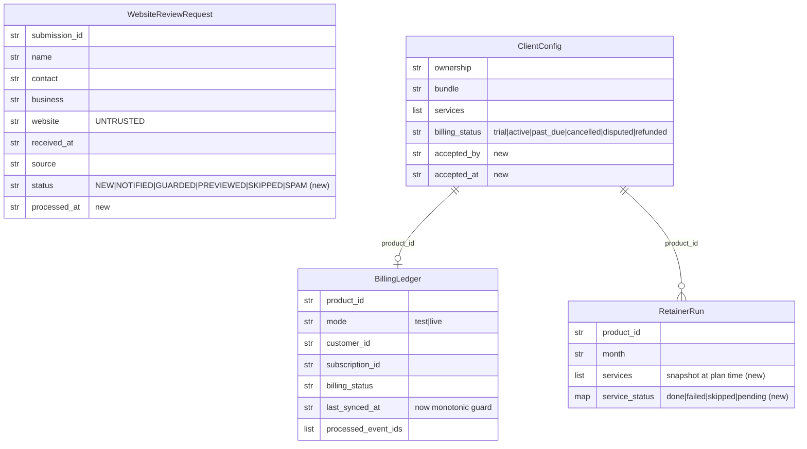

# ✨ Full-fledged agency — close the transaction loop + complete Package C fulfillment

## Enhancement Summary

**Deepened on:** 2026-06-04 · **Sections enhanced:** all (G1–G10 + Tier 3 + cross-cutting) · **Agents:** 4 depth-research (Stripe, Twilio, Resend+Plausible, repo seams) + 8 review (security, data-integrity, data-migration, deploy-verification, architecture, simplicity, kieran-python, performance).

### Key improvements folded in
1. **Concrete, 2026-current API depth** for every external integration (Stripe subscription Checkout, Twilio A2P send-time gate, Resend handler, Plausible v2 query) — see **§🔬 Deepened research insights** at the end.
2. **A P0 platform-outage bug caught before coding** — enum-widening breaks the strict registry loader (§Migration safety).
3. **Latent bugs in the code we reuse, surfaced** — `_billing_status` flips active on `subscription.created` + silently falls through to `trial`; `last_synced_at` stored as a string so the [B3] ordering guard mis-compares; non-atomic writes across the whole persistence layer; SSRF guard has no port restriction.
4. **A simplicity/sequencing re-think** — a recommended **Slice 1** that reaches first revenue with ~20% of the surface area (§Recommended sequencing).
5. **A `ServiceExecutor` contract** to define before G4 so G4–G10 don't fork into 7 shapes (§Hardened cross-cutting).

### New considerations discovered (highest-impact)
- **[MIG-P0]** `ClientConfig.from_dict` strict-coerces `BillingStatus(...)`; writing `"disputed"` to the registry makes *every* later registry load raise → platform-wide outage. The reader guard MUST land in the same commit as the dispute/refund writer.
- **[SEC-P0]** SSRF guard validates the address only and has **no allowed-port check** — local Postgres/Redis/memcached on the always-on Mac are reachable via the public `website` field today. Re-guard every redirect hop, pin the resolved IP, restrict to ports 80/443, cap body size.
- **[DEPLOY-P0]** No HTTP receiver for forwarded Stripe events exists (only a file-based CLI); live billing cannot reconcile until it's built, and the forwarder returns 200 even on a dropped forward (silent payment loss).
- **[DATA-P0]** The reconciler is stateless re-derivation, not a guarded state machine; needs an explicit transition table, an **integer** monotonic cursor, and atomic writes.

### Conflict → decision (simplicity vs thoroughness)
The simplicity reviewer argues most of this is built for scale that doesn't exist (0 customers) and recommends a hand-made Stripe Payment Link + manual fulfillment first. The security/data/migration reviewers argue the safety items are load-bearing. **Resolution: both are right about different axes.** Re-sequence to ship **Slice 1** (minimal, manual payment link, reuse the existing reconciler) as the real Phase 0, and **demote the full Checkout engine + dispute state machine + G4–G10 executors to "build on first paying request / tight fast-follow"** — while **preserving every safety acceptance criterion** for whenever each piece is built. Nothing below is deleted; it is re-ordered and the load-bearing safety four are pinned. See §Recommended sequencing.

## ✅ Slice 1 (G2) — implemented 2026-06-04

Branch `feat/agency-g2-lead-activation`. **889 unit tests pass** (36 in the G2 subset via `scripts/agency/verify_inbound_fulfillment.py`); ruff clean. **No deploy, no live email, not committed.**

| Item | Status | Where |
|---|---|---|
| G2a — Resend lead email (persist-first, non-fatal, HTML-escaped, idempotency-key) | ✅ | `products/better-business-web/site/netlify/functions/website-review.mjs` |
| Secret env constants + `.env.example` block (no `PUBLIC_` prefix) | ✅ | `packages/config/settings.py`, `.env.example` |
| todo-075 `dist/` secret-leak scan, fail-closed before upload | ✅ | `packages/web/deploy.py` (`assert_no_secret_leak`) |
| G2b — `process_inbound_review` (audit + optional preview, idempotent, `--force`) | ✅ | `packages/agency/inbound_fulfillment.py`, `scripts/agency/process_inbound_review.py` |
| `[X-PORT]`/`[+G2-FETCH]` guarded fetch (per-hop re-guard, ports 80/443, hop+body caps, timeout) | ✅ | `packages/policies/url_guard.py` (`fetch_public_url`) |
| `[+G2-STATUS]` `status`/`processed_at`/`notified_at` defaulted + legacy-load round-trip | ✅ | `packages/agency/inbound.py` (`ReviewStatus`) |
| `[+G2-REC]` `_record_id` collision guard | ✅ | `packages/agency/inbound.py` |
| `[X-ATOM]` atomic JSON writes | ✅ | `packages/db/json_store.py` |
| `[X-CLI]`/`[X-CLOCK]` CLI shape + injected clock seam | ✅ | as above |
| `[A2]` socket-level IP pinning (DNS-rebinding hard close) | ⏳ deferred | documented residual in `url_guard.py` |
| `[A3]` daily cap, `[A8]` contact-format validation, honeypot→`spam` status | ⏳ deferred | noted as TODO (todo 074) |
| G2a live email send + deploy verification | ⏳ pending | requires Resend domain verify + Netlify env (operator) |

## ✅ Slice 2 (G1 hardening + G3) — implemented 2026-06-04

Same branch. **908 unit tests pass** (+19); ruff clean. The reconciler that protects real money once a payment lands is now hardened, and the platform-outage migration bug is closed. **No commit/deploy.**

| Item | Status | Where |
|---|---|---|
| `[MIG-P0]` `BillingStatus` += `disputed`/`refunded` **+ guarded `ClientConfig.from_dict`** (unknown → `cancelled`, never aborts the registry load) | ✅ | `packages/schemas/product.py` |
| `[MIG-3]` V1/V2 verification green against real `infra/products.json` | ✅ | — |
| Dispute/refund states + **`charge.dispute`/`charge.refunded`** handling (full-refund stops work, partial doesn't; dispute.closed won→active/lost→refunded) | ✅ | `packages/agency/billing.py` |
| `[B9]` only `invoice.paid` activates — removed `subscription.created → active` + silent `trial` fall-through | ✅ | `packages/agency/billing.py` |
| `[B3]` integer ordering cursor — a late `invoice.paid` can't resurrect a cancelled/disputed sub (terminal events exempt) | ✅ | `packages/agency/billing.py` |
| `[B2]` cross-mode fence (live event can't mutate a test ledger) | ✅ | `packages/agency/billing.py` |
| `[C4]` unknown-`product_id` → dead-letter + typed `BillingDeadLetterError`, **no orphan ledger** | ✅ | `packages/agency/billing.py` |
| `[B6]` customer/subscription-id ledger fallback (so metadata-less dispute/refund events reconcile) | ✅ | `packages/agency/billing.py` |
| `[G3]` write-once acceptance stamping (`accepted_by`/`accepted_at` via field-level merge on first `invoice.paid`) | ✅ | `packages/schemas/product.py`, `packages/agency/billing.py` |
| `[X-SOT]`/`[E2]` `assert_billing_active` work-guard + `RETAINER_CLIENT_NOT_ACTIVE` code | ✅ | `packages/policies/agency_gates.py`, `approvals.py` |
| `[X-ATOM]` atomic registry write | ✅ | `packages/agency/registry.py` |
| Thin `create_checkout.py` (Stripe initiation) | ⏳ deferred | hand-made Payment Link covers it; existing reconciler closes the loop |
| HTTP webhook receiver + `[B4]`/`[B5]` forwarder hardening | ⏳ deferred | deploy-gated; next slice. Dead-letter raises `BillingDeadLetterError` ready for it to catch → 200 |
| Real dispute-object enrichment (charge→customer expansion) | ⏳ note | the receiver must enrich dispute events; the customer-id fallback is in place |

## ✅ Slice 3 (G1 Checkout initiation) — implemented 2026-06-04

Branch `feat/agency-g1-checkout`. **917 unit tests pass** (+9); ruff clean; forwarder `node --check` OK. No live call.

| Item | Status | Where |
|---|---|---|
| Subscription Checkout (setup + monthly line items, dual metadata, idempotency key, clamped `expires_at`) behind a `CheckoutProvider` seam | ✅ | `packages/agency/payments.py` |
| Live mode approval-gated (`stripe_live_subscription`); test mode ungated | ✅ | `packages/agency/payments.py` |
| `STRIPE_PRICE_MAP` config (mode-scoped, not catalog) + `.env.example` | ✅ | `packages/config/settings.py`, `.env.example` |
| OFFER.md `## Pay & start` injection with link + expiry ([G3] paying = accepting) | ✅ | `packages/agency/templates.py` |
| Thin `create_checkout.py` CLI (mode + live-gate + clean exits) | ✅ | `scripts/agency/create_checkout.py` |
| `[B4]` forwarder: non-2xx on forward failure (Stripe retries) + 4 s `AbortController` timeout; forwards `refunded`/`charge`/`status` for dispute/refund | ✅ | `packages/web/scaffold/.../stripe-webhook.mjs` |
| HTTP **receiver** endpoint (forward-secret → `reconcile_stripe_event`) | ✅ Slice 4 | `packages/agency/stripe_receiver.py`, `apps/api/stripe_endpoint.py` |
| Real `StripeCheckoutProvider` live exercise + test→live price recreation | ⏳ pending | operator: set `STRIPE_PRICE_MAP` live block + `sk_live_` key + grant approval |

## ✅ Slice 4 (Stripe receiver) — implemented 2026-06-04

Branch `feat/agency-stripe-receiver`. **924 unit tests pass** (+7); ruff clean; the FastAPI app mounts `/stripe/forward`. **The reconciliation path is now closed in code** (forwarder → receiver → ledger).

| Item | Status | Where |
|---|---|---|
| Pure receiver handler — constant-time shared-secret verify → `reconcile_stripe_event` → status mapping (200 reconciled / 200 dead-lettered / 422 malformed / 500 transient / 401 / 503) | ✅ | `packages/agency/stripe_receiver.py` |
| FastAPI route `POST /stripe/forward` (127.0.0.1) mounted in the control-plane API | ✅ | `apps/api/stripe_endpoint.py`, `apps/api/main.py` |
| `AGENCY_STRIPE_EVENT_FORWARD_SECRET` env constant | ✅ | `packages/config/settings.py` |
| `[B5]` independent Stripe-signature re-verification at the receiver | ⏳ note | the forwarder verifies + reshapes (no raw body forwarded); the shared secret authenticates "from our forwarder." Re-verifying the raw signature needs the forwarder to send the raw body — a deliberate follow-up |
| Live run (start the API, wire Netlify forward URL/secret, complete a test checkout) | ⏳ pending | operator/deploy |

**The transaction loop is code-complete:** notice a lead (G2) → quote with a pay link (G1 write) → forwarder → receiver → reconcile + activate + stamp acceptance (G1 read) → `assert_billing_active` guards paid work. What remains is operator/deploy setup (Stripe live prices/keys, Resend domain, start the API, wire Netlify env) and the Tier-2 service executors (G4–G10).

## ✅ Slice 5 (G4 promo landing page) — implemented 2026-06-04

Branch `feat/agency-g4-promo`. **929 unit tests pass** (+5); ruff clean. First Tier-2 Package C service, moved from 🔴 catalog-only → 🟢 **automated**.

| Item | Status | Where |
|---|---|---|
| `PromoCampaign` + `render_promo_html`/`emit_promo_page` — single-offer campaign page reusing the existing scaffold token-template (design system + form), render-guarded, offline/no-Node | ✅ | `packages/agency/promo_page.py` |
| `build_promo_page.py` CLI (renders a real ~17 KB `dist/index.html`) | ✅ | `scripts/agency/build_promo_page.py` |

Package C scorecard update: `promo_landing_page` is now automated. Remaining Tier-2: `business_email` (G5), `booking` (G6), `gbp` (G7), `google_ads` (G8), `reviews`-SMS (G9), `monthly_reporting` data (G10).

## ✅ Slice 6 (G7 GBP changeset draft) — implemented 2026-06-04

Branch `feat/agency-g7-gbp`. **938 unit tests pass** (+9); ruff clean. `gbp` moved 🟡 planner-label → 🟢 **runbook-with-generator**.

| Item | Status | Where |
|---|---|---|
| `draft_gbp_changeset(intake)` → `GbpChangeset` → `GBP_CHANGESET.md` (category suggestion, services, hours, ≤750-char description, contact/booking, photo checklist) | ✅ | `packages/agency/gbp.py` |
| `suggest_primary_category` (free-text service → GBP category, with fallback) | ✅ | `packages/agency/gbp.py` |
| `draft_gbp_changeset.py` CLI (emit to workspace or `--print`) | ✅ | `scripts/agency/draft_gbp_changeset.py` |
| `[D6]` advisory note baked into the doc; live-state drift-diff before apply | 🟡 noted | full API drift-diff is later automation |

Remaining Tier-2: `business_email` (G5), `booking` (G6), `google_ads` (G8), `reviews`-SMS (G9), `monthly_reporting` data (G10).

## ✅ Slice 7 (G8 Google Ads draft) — implemented 2026-06-04

Branch `feat/agency-g8-ads`. **944 unit tests pass** (+6); ruff clean. `google_ads` moved 🟡 planner-label → 🟢 **runbook-generator + gated go-live**.

| Item | Status | Where |
|---|---|---|
| `draft_google_ads(intake)` → `ADS.md` (campaign + ad-group structure, service×geo keywords, negative list, RSA headlines/descriptions within char limits, geo targeting) | ✅ | `packages/agency/google_ads.py` |
| `[D7]` `assert_ad_campaign_go_live` — refuses go-live without a **positive daily AND monthly budget cap** + the granted `ad_campaign_go_live` approval; new `AD_BUDGET_CAP_MISSING` code | ✅ | `packages/policies/agency_gates.py`, `approvals.py` |
| `draft_google_ads.py` CLI; spend stays client-owned (noted in `ADS.md`) | ✅ | `scripts/agency/draft_google_ads.py` |

Remaining Tier-2: `business_email` (G5), `booking` (G6), `reviews`-SMS (G9), `monthly_reporting` data (G10).

## Overview

The Better Business Web agency landing page is **live** and its core engine — build → host → launch a small-business website, plus automated Local SEO — is real and gated. But the **business cannot transact**: it can't reliably *notice* a lead, it can't *get paid* through any wired capability, and **6 of Package C's 10 services have no executor**. This plan closes those gaps in priority order so the agency becomes a self-sustaining operation rather than a high-craft demo.

The work is deliberately **reuse-first**: the billing *reconciler* (`packages/agency/billing.py`), inbound *capture* (`packages/agency/inbound.py`), SSRF *guard* (`packages/policies/url_guard.py`), approval *gates* (`packages/policies/agency_gates.py` + `packages/agency/approvals.py`), and catalog *source-of-truth* (`packages/agency/catalog.yaml`) already exist. Most gaps are **wiring + the missing "initiation"/"executor" half**, not greenfield.

**Scope:** G1–G10 + a Tier-3 retainer executor. **Explicitly out of scope:** auto-polling inbound leads (operator pulls manually for now; the live-capture email below removes the urgency).

## Problem statement — the three gaps

1. **Can't get paid.** [billing.py](../../packages/agency/billing.py) is *read-only reconciliation*. Nothing creates a Checkout/subscription; every client is pinned at `billing_status: "trial"`. (Note: the *state model* and *webhook execution* halves are already done — todos [083](../../todos) and [085](../../todos) are complete; only **initiation** is missing.)
2. **Can't notice a lead.** The form captures to Netlify Blobs and a typed `WebsiteReviewRequest`, but there is **zero notification** and **no command** bridges a captured lead → a preview build. The live page promises "you'll hear back within 2 business days" with nothing behind it.
3. **Half of Package C is manual/unbuilt.** Website, hosting, Local SEO are automated; `monthly_reporting` is a draft with no data; `reviews`, `gbp`, `google_ads` are planner-labels + gates with no executor; `business_email`, `booking`, `promo_landing_page` are catalog-only.

## Current-state grounding (do **not** rebuild these)

| Asset | Path | State |
|---|---|---|
| Service catalog (SoT) | [catalog.yaml](../../packages/agency/catalog.yaml) | ✅ canonical; mirrors regen via `render_catalog_md.py` + `render_catalog_json.py`, two drift tests |
| Website build → deploy | [scaffold.py](../../packages/web/scaffold.py), [deploy.py](../../packages/web/deploy.py) | ✅ automated, gated |
| Local SEO | [local_seo.py](../../packages/agency/local_seo.py) | ✅ automated |
| Monthly report (draft) | [monthly_report.py](../../packages/agency/monthly_report.py) | 🟡 renderer only, no live data |
| Inbound capture | [inbound.py](../../packages/agency/inbound.py), `netlify/functions/website-review.mjs`, `scripts/web/pull-inbound.mjs` | ✅ typed `WebsiteReviewRequest`, JsonStore → `state/prospects/inbound/` |
| SSRF guard | [url_guard.py](../../packages/policies/url_guard.py) | ✅ `assert_safe_public_url(url, *, resolver=…)`; redirect/rebinding noted open |
| Billing reconciler | [billing.py](../../packages/agency/billing.py) | ✅ webhook→ledger; idempotent on `event.id`; **no initiation, no refund/dispute states** |
| Approval gates | [agency_gates.py](../../packages/policies/agency_gates.py), [approvals.py](../../packages/agency/approvals.py) | ✅ `stripe_live_subscription`, `ad_campaign_go_live`, `review_sms_activation` specs + `PAYMENTS_LIVE_NOT_APPROVED` code exist |
| Retainer planner | [retainer_ops.py](../../packages/agency/retainer_ops.py) | 🟡 `plan_retainer_run` emits *labels*; `write_retainer_run` exists; **no executor** |
| OFFER.md renderer | `render_offer` in [templates.py](../../packages/agency/templates.py) | ✅ markdown quote; seam for a payment section |
| Stripe scaffold fns | `packages/web/scaffold/astro-landing/netlify/functions/{create-checkout,stripe-webhook}.mjs` | 🟡 `create-checkout` is `mode:"payment"` single-item (landing demo), **not** the subscription combo we need |

## Conventions to honor (house rules — from repo research)

- **Scripts are thin.** `scripts/agency/*.py`: `argparse` + `main() -> int` + `raise SystemExit(main())`; JSON to stdout via `print(json.dumps(payload, indent=2))`; errors to `stderr` + non-zero exit (`0` ok, `1` bad input, `2` policy/not-ready). **Path resolution lives in the library** via `load_runtime_paths(repo_root)`; tests override with `AI_COMPANY_OS_REPO_ROOT`. Add a peer offline `scripts/agency/verify_*.py` that runs the new tests (pattern: `verify_landing_inbound.py`).
- **Typed records.** `@dataclass(frozen=True)` + `validate()` (raises `ValueError`) + `to_dict()` + `@classmethod from_dict()` (defensive `.get` + coercion). Enums are `class X(str, Enum)`. Persist via `JsonStore` (one file/record) wrapped in a repository, or plain file helpers, under `state/agency/<lane>/` or `state/clients/<product_id>/<lane>/`.
- **Approval = three edits, every time.** A new gated action requires (1) a `RetainerApprovalSpec` entry in `approvals.py`, (2) an `assert_<action>(...)` gate in `agency_gates.py` that raises `PolicyViolation`, (3) a `PolicyViolationCode` enum member (guard test `test_policy_violation_codes_enumerated` fails on bare-string raises). **An enum member alone does nothing.** `ApprovalStore` is DB-backed → tests use the `isolated_repo_root` fixture.
- **Registry is strict.** New `ClientConfig`/product fields **must default** so legacy `infra/products.json` records load unchanged (schema edit + loader branch in `packages/schemas/product.py`). Branch on `product.type`, not directories ("client is a product, not a parallel tree").
- **Secrets.** Add an `*_ENV_VAR` constant in [settings.py](../../packages/config/settings.py), a documented block in `.env.example`, set the real value **only** in Netlify env / gitignored `.env` — never committed, **never shipped in `dist/`** (the file-digest deploy `rglob`s all of `dist/`; todo 075). No `PUBLIC_`/`VITE_` prefix on any secret.
- **External IO behind an injectable seam.** Define a tiny `Protocol`/`Callable` (`EmailSender`, `SmsSender`, `CheckoutProvider`, `StatsClient`) with a real default impl + a fake in tests. **Never hit the network in unit tests.** Mirror the `Resolver` seam in `url_guard` and the `DeployTarget` Protocol.
- **Catalog SoT.** Any dollar-price change: edit `catalog.yaml` → run **both** render scripts → commit all three; both drift tests must pass. Stripe **price IDs are NOT catalog data** (they're environment-scoped) — they live in config/env keyed by `(bundle_id, mode)`.

## Cross-cutting design decisions (global rules)

These resolve repeated patterns the SpecFlow analysis flagged across flows:

- **Persist-first, return 200, reconcile async.** Webhooks/form handlers (lead email, Stripe forward) must persist the durable record **before** any best-effort side effect, never `500` the caller on a downstream failure, and expose an operator-visible "unreconciled/un-notified" list. A downstream failure must be **logged + retryable**, never silently dropped.
- **Entitlement ≠ audit.** `billing_status` drives *service entitlement* (whether work happens). `accepted_at` is an immutable *audit fact* (they clicked pay). A dispute stops work **without** rewriting acceptance history.
- **Every long-lived record carries a status field** so idempotency, caps, and reconciliation have something to key on (`WebsiteReviewRequest.status`, per-service status inside `RetainerRun`).
- **Compliance/abuse gates evaluate at the moment of action, not once up front** — per-recipient at send time (SMS), per-hop on redirect (SSRF), per-event ordering (billing).

### Data-model changes (ERD)



---

## Phase 0 — Close the revenue loop (Tier 0)

> Do **G2 first** (smallest; unblocks the live "2 business days" promise), then **G1**.

### G2 · Notice + activate the lead

**What exists:** capture + typed record + SSRF guard + manual pull script. **What's missing:** notification, the fulfillment-trigger command, the anti-abuse cap.

**Build:**
- **(a) Live lead email** — extend `netlify/functions/website-review.mjs`: after the Blob write succeeds, send a notification via **Resend** to `LEAD_NOTIFY_EMAIL` (env; default documented as `ksakhakorn@gmail.com`, swappable later). `RESEND_API_KEY` + `LEAD_NOTIFY_EMAIL` set in Netlify env only. Email failure is **non-fatal** (log, still `303 → /thanks/`). Include the submission fields so the operator can act without pulling.
- **(b) Operator command** — `scripts/agency/process_inbound_review.py` + library `packages/agency/inbound_fulfillment.py`:
  - load the `WebsiteReviewRequest` by id;
  - if `website` ∈ {"", "none", whitespace} → **skip audit**, build a *generic* preview (this is the no-website persona); else normalize (prefix `https://` once if schemeless) and `assert_safe_public_url`;
  - enforce a **daily cap** (todo 074) before triggering the [prospect_site](../../packages/agency/prospect_site.py) preview build (decouple submit from auto-fulfillment);
  - stamp `status` + `processed_at`; idempotent (re-run = no-op unless `--force`).

**Acceptance criteria:**
- [ ] Submitting the live form emails `LEAD_NOTIFY_EMAIL` within seconds; the address is a single env var, no redeploy of source needed to change it.
- [ ] Blob/record is written **before** the email; an email failure never `500`s the form or loses the lead (operator can list un-notified submissions).
- [ ] `RESEND_API_KEY` is absent from `dist/` (verified by the todo-075 leak scan) and from git.
- [ ] `process_inbound_review.py`: `"none"`/empty website → generic preview, no fetch; schemeless → one `https://` attempt then guard; guard failure → record flagged for manual review, **no crash**.
- [ ] **[A1]** Preview/audit fetch disables auto-redirect and re-runs `assert_safe_public_url` on **every hop**; **[A2]** resolves once and pins the IP for the connection (document residual rebinding risk if deferred).
- [ ] **[A3]** Daily cap dimension is explicit (per-contact + global ceiling); at cap → operator-only queue, never auto-fulfill; honeypot trips → `source=spam`, no email, no cap consumption.
- [ ] **[A7]** Missing id → clean non-zero exit; already-processed → no-op; `processed_at` recorded.
- [ ] **[A8]** `WebsiteReviewRequest.validate()` flags a `contact` that is neither email nor E.164 (accept-and-flag, don't drop).
- [ ] `WebsiteReviewRequest` gains a `status` field, defaulted so existing records load.

**Tests:** `test_agency_inbound_fulfillment.py` (fake `EmailSender`, fake `Resolver`, `tmp_path` store, cap boundary, redirect re-guard, none/schemeless/garbage website). Extend `test_bbw_landing_inbound.py` drift guard for the new function behavior. `scripts/agency/verify_inbound_fulfillment.py`.

**Secrets:** `RESEND_API_KEY`, `LEAD_NOTIFY_EMAIL` (+ `.env.example` block; Resend sending domain SPF/DKIM verified as a one-time setup task).

### G1 · Get paid

**What exists:** the reconciler + ledger + state model (billing.py, todos 083/085) + the `stripe_live_subscription` gate + `PAYMENTS_LIVE_NOT_APPROVED` code. **What's missing:** Checkout *initiation*, the price map, OFFER injection, and **refund/dispute handling**.

**Build (least-code path, per research — single Checkout Session, `mode=subscription`, two line items):**
- `packages/agency/payments.py`: `CheckoutProvider` Protocol + `StripeCheckoutProvider`; `create_client_checkout(product_id, bundle, *, mode, provider, approval_id|None)`:
  - resolves `(bundle_id, mode) → {setup_price_id, monthly_price_id}` from config (`STRIPE_PRICE_MAP`, env/JSON — **not** catalog);
  - builds one Checkout Session: `line_items=[{monthly_price}, {setup_price}]`, `mode="subscription"`;
  - sets `metadata={product_id, bundle}` on **both** the session **and** `subscription_data.metadata` (so it rides every future `invoice.paid` — fixes the invoice-has-no-metadata reconciliation gap **[B6]**);
  - sets `expires_at` and passes an `Idempotency-Key` keyed on `(product_id, bundle, mode)`;
  - **live mode** (`sk_live_…`) requires a granted `stripe_live_subscription` approval (`assert_retainer_approval_granted`); **test mode** ungated.
- `scripts/agency/create_checkout.py` (thin CLI) → emits the URL + `expires_at`.
- Inject into OFFER: add `payment_link`/`payment_expires_at` params to `render_offer` (templates.py) → a `## Pay & start` section. Stale/expired link is labeled; regeneration = re-run the gate.
- **Refund/dispute (close the [B1]+[E2] loop):** in `billing.py` add `BillingStatus.DISPUTED` + `REFUNDED`, handle `charge.dispute.created → DISPUTED`, `charge.refunded → REFUNDED`/`CANCELLED`; add **event ordering** — ignore an event whose `created` < `last_synced_at` so a late `invoice.paid` can't resurrect a cancelled sub **[B3]**.

**Acceptance criteria:**
- [ ] One command produces a working hosted Checkout for `{setup once + monthly recurring}`; paying flips `billing_status → active` via the **existing** reconciler.
- [ ] **[B2]** Live URL refused unless price IDs are live-mode **and** a `stripe_live_subscription` approval is granted; reconciler raises if an event's `mode` disagrees with the ledger's `mode`.
- [ ] **[B1]** `charge.dispute.created` → `DISPUTED`, `charge.refunded` → `REFUNDED`/`CANCELLED`; these states **stop** retainer work (see E2).
- [ ] **[B3]** Out-of-order events are ignored by `created` monotonicity; replay still deduped on `event.id`.
- [ ] **[B4]** Stripe forward failure returns non-2xx so Stripe retries (no silently-dropped payment); **[B5]** the receiver independently verifies `stripe-signature` and does not trust the shared forward header alone.
- [ ] **[B6]** `invoice.paid` reconciles because metadata is on `subscription_data`; reconciler also falls back to `customer_id`/`subscription_id` lookup.
- [ ] **[B8]** Checkout `expires_at` is set and stamped into `OFFER.md`; expired links are not presented as live.
- [ ] **[B9]** `billing_status → active` requires `invoice.paid` for the subscription (don't flip active on `subscription.created` alone).
- [ ] Price IDs are config, never committed; test→live recreated and documented.

**Tests:** `test_agency_payments.py` (fake `CheckoutProvider`: asserts two line items + dual metadata + idempotency key + expiry; live-gate enforcement). Extend `test_agency_billing.py`: dispute/refund branches, ordering guard, metadata-fallback. `test_agency_offer.py` for the OFFER payment section. `scripts/agency/verify_payments.py`.

**Secrets/config:** `STRIPE_SECRET_KEY`/`STRIPE_WEBHOOK_SECRET` (exist); add `STRIPE_PRICE_MAP` config (per-mode bundle→price ids).

---

## Phase 1 — Close the sale (Tier 1)

### G3 · Acceptance record

**Build:** add `accepted_by` + `accepted_at` (defaulted) to `ClientConfig` (`packages/schemas/product.py`); the billing reconciler stamps them on the **first** `invoice.paid` for a product.

**Acceptance criteria:**
- [ ] **[C1]** Stamp once — never overwrite `accepted_at` on later invoices.
- [ ] **[C2]** `accepted_by` = Stripe customer email (fallback: registry contact), recorded verbatim.
- [ ] **[C3]** Acceptance is independent of entitlement — a later dispute changes `billing_status`, not `accepted_at`.
- [ ] **[C4]** Payment for an unknown `product_id` → dead-letter for operator promotion, not a webhook crash.
- [ ] Legacy registry records load unchanged (fields default to empty).

**Tests:** extend `test_agency_billing.py` / registry tests: first-payment stamping, idempotency, unknown-product dead-letter.

---

## Phase 2 — Complete Package C (Tier 2)

Each item moves a service up at least one fulfillment rung. Ordered easiest-win → highest-risk.

### G4 · Promo landing page *(→ Automated; easiest win)*
Wire the existing scaffold/render path to emit a single-purpose campaign page (a `--promo` mode / `render_promo_page`). Reuses the design system; demo guardrails unchanged.
- [ ] Generates a conversion-oriented single page (headline + offer + form) from intake; built `dist/` passes the web/UX gate. Tests + drift guard for the new render path.

### G5 · Business email *(→ Runbook)*
A `business-email-setup` canonical skill (Google Workspace checklist: domain verify, MX, `info@/support@/sales@` aliases) + a typed completion record under `state/clients/<product_id>/`.
- [ ] Skill + adapter + registry entry (no logic in `.claude/skills/`); a completion record marks the service delivered.

### G6 · Booking *(→ partial Automated)*
A `booking-setup` skill + a provider-embed **injector** that drops a Calendly/Square/Vagaro/Acuity/Mindbody embed into the client site, reusing the scaffolded `BOOKING.md` stub.
- [ ] **[D8]** Injection target validated; idempotent (no double-inject on re-run); supported-provider list enforced.

### G7 · GBP changeset *(→ Runbook with generator)*
Implement the planner-named `draft_gbp_changeset`: generate `GBP_CHANGESET.md` from intake (hours, categories, services, photos, booking link). Operator applies via GBP (API automation later).
- [ ] **[D6]** Draft is advisory — re-read live GBP state before apply; refuse/flag if it drifted from the drafted baseline.

### G8 · Google Ads draft *(→ Runbook with generator, gated)*
Implement `draft_google_ads`: `ADS.md` (campaign structure, keywords, negative list, ad copy, geo) from intake + Local SEO geo. **Spend stays client-owned.** Go-live behind the existing `ad_campaign_go_live` gate.
- [ ] **[D7]** Go-live approval artifact **must include a max daily/monthly budget cap** (denial-of-wallet guard); reject go-live without it.
- [ ] **[D6]** Draft re-validated against live account state before apply.

### G9 · Review-SMS sender *(→ partial Automated; highest compliance risk)*
Build the Twilio sender **behind** `assert_review_sms_allowed`, upgrading the gate from *config-exists booleans* to *this-send-is-legal* checks. Activation stays gated on the signed consent addendum.

> **Compliance preconditions (A2P 10DLC / TCPA, 2026):** brand + campaign registered; **`PrivacyPolicyUrl` and `TermsAndConditionsUrl` live before campaign registration (binding 2026-06-30)**; documented prior express consent; STOP/HELP auto-replies wired.

**Acceptance criteria:**
- [ ] **[D1]** A per-recipient **STOP-suppression store** is checked immediately before **each** message; inbound STOP/UNSUBSCRIBE webhook writes it synchronously.
- [ ] **[D2]** Quiet hours enforced at **send time** in the **recipient's** local timezone (8am–9pm), not as a boolean.
- [ ] **[D3]** Live A2P campaign status verified before send; carrier filtered errors (`30007/30008`) are hard stops, not retries.
- [ ] **[D4]** Consent scope resolved: texting the *client's customers* requires **their** opt-in records, not only the client's signed addendum — surfaced as a design gate before any send.
- [ ] **[D9]** Per-recipient last-sent ledger enforces the frequency cap at send time.
- [ ] Sender is fully behind the gate; default posture ships **templates only**, live send unlocked per client only after all checks pass.

**Tests:** `test_agency_review_sms.py` (fake `SmsSender`; STOP-suppression, quiet-hours boundary across timezones, frequency cap, gate-blocks-send). New `PolicyViolationCode`s as needed (+ guard test).

### G10 · Plausible reporting data *(→ Automated with real data)*
A `StatsClient` seam + Plausible v2 Stats API adapter feeding [monthly_report.py](../../packages/agency/monthly_report.py): `POST /api/v2/query` for monthly `visitors`/`pageviews`, and a goal-filtered query for **form leads**. Base URL is config (cloud vs self-host).
- [ ] **[D5]** Requires a `Form Lead` goal — if absent, adapter **fails loud** with a "configure goal" action item (never reports 0 as if real). The client site's form success handler fires the goal event (site-build dependency).
- [ ] Report shows real visits/leads for the month; call tracking remains honestly "not tracked" absent CallRail.

**Tests:** `test_agency_plausible.py` (fake `StatsClient`, goal-missing path). Extend `test_agency_monthly_report.py`.

---

## Phase 3 — Full-fledged / scale (Tier 3)

> Auto-poll inbound is **intentionally out of scope.**

### Retainer executor
Turn `plan_retainer_run` (labels) into `run_retainer_month(record, *, month)` in `retainer_ops.py` that **invokes** the G4–G10 executors per client; `write_retainer_run` already persists one JSON/month — extend it with **per-service status**.
- [ ] **[E2]** Refuse to plan/run for any client not `active` (closes the dispute→keeps-working loop with B1).
- [ ] **[E1]** Continue-on-error with a per-service checkpoint (`done/failed/skipped/pending`); re-run resumes only `failed`/`pending`, never double-applies `done`.
- [ ] **[E3]** A blocked service without a granted approval → `skipped` with reason (catch `PolicyViolation`, continue), never silently dropped, never auto-executed.
- [ ] **[E4/E5]** Idempotent per month; service list **snapshotted at plan time** so mid-month config changes don't make the run non-deterministic; `--force` semantics defined.
- [ ] **[E6/E7]** `month` validated (format, not-future); a `processing` lock prevents concurrent interleaving.

### Operator digest / pipeline view
A read-only `scripts/agency/pipeline_status.py` (JSON) joining leads → clients → `billing_status` → retainer-run status, so the operator sees the funnel at a glance (replaces the dropped auto-poll as the awareness mechanism alongside the G2 email).

### Close todo 075
Implement the deploy-time `dist/` credential-leak scan (fails closed on credential-shaped strings) and confirm all notification/payment/SMS secrets are server-side only.

### Post-Package-C catalog extras
`meta_ads`, `crm_setup`, `follow_up_automation` follow the **same** executor + gate pattern (catalog already lists them). Out of the critical path; sequence after Package C is whole.

---

## Risk analysis & mitigation

| Risk | Severity | Mitigation |
|---|---|---|
| Disputed/refunded client keeps getting paid retainer work | **High** | G1 dispute/refund states + G-Tier3 `billing_status==active` guard (B1+E2 together) |
| TCPA/A2P SMS liability ($500–1,500/msg) | **High** | G9 ships templates-only by default; send-time STOP + quiet-hours + consent-scope gate; never auto-enable |
| SSRF via the public `website` field (against the always-on Mac) | **High** | url_guard on every redirect hop + IP pinning; `"none"` short-circuits the fetch |
| Denial-of-wallet (lead flood → preview/audit/ads spend) | **High** | G2 daily cap (per-contact + global) decoupled from submit; G8 mandatory ad budget cap |
| Dropped payment webhook (fire-and-forget forward) | **High** | Return non-2xx on forward failure → Stripe retries; receiver re-verifies signature |
| Secret leak into public `dist/` | Med | todo-075 scan; secrets only in Netlify env; no `PUBLIC_` prefix |
| Catalog/Stripe price drift, test↔live mismatch | Med | Price IDs in per-mode config (not catalog); reconciler asserts mode agreement |
| Lost lead (email send fails) | Med | persist-first; email non-fatal + operator-visible un-notified list |

## Dependencies & sequencing

1. **G2** (smallest, unblocks the live promise) → **G1** (+ dispute/refund states) → **G3**.
2. **G4 → G5 → G6 → G7 → G8 → G9 → G10** (easiest-win → highest-risk; G9 last).
3. **Tier 3** retainer executor depends on G4–G10 + the G1 dispute states (for E2).
4. Cross-cutting: the todo-075 leak scan should land with **G2** (first secret introduced).

## Secrets & config (new)

| Name | Where | For |
|---|---|---|
| `RESEND_API_KEY`, `LEAD_NOTIFY_EMAIL` | Netlify env + `.env.example` | G2 lead email |
| `STRIPE_PRICE_MAP` (per-mode bundle→price ids) | config/env (not catalog) | G1 checkout |
| `TWILIO_ACCOUNT_SID`/`AUTH_TOKEN`/`MESSAGING_SERVICE_SID` | env | G9 SMS |
| `PLAUSIBLE_API_KEY`, `PLAUSIBLE_BASE_URL` | env | G10 reporting |

(`STRIPE_SECRET_KEY`, `STRIPE_WEBHOOK_SECRET`, `NETLIFY_AUTH_TOKEN` already exist.)

## Test plan (per house convention)

- Unit tests in `tests/python/unit/test_agency_*.py`; external IO behind `Protocol`/`Callable` fakes (`EmailSender`, `CheckoutProvider`, `SmsSender`, `StatsClient`, `Resolver`); `isolated_repo_root` for anything touching `state/` or `ApprovalStore`.
- New gated actions add a `PolicyViolationCode` member (guard test enforces).
- Catalog untouched on dollar prices → no mirror regen; **if** prices change, run both render scripts + both drift tests.
- A peer offline `scripts/agency/verify_<lane>.py` per new lane.

## Out of scope (now)

- **Auto-polling inbound leads** (manual pull; G2 email covers awareness).
- DNS-rebinding socket-level hard close (documented residual; pin-IP mitigates).
- E-signature vendor for OFFER (paying = accepting for v1).
- GBP/Ads **apply via API** (drafts only this round).
- CallRail call tracking.

## References

**Internal:** [LANDING_PAGE_PLAN.md](../products/better-business-web/LANDING_PAGE_PLAN.md) (§7 capture, §10 fulfillment, §11 guardrails) · [billing.py](../../packages/agency/billing.py) · [agency_gates.py](../../packages/policies/agency_gates.py) · [approvals.py](../../packages/agency/approvals.py) · [retainer_ops.py](../../packages/agency/retainer_ops.py) · todos [074](../../todos/074-pending-p2-cta-anti-abuse-decouple-submit-from-audit.md), [075](../../todos/075-pending-p2-notification-secret-dist-leak-guard.md) · solution: `docs/solutions/architecture/agency-layer-reuse-and-repo-mechanism-footguns.md` · decision: `docs/decisions/2026-06-01-client-is-a-product-not-a-parallel-tree.md`

**External (2026):** Stripe [subscriptions via Checkout](https://docs.stripe.com/payments/checkout/build-subscriptions) + [one-time fee with subscription](https://support.stripe.com/questions/add-a-one-time-fee-or-discount-with-a-new-subscription-plan) · [Resend](https://resend.com/docs) · Twilio [A2P 10DLC](https://www.twilio.com/docs/messaging/compliance/a2p-10dlc) + [2026-06-30 privacy/terms URL requirement](https://www.twilio.com/en-us/changelog/a2p-10dlc-campaign-registration-will-require-privacy-policy-and-) · [Plausible Stats API v2](https://plausible.io/docs/stats-api)

---

# 🔬 Deepened research insights (2026-06-04)

> Folded in from 12 parallel research/review agents. Original plan above is unchanged; this section adds implementation depth and **additional acceptance criteria** (tagged `[+…]`) per gap, plus new global rules. Where a finding conflicts with the body, this section wins (it's newer and code-grounded).

## Recommended sequencing — ship "Slice 1" first

The simplicity review is right that the body plan is sized for a book of recurring clients that doesn't exist yet (today: **0 customers, 0 inbound, 0 ledgers, 4 registry records**). Re-sequence so the **first slice reaches revenue with ~20% of the surface area**, and pull the rest forward only as real demand appears. Nothing is deleted — the safety criteria below still apply when each piece is built.

**Slice 1 — Close the loop (the only thing blocking revenue):**
1. **G2a** — Resend lead email in `website-review.mjs` (persist-first, non-fatal) + the **todo-075 `dist/` leak scan** (first server-side secret).
2. **G2b (minimal)** — `process_inbound_review.py`: load the lead, apply the **existing SSRF guard** (with `"none"`→generic-preview branch), trigger the existing preview build. Add a defaulted `status` field. **Defer** the multi-dimensional daily cap, honeypot/spam status, and contact-format validator until volume appears.
3. **G1 (manual)** — create a Stripe **Payment Link by hand** in the dashboard; paste into OFFER/email. The **existing reconciler** ([billing.py](../../packages/agency/billing.py)) flips `active`. Keep the existing live gate. **Zero new payment code.**
4. Fulfill with the **already-automated** website + hosting + Local SEO, run by hand.

**Slice 2 — Harden what's now real (the week after first payment clears):** thin `create_checkout.py` (direct Stripe call, no Protocol until a 2nd impl exists) + **dispute/refund states + the [B3] ordering guard** (a chargeback mid-fulfillment is the one "scale" problem that bites at customer #1) + G3 acceptance stamping + a standalone `assert_billing_active` work-guard.

**Slice 3+ — Build on demand:** pull G4–G10 off the shelf **only when a paying client requests that specific service**; build the retainer executor only at ≥2 recurring clients; build the pipeline view when the funnel won't fit in your head.

**Load-bearing safety — keep verbatim regardless of slicing:** (1) SSRF guard on the public `website` field, (2) `dist/` secret-leak scan, (3) SMS default-deny compliance gate, (4) `billing_status == active` work-guard before any paid work.

## NEW · Migration safety — **[MIG-P0]** the enum-widening platform-outage guard

Verified against live data: `infra/products.json` has a real `joes-plumbing-site` client record; `ClientConfig.from_dict` (`packages/schemas/product.py`) coerces `billing_status` through `BillingStatus(...)`, which **raises `ValueError` on an unknown value** — and unlike `phase`/`type`, it is **not** wrapped in the loader's `try/except`. So the moment the reconciler writes `billing_status: "disputed"` into the registry, the **next `load_product_configs()` aborts the entire registry load** (all products, not just the client) — a platform-wide outage triggered by a routine dispute webhook.

**Binding rule (must-fix, blocks G1):**
- [ ] **[MIG-1]** Add `DISPUTED`/`REFUNDED` to `BillingStatus` **and** wrap `ClientConfig.from_dict`'s `BillingStatus(...)` in `try/except ValueError` (copy the `phase`/`type` pattern in `packages/config/products.py`), falling back to a **work-stopping** state (`CANCELLED`/`PAST_DUE`) — **never** silently to `ACTIVE`/`TRIAL` (that would re-create the dispute→keeps-working loop). Reader + writer land in the **same commit**.
- [ ] **[MIG-2]** New fields are **additive + defaulted**, no backfill: `accepted_by/at=""`, `WebsiteReviewRequest.status=NEW`/`processed_at=""`, `RetainerRun.service_status={}`. **Never fabricate `accepted_at`** from `created_at` or any proxy — that invents an audit fact.
- [ ] **[MIG-3]** Pre-merge verification gates (run on `main` then branch, counts must match):
  - `V1`: `python3 -c "from packages.config.products import load_product_configs as L; print(len(L()))"` loads all 4.
  - `V2`: every `BillingStatus` value **plus an unknown** loads through `ClientConfig.from_dict` without raising.
  - `V3`: round-trip every on-disk inbound/ledger/retainer JSON.
- [ ] **[MIG-4]** Author `RetainerRun.from_dict` (it has only `to_dict` today) with `isinstance(raw, dict)` guard on the `service_status` map; legacy run → empty map → all services `pending` (safe resume; never infer `done`).

## NEW · Hardened cross-cutting rules (apply everywhere)

- [ ] **[X-ATOM]** All durable writes touched by this plan (`save_ledger`, `JsonStore.save`, `write_registry`, `write_retainer_run`, acceptance stamping) use **atomic replace** (temp file in same dir + `os.replace`). The whole persistence layer is non-atomic today → a crash mid-write truncates the JSON and the record is lost. P0 for the billing ledger + registry (money/entitlement state).
- [ ] **[X-CURSOR]** Store the billing ordering cursor as an **integer** epoch (`last_event_created: int`), compared numerically. Today `last_synced_at` is `str(event.get("created"))` → the [B3] guard would compare stringified ints (`"99999999" < "100000000"` is lexicographically true but numerically false). Empty/legacy cursor = −∞ (accept first event).
- [ ] **[X-CLOCK]** Inject a `Clock`/`now: datetime` seam everywhere time matters (SMS quiet-hours, [B3] ordering, `month` not-future, `accepted_at`). Default `lambda: datetime.now(timezone.utc)`; override in tests. Quiet-hours-across-timezones is **untestable without this**. Do not call `datetime.now()` inline.
- [ ] **[X-PORT]** The SSRF-guarded fetch restricts to **ports 80/443 only** (the guard checks neither port today — local Postgres `:5432`/Redis `:6379`/memcached `:11211` are reachable), re-runs `assert_safe_public_url` on **every redirect hop** (disable auto-redirect), **pins the resolved IP** for the connection, caps **redirect hops (≤5)**, and caps **response bytes (~1–2 MB, read a capped count — do NOT trust `Content-Length`)** + connect/read timeout (~5s). Lives as one guarded-fetch helper beside `assert_safe_public_url`, reused by G2 preview/audit and any future fetcher — never inlined per call site. Also run `PLAUSIBLE_BASE_URL` (operator config) through the guard.
- [ ] **[X-EXEC]** Define **one `ServiceExecutor` Protocol** + frozen `ServiceResult` **before G4**, so G4–G10 don't fork into 7 signatures and `run_retainer_month` is a uniform loop (look up by `service_id` → `execute` → catch `PolicyViolation`→`skipped` **once in the orchestrator** → checkpoint → continue). Kills the if-ladder already in `plan_retainer_run`.
  ```python
  class ServiceStatus(str, Enum): PENDING="pending"; DONE="done"; FAILED="failed"; SKIPPED="skipped"
  @dataclass(frozen=True)
  class ServiceResult: service_id: str; status: ServiceStatus; detail: str = ""; artifact_path: str = ""
  @runtime_checkable
  class ServiceExecutor(Protocol):
      service_id: str
      def execute(self, record, *, month: str, store=None) -> ServiceResult: ...
  ```
- [ ] **[X-SOT]** Declare the **ledger** the source of truth for `billing_status`; the registry copy is a denormalized display cache. The retainer `active`-guard ([E2]) reads the **ledger**. Keep the "which statuses permit work" predicate in `packages/policies/` (e.g. `assert_billing_active`), called by `retainer_ops.py` — not an inline `if status != "active"` (retainer_ops imports no policy today; keep "workers don't own policy").
- [ ] **[X-TAXONOMY]** Error taxonomy, three-way: **`ValueError`-subtype** = bad data (validate/from_dict/`PaymentInitiationError`/`StatsQueryError` incl. Plausible goal-missing); **`PolicyViolation` + a `PolicyViolationCode` member** = forbidden action (live Stripe w/o approval, SMS w/o consent, ad go-live w/o budget cap, retainer for non-active client); **`*ProviderError(RuntimeError)`** = external IO failed (retryable/operational). No bare `except` except the one commented persist-first webhook boundary. **Result objects** for the multi-service retainer loop; **exceptions** for single-action executors. CLIs map these to exit codes `0/1/2`.
- [ ] **[X-PERF]** Keep the retainer executor **serial** (document "no parallelism by design" — parallelism only multiplies API-rate-limit + registry-write contention at ≤50 clients). Bounded retry-with-backoff (≤3, jittered) lives **inside** each adapter, never at the loop level (loop retry re-runs `done`). Snapshot `billing_status` at plan time so the run doesn't re-read the registry mid-loop (kills the webhook-vs-run race). Do **not** migrate to SQLite; do **not** cache Plausible/Stripe.
- [ ] **[X-CLI]** New CLIs copy `scripts/agency/reconcile_stripe_billing.py` (`main() -> int` + `raise SystemExit(main())`, JSON-only on stdout, errors to stderr), **not** `build_prospect_site.py` (`main() -> None` + `sys.exit(str)` + bare except). Path resolution stays in the library via `load_runtime_paths`.

## G1 deepened — Stripe (close the revenue loop)

**Implementation (least-code, 2026-current):** one Checkout Session, `mode="subscription"`, two `line_items` (`monthly_price` recurring + `setup_price` one-time — the one-time lands on the initial invoice only). Set `metadata={product_id,bundle,mode}` on **both** the session **and** `subscription_data.metadata`. `Idempotency-Key` keyed on `(product_id,bundle,mode)`; `expires_at` ≤24h, stamped into OFFER.md.

**2026 API truths that change [B6]/[B3]:**
- `invoice.subscription`/`invoice.metadata` are **deprecated** (API 2025-03-31.basil). Read subscription metadata from **`invoice.parent.subscription_details.metadata`** and the sub link from `invoice.parent.subscription_details.subscription`, with a legacy `invoice.subscription` fallback. Reconciliation fallback order: `parent.subscription_details.metadata` → lookup by `subscription_id` → by `customer_id` → dead-letter. Capture `customer_id`+`subscription_id` onto the ledger at `checkout.session.completed` so fallbacks have a key.
- **"Money in hand" = `invoice.paid`** with `billing_reason="subscription_create"` (first) / `"subscription_cycle"` (renewals). Activation **and** the G3 `accepted_at` stamp key off the first `invoice.paid` — never `subscription.created` (which today wrongly flips active — fix it).
- **[B3] ordering guard must be scoped per stream:** monotonic-by-`created` for the *subscription-status* stream, but **exempt `charge.dispute.created`/`charge.refunded` terminal transitions** (a dispute on an older charge can carry a smaller `created` than the latest renewal and must not be swallowed).

**Added acceptance criteria:**
- [ ] **[+G1-SM]** Replace stateless re-derivation with an explicit `transition(current_status, event) -> status|REJECT` table; illegal transitions are recorded in `processed_event_ids` (no infinite retry) but leave status unchanged + log to an operator-visible list. Use `match` + `typing.assert_never` so a new `BillingStatus` member can't silently fall through; **remove the silent `→ trial` fallthrough** and the `subscription.created → active` mapping.
- [ ] **[+G1-CARDS]** `invoice.paid` may move `disputed/refunded/cancelled → active` only if the event's `subscription_id` differs from the ledger's (a genuine re-subscribe), never a trailing invoice on the disputed sub.
- [ ] **[+G1-DL]** Reconcile [C4] vs current code: unknown `product_id` → **dead-letter** (`state/agency/billing/dead-letter/`, idempotent on `event.id`) + webhook **200** (event durably captured, Stripe stops retrying) + **no orphan live ledger written**; distinct from forward/signature failure → **non-2xx** (Stripe retries). `billing.py` currently *raises* here.
- [ ] **[+G1-FWD]** `stripe-webhook.mjs`: `AbortController` timeout (~3–5s) on the forward; on timeout/non-2xx **return non-2xx** so Stripe's own retry is the async queue. Receiver independently `constructEvent`-verifies `stripe-signature`; a forged body with a valid `x-agency-forward-secret` but bad signature is **rejected** (negative test). Build the receiver — it doesn't exist yet (only the file CLI).
- [ ] **[+G1-TYPES]** Typed `CheckoutMetadata` with one `to_stripe_dict()` used at **both** write sites (session + subscription_data) so they can't drift; typed `PriceMapEntry` + `resolve_price_map(bundle,mode)` raising `PaymentInitiationError` on miss; reconciler asserts `event.livemode == (ledger.mode=="live")` ([B2]).

## G2 deepened — notice + activate the lead

**Email (Resend, server-side):** persist the Blob **first**, then `notifyLead()` best-effort (own try/catch, `console.error`, still `303 → /thanks/`). `RESEND_API_KEY` + `LEAD_NOTIFY_EMAIL` (default `ksakhakorn@gmail.com`) from `process.env`, **no `PUBLIC_`/`VITE_` prefix**, in the leak-scan denylist. `Idempotency-Key: lead-<submission_id>`. Verified sending **subdomain** (SPF `TXT` + DKIM `TXT` + DMARC `p=none`); the shared `onboarding@resend.dev` works pre-verification for a smoke test only (spam-prone). Stamp `notified_at`/`notify_message_id` on success; a `list-unnotified` sweep (`notified_at == null`) is the reconciliation surface if Resend was down. **HTML-escape every submitted field** in the email body (attacker-controlled `business`/`name`/`website`); never render `website` as a clickable link.

**Added acceptance criteria:**
- [ ] **[+G2-ESC]** All submitted fields HTML-escaped in the notification; `website` not clickable. (security P1)
- [ ] **[+G2-FETCH]** The preview/audit fetch obeys **[X-PORT]** (ports, per-hop re-guard, IP pin, hop cap, **body-size cap**, timeout) — the guard alone is insufficient; these bind the *caller*. Test a 302→`http://169.254.169.254/` is rejected.
- [ ] **[+G2-REC]** `_record_id` collision closed: two `submission_id`s that sanitize to the same stem must not silently overwrite (store full id in the record, assert on load). (data-integrity)
- [ ] **[+G2-STATUS]** `status`/`processed_at` added to **both** `to_dict` and `from_dict` (defaulted; legacy load test); honeypot → `status=SPAM`, `source=spam`, **no email, no cap consumption**; an inbound status transition table rejects backward moves; preview build fires **after** persisting pre-action status and the terminal status is written **after** it returns (crash → resumable, never double-build).
- [ ] **[+G2-PII]** Lead PII lives only under gitignored `state/`; assert `state/prospects/**` is ignored; no full-contact PII or secrets in info logs.

## G3 deepened — acceptance (paying = accepting)

- [ ] **[+G3-WRITE]** `accepted_by/at` added to `ClientConfig.to_dict` **and** `from_dict` (round-trip test) — the hand-written `to_dict` silently drops fields not listed. The reconciler updates the registry `client` block by **field-level merge** (like `_update_registry_billing_status`), never a full `ClientConfig` round-trip, so acceptance survives an unrelated billing write.
- [ ] **[+G3-ONCE]** Stamp only when `accepted_at == ""`; a 2nd `invoice.paid` asserts byte-identical + no write. `accepted_by` resolution: session/invoice `customer_email` → registry `client.contact` → `"unknown"` (never silently empty); recorded verbatim, audit-only (does not gate entitlement). A later dispute changes `billing_status`, never `accepted_at` (explicit invariant test).

## G9 deepened — review-SMS (highest legal risk)

**The gate must move from "config exists" to "this send, this number, this instant is legal."** Keep `assert_review_sms_allowed` as the campaign precondition; add `assert_review_sms_send_allowed(*, product_id, to_e164, now_utc, optin_repo, suppression_repo, ledger_repo, …)` run **per recipient** that checks, in order: (1) **suppression** (own store, not just Twilio's block list — FCC 2025 "any reasonable means" revocation can arrive off-channel), (2) **per-customer consent** exists ([D4] — the client's signed addendum ≠ the customer's opt-in), (3) **quiet hours 8am–9pm in the recipient's local tz** (resolve via explicit `SmsOptIn.timezone` → area-code map → else **drop, don't guess**; state-stricter windows FL/CT/MD/OK/WA = 8pm; outside window → **defer to next 8am-local and re-run the full gate at release**), (4) **frequency cap** via per-recipient last-sent ledger.

**Send path:** Twilio **Messaging Service** (`MGxxx`) with Advanced Opt-Out (auto STOP/HELP/START); status-callback webhook is the source of truth (validate `X-Twilio-Signature`, persist-first, 200). **Preconditions before first send:** campaign `campaign_status == "VERIFIED"`; **`PrivacyPolicyUrl` + `TermsAndConditionsUrl` live (binding 2026-06-30 — registration 400s without them)**; ≥1 opt-in record; STOP/HELP wired. **Error handling:** `21610` (STOP'd) / `30007`/`30008` (filtered) → back-fill suppression, **hard stop, never retry**.

**Added acceptance criteria:**
- [ ] **[+G9-STORE]** Three typed frozen records under `state/clients/<product_id>/review_sms/`: `SmsOptIn` (phone, opted_in_at, source, **verbatim disclosure_text**, timezone), `SmsSuppression` (phone, suppressed_at, source incl. `MANUAL`), `SmsSendLedgerEntry` (last_sent_at, message_sid, last_status, last_error_code). All keyed on **normalized E.164**.
- [ ] **[+G9-CODES]** New `PolicyViolationCode` members (guard-test enforced): `review_sms_recipient_suppressed`, `review_sms_no_recipient_consent`, `review_sms_outside_quiet_hours`, `review_sms_frequency_cap_hit`, `review_sms_campaign_not_verified`.
- [ ] **[+G9-DEFAULT]** Default-deny: no Twilio config / no `review_sms_activation` approval → sender **raises**, never silent no-op. Ships templates-only until every check passes. STOP mid-batch suppresses the rest of the batch (atomic store).

## G10 deepened — Plausible reporting

**Implementation:** `StatsClient` seam + `PlausibleStatsClient(api_key, base_url)`. Call 1: `POST /api/v2/query` `{site_id, metrics:["visitors","pageviews"], date_range:["2026-05-01","2026-05-31"]}` → `results[0].metrics`. Call 2 (leads): add `filters:[["is","event:goal",["Form Lead"]]]`, read `visitors`. **A goal that exists but had 0 conversions returns `results:[]`; a goal that doesn't exist must be detected** via a `dimensions:["event:goal"]` probe → if `"Form Lead"` absent, **raise `GoalNotConfigured`** (never report 0 as real, [D5]). Site-build dependency: the client form success handler must fire `window.plausible('Form Lead')` and an operator must create the matching custom-event goal (name char-for-char). `PLAUSIBLE_BASE_URL` config (cloud vs self-host) + per-query timeout + the shared bounded retry; no caching.

## Retainer executor deepened (Tier 3)

- [ ] **[+E-CHECK]** Per-service status written **atomically after each service** (temp + `os.replace`) before the next starts; crash after service N → N `done`, rest `pending`; re-run executes only `pending`/`failed`; `done` is terminal (fake executor asserts call-count==1 across two runs). Service list **snapshotted at plan time**; executor iterates the snapshot, not live `client.services`.
- [ ] **[+E-LOCK]** A `processing` lock (lockfile w/ PID + acquired_at, documented staleness/TTL) per `(product_id, month)`; a concurrent invocation **refuses** (clean non-zero), never waits-and-overwrites. `month` validated (format, not-future).
- [ ] **[+E-ACTIVE]** Refuse to run for any client whose **ledger** `billing_status != active`, re-checked at run time (not plan time) — closes the dispute→keeps-working loop with [MIG-1]. Test each terminal state blocks a run. Test-mode ledger never drives live fulfillment.
- [ ] **[+E-SKIP]** A service whose gate raises `PolicyViolation` → recorded `skipped` with the violation code; loop continues; never `done`, never silently dropped. Per-call bounded **timeout** → `failed` (resumable).

## Repo seam / test templates (copy these exact shapes)

- **Injectable seam:** `Resolver = Callable[[str], list[str]]` with a `_default_resolver`, tests pass a fake (`packages/policies/url_guard.py`). Use a `Callable` alias **only** for the unary `EmailSender`-style case; use `@runtime_checkable typing.Protocol` (real impl by structure, no inheritance) for `CheckoutProvider`/`SmsSender`/`StatsClient`/`ServiceExecutor` — mirror `DeployTarget` (`packages/web/deploy.py`). Add one `assert isinstance(Fake…, Proto)` smoke per seam; type fakes as the Protocol (`sender: EmailSender = FakeEmailSender()`) so mypy checks conformance; add a `FakeFailingEmailSender` for the non-fatal path.
- **Adapter internals:** inject `httpx.Client` and drive with `httpx.MockTransport` (`tests/python/unit/test_web_deploy.py`) — test request shaping (two line items, dual metadata) with zero network.
- **Approval triple:** one `RetainerApprovalSpec` in `approvals.py` + one `assert_*` gate in `agency_gates.py` + one `PolicyViolationCode` member in `policies/approvals.py` (guard test `test_policy_violation_codes_*` fails on bare-string raises). `stripe_live_subscription`/`ad_campaign_go_live`/`review_sms_activation` specs + `PAYMENTS_LIVE_NOT_APPROVED` already exist; G8's budget-cap gate is genuinely new.
- **Typed record + repo:** mirror `WebsiteReviewRequest` + `InboundReviewRepository` (frozen, `validate/to_dict/from_dict`, `JsonStore` one-file-per-record).
- **Tests touching `state/`/`ApprovalStore`:** `isolated_repo_root` fixture (DB-backed approvals); `tmp_path` + `*_root=` override for file stores.

## Reviewer-flagged latent bugs in reused code (fix as you touch them)

1. `_billing_status` (`billing.py:171,185`): flips `active` on `subscription.created` **and** silently falls through to `trial` on unknown events. → `match` + `assert_never` + explicit raise; only `invoice.paid` activates.
2. `last_synced_at` stored as a string (`billing.py:134`) → [B3] compares stringified ints. → integer cursor ([X-CURSOR]).
3. `_update_registry_billing_status` (`billing.py:203`) **raises** on unknown `product_id` → webhook non-2xx → Stripe retries forever, orphan ledger each time. → dead-letter + 200 ([+G1-DL]).
4. `stripe-webhook.mjs:45` `await fetch(...)` no try/catch, returns 200 unconditionally → silent payment loss. → [+G1-FWD].
5. `url_guard.py`: no port check, no redirect re-guard, no IP pin (pure validator) → [X-PORT] at the call site.
6. Whole persistence layer (`json_store.py`, `write_registry`, `write_retainer_run`) non-atomic → [X-ATOM].
7. `ClientConfig.to_dict`/`WebsiteReviewRequest.to_dict` hand-written → new fields silently dropped unless added to both halves.
8. `RetainerRun` has no `from_dict` but the plan now persists-and-resumes it → author one ([MIG-4]).

## Deploy / go-live gates (from the verification agent)

- [ ] **Cross-cutting blocker:** the `dist/` secret-leak scan must be wired into `packages/web/deploy.py` (before the `rglob` upload) and **green** before G1/G2/G9 deploy. Interim manual `grep` denylist: `sk_live_`,`sk_test_`,`rk_live_`,`whsec_`,`re_`,`AC…`,`SK…`,`hooks.slack.com`,`*_FORWARD_SECRET`.
- [ ] **G1 no-go until** the HTTP receiver exists + forwarder returns non-2xx on drop + `subscription.created→active` removed + dispute/refund states + ordering guard land. Live smoke = real card you control → ledger reconciles → immediately refund and confirm `REFUNDED`. Monitor: unreconciled webhook deliveries, ledger↔registry `billing_status` drift, dispute/refund → page + halt that client's retainer.
- [ ] **G2 go-live:** Resend domain verified (preflight `curl` to a test inbox), submit a real test lead → email + typed record both appear; prove email-failure-non-fatal in a preview context; honeypot → no email. Rollback = unset `RESEND_API_KEY` (capture stays intact).
- [ ] **G9 first send** goes to a number the operator controls; reply `STOP` → confirm suppression store written synchronously and the next send is blocked **at send time** (not just by Twilio). Kill switch = revoke `review_sms_activation` approval. There is no safe partial rollout — the first live message is the gate.
