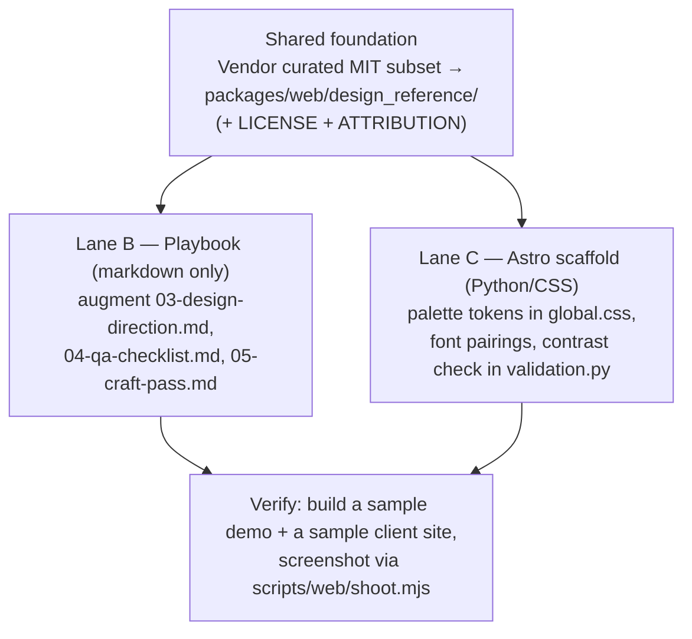

# ✨ Design intelligence for the two LIVE web paths

## Enhancement Summary

**Deepened on:** 2026-06-04
**Sections enhanced:** Shared foundation, Lane C (contrast + fonts), Palette method (both lanes)
**Research used:** WCAG-contrast-in-Python, color-theory (secondary/accent derivation), Google-Fonts
weight validation, exact UI-UX-Pro-Max CSV schemas, local learnings scan.

### Key improvements grounded by research
1. **Exact MIT data schemas captured** — `colors.csv` (18 cols incl. `Primary/On Primary/Secondary/
   On Secondary/Accent/On Accent/Background/.../Notes` with WCAG-adjustment notes), `ux-guidelines.csv`
   (`Category/Issue/Do/Don't/Code Example Good/Bad/Severity`), and `google-fonts.csv` (family catalog
   with `Styles` = available weights + `Variable Axes` = VF ranges). Vendoring is now concrete.
2. **The contrast check is now spec'd to be *sound, not complete*** — resolve only literal light-mode
   `:root` pairs; explicitly SKIP (don't guess) `var()`/`color-mix()`/`light-dark()`/alpha<1/dark-mode-
   `@media` values and report the skip. Stdlib-only (`re` + `colorsys`). Reference impl below.
3. **Google-Fonts validation gets a real source of truth** — the MIT `google-fonts.csv` `Styles` +
   `Variable Axes` columns double as an offline, network-free weight snapshot; the URL builder must
   **raise** on unknown family/weight instead of falling back to `400;700` (which masks both
   nonexistent-static-weight 400s and out-of-range VF clamps).
4. **Palette derivation has a deterministic, WCAG-gated algorithm** — derive in HSL (split-complement
   default), then clamp accent into an AA-legible band via real contrast, emit a lightened dark-mode
   accent variant. Sketch below.

### New considerations discovered
- **Existing fonts home:** `packages/tools/content_tools/fonts/` already vendors a font + `OFL.txt` —
  the natural place for the `google_fonts_snapshot` + validation, not a new dir.
- **`colors.csv` is keyed by "Product Type" (SaaS/E-commerce/…), not local-SMB genres** — mapping our
  ~20 trades/wellness/food genres needs judgment; many rows won't map cleanly. Curate, expect gaps,
  fall back to the HSL synthesizer.
- **`colors.csv` already encodes `On Primary`/`On Accent`** (the text-on-color) and documents WCAG
  fixes in `Notes` — lift those pairs directly rather than recomputing.
- **No directly-relevant prior learnings** in `docs/solutions/` (closest:
  `architecture/agency-layer-reuse-and-repo-mechanism-footguns.md` — worth a glance for repo-mechanism
  footguns during implementation).

## Overview

Bring richer, vetted design intelligence (palettes, font pairings, UX/a11y rules — sourced from the
MIT-licensed [UI UX Pro Max](https://github.com/nextlevelbuilder/ui-ux-pro-max-skill) data) into the
two web paths that **actually ship today**, in parallel:

- **Path B — Bespoke prospect demos (live).** Customer-facing prospect mockups are hand-built per
  business via `docs/demo-site-build-playbook.md` and the `state/prospects/sites/_scaffold/`
  checklists, producing `dist-v2/`. There is **no code generator** — the "builder" is a human/agent
  following checklists. So design intelligence lands as **reference data and guidance inside those
  checklists**, augmenting (never overriding) the existing "palette from the business's own visual
  cues first" rule.
- **Path C — Paid client Astro sites (live).** Paid sites are built from `packages/web/scaffold.py`
  (Astro under `products/<slug>-site/`, via the `landing-page-build` skill and the planned
  `client-intake`). Here design intelligence lands as **code**: richer palette tokens, expanded font
  pairings, and a contrast check in the web gate.

A small **shared foundation** (vendor a curated subset of the MIT data once, with attribution)
precedes both. Because B is markdown and C is Python/CSS, the two lanes touch **disjoint files** and
run truly concurrently with no merge seam.

### Why NOT the original target (decision record)

A prior draft targeted `packages/agency/demo_theme.py` + `render_landing_html` → `dist/`. A technical
review proved that path is **deprecated for prospects** — `prospect_site.py:1-15` says so explicitly,
and `resolve_prospect_dist_dir` (`prospect_site.py:237-249`) *refuses* to fall back to `dist/`:

> "The **legacy token-fill** path (`render_landing_html` + `demo_theme` → `dist/`) is deprecated for
> prospects. It remains only for `--legacy-build` bulk regeneration."

Enriching that engine would polish a path that no longer ships. We leave `demo_theme.py` untouched.

### Scope guard

Does **not** adopt Magic MCP (21st.dev) — remote/rate-limited/React output, incompatible with our
offline static pipeline. We take UI UX Pro Max's **data**, not the live tool. See
[§ Alternatives](#alternative-approaches-considered).

---

## Problem Statement

Both live paths under-use available design intelligence:

- **Path B** demos are high-craft but rely on per-build human taste; there's no *shared, vetted
  reference* for "which display+body pairing fits a barber vs. a yoga studio," "what accent harmonizes
  with this dominant canvas," or a crisp UX/a11y acceptance bar. The craft-pass checklist
  (`_scaffold/05-craft-pass.md`) already gestures at this ("Fraunces / Cabinet Grotesk … + Geist /
  General Sans") but the options are ad hoc.
- **Path C** Astro sites theme via a single `--brand` token override (`global.css`), so client sites
  are essentially monochrome-accented. There's no secondary/accent palette structure and no automated
  contrast guard, so a low-contrast brand color can ship.

The goal in both: more intentional palette + typography, and a measurable UX/a11y floor — **without**
breaking Path B's "derive palette from the business's own visual cues first" principle (the thing that
keeps demos from converging on one canned look).

---

## Proposed Solution



### Shared foundation (precedes both lanes; one small commit)

- [ ] Create `packages/web/design_reference/` holding a **curated subset** actually used:
  - `palettes.md` — ~20–30 industry palettes (primary / secondary / accent / suggested text+bg),
    chosen to cover our genres, in a human-readable table (Path B reads it; Path C lifts literals).
  - `font_pairings.md` — ~20 vetted Google-Fonts display+body pairings grouped by vibe
    (industrial / trades / elegant / warm / calm / playful / friendly / professional / vintage).
  - `ux_rules.md` — the handful of UX/a11y rules we'll enforce (contrast AA, tap-target ≥44px,
    one primary CTA above the fold, etc.).
  - `LICENSE` (upstream MIT verbatim) + `ATTRIBUTION.md` (source repo URL + commit SHA + MIT notice).
- [ ] **Curate, don't bulk-import.** We use ~12% of the upstream 161 palettes / 57 pairings; copy only
  the rows we map to our genres. No CSV loader, no runtime parse.

> Simplicity note (from review): a markdown reference is the right shared artifact because Lane B
> consumes it as human-readable guidance and Lane C copies ~20 literals from it by hand. No
> `design_data/` module or CSV pipeline.

### Lane B — Bespoke playbook (markdown only; no code) — *parallel*

Augment the checklists; **preserve the visual-cue-first palette rule** — the reference is a
*fallback/enrichment*, not an override.

- [ ] `state/prospects/sites/_scaffold/03-design-direction.md`:
  - Add a "Font pairing — pick from the reference" subsection linking `design_reference/font_pairings.md`,
    grouped by the vibe the human picked.
  - Add an "Accent harmony" hint: when visual cues give a dominant canvas, suggest a harmonizing
    secondary/accent from `design_reference/palettes.md` (only if the business has no strong own cue).
  - Add a **structural archetype menu** (gallery-led / services+pricing-led / booking-first /
    classic) so structure is a deliberate choice, not default. This is where structural variety lives
    for prospects (bespoke HTML, chosen per business) — **not** in code templates.
- [ ] `state/prospects/sites/_scaffold/04-qa-checklist.md`: add the `ux_rules.md` items as explicit
  gate checkboxes (contrast AA on text/bg + CTA, tap-target size, single primary CTA, focus states).
- [ ] `state/prospects/sites/_scaffold/05-craft-pass.md`: replace the ad-hoc font examples with a
  pointer to `font_pairings.md`; keep all existing craft items.
- [ ] `docs/demo-site-build-playbook.md`: one line in the Step-4 build section pointing to
  `design_reference/` for palette/type/UX intelligence.

### Lane C — Paid client Astro sites (Python/CSS) — *parallel*

Where the original plan's *valid* mechanics move. Targets `packages/web/`.

- [ ] **Expand palette tokens** in `packages/web/scaffold/astro-landing/src/styles/global.css`
  (`:9-40`): add `--secondary` and `--accent` (3–4 roles total with the existing `--brand`), used in
  section accents / CTAs. **Keep neutral `--bg`/`--text`/`--border` as-is** so dark-mode handling
  (`global.css:42-55`) keeps working — those are not per-brand.
- [ ] **Thread the new tokens through every context producer** so `unfilled_tokens()`
  (`prospect_site.py:199-201`) never trips: `default_context()` (`scaffold.py:51-104`),
  `local_business_context()`, **and `ClientIntake.to_site_context()`** (the real client-site entry).
  Provide sensible defaults derived from `--brand` when no secondary is given.
- [ ] **Expand font pairings available to client sites** from the `design_reference/font_pairings.md`
  list (validate each family is a real Google Font *and* the requested weights exist — see Risks).
- [ ] **Add one contrast check** to `packages/web/validation.py`, registered in `validate_web_dist()`
  (`:316-322`). Scope it to what it can actually resolve: the **brand/brand-contrast and
  text/bg pairs present in the built HTML's inlined CSS**. This requires a small new CSS-extraction
  helper (the current `_PageParser`, `:63-124`, parses tags only — it does **not** read `<style>`).
  Acknowledge in the check that dark-mode `@media` cascades are out of scope for v1 (compute against
  the light-mode `:root` values only).

> Review fixes folded in: palette trimmed to 3–4 roles (not 7 — `bg/text/border` are global neutrals);
> validation trimmed to **contrast only** in code (tap-target + single-CTA become Path B checklist
> items, where they're cheap and actually vary); no reliance on the false
> `render_landing_html(template=...)` page-selection claim (Lane C does not add page templates —
> structural variety is Path B's bespoke job).

### Verify (after both lanes merge)

- [ ] Build one sample client site from the Astro scaffold; confirm new palette tokens render and the
  contrast check passes (and fails a crafted low-contrast fixture).
- [ ] Hand-build (or dry-run) one demo through the augmented checklists to confirm the reference is
  usable and the visual-cue rule still leads.
- [ ] Screenshot via `scripts/web/shoot.mjs` into `docs/products/better-business-web/screenshots/`
  per the screenshot convention.
- [ ] `pytest packages/web -q` green.

---

## Research Insights (deepened 2026-06-04)

### A. Exact MIT data schemas → what to vendor

The shared-foundation step now has concrete source schemas (verified from raw files):

```
colors.csv:        No, Product Type, Primary, On Primary, Secondary, On Secondary, Accent,
                   On Accent, Background, Foreground, Card, Card Foreground, Muted,
                   Muted Foreground, Border, Destructive, On Destructive, Ring, Notes
  e.g. 1, SaaS (General), #2563EB, #FFFFFF, #3B82F6, #FFFFFF, #EA580C, #FFFFFF, #F8FAFC, ...,
       "Trust blue + orange CTA contrast [Accent adjusted from #F97316 for WCAG 3:1]"

google-fonts.csv:  Family, Category, Stroke, Classifications, Keywords, Styles, Variable Axes,
                   Subsets, Designers, Popularity Rank, Trending Rank, Is Noto, Date Added,
                   Last Modified, Google Fonts URL
  e.g. AR One Sans, Sans Serif, , , "clean modern…variable…", "400 | 500 | 600 | 700",
       "ARRR: - | wght: -", latin|latin-ext|vietnamese, …

ux-guidelines.csv: No, Category, Issue, Platform, Description, Do, Don't,
                   Code Example Good, Code Example Bad, Severity
```

**Implications for the foundation step:**
- For `design_reference/palettes.md`: lift `Primary / Secondary / Accent` **and their `On *` text
  pairs** directly (don't recompute — the data already WCAG-adjusted them, per `Notes`). Map our ~20
  local-SMB genres onto the closest `Product Type`; **expect unmapped genres** and fall back to the
  HSL synthesizer (§C).
- For font selection: `google-fonts.csv` `Keywords` + `Classifications` drive vibe→family choice; the
  **`Styles` column gives discrete weights and `Variable Axes` gives VF ranges** — this is the weight
  snapshot for §B. Vendor the rows for our chosen families only.
- For `ux_rules.md`: filter `ux-guidelines.csv` to `Severity: High` accessibility/touch/forms rows
  (contrast, 44×44 tap targets, labeled inputs, focus states) — these become Path B checklist items.

### B. Google-Fonts weight validation (Lane C)

- CSS2 URL grammar is strict: family spaces→`+` (never re-encode `+`), axes listed **alphabetically**
  (`ital,wght`), tuples **numerically sorted** (`0,400;0,700;1,400`), ranges via `..`. Unsorted or
  bad-axis → **HTTP 400** → browser silently has no `@font-face` → system-font fallback, build "passes."
- **Two silent-failure modes the current `400;700` fallback hides:** (1) a nonexistent *static* weight
  → 400 → silent fallback; (2) an out-of-range weight on a *variable* font → browser **clamps** to the
  nearest end (e.g. 100 requested on a 300..900 VF renders at 300). Validate against discrete `Styles`
  for static and the `Variable Axes` `wght` range for VF.
- **Source of truth, network-free:** the vendored `google-fonts.csv` (`Styles` + `Variable Axes`) — no
  API key, already MIT. Home: `packages/tools/content_tools/fonts/` (already vendors fonts + `OFL.txt`).
- **Required engine change + test:** the URL builder **raises** on unknown family/weight (no `400;700`
  fallback); a parametrized test asserts every pairing's requested weights ∈ available, and asserts the
  builder *raises* on an invalid weight. Track `italics` separately (700 normal ≠ 700 italic).
- **Two emit modes** (the craft-pass wants self-host before deploy): CDN `css2?` link for previews;
  local `@font-face` + woff2 (Fontsource `metadata.json` is a clean cross-check) for production. Same
  snapshot answers both; for self-hosted *static* instances restrict to downloaded weights, not VF range.

### C. Palette derivation — deterministic, WCAG-gated (both lanes)

Derive in HSL, **validate legibility with real WCAG contrast** (HSL lightness is non-perceptual). Pick
harmony by mood; **split-complementary is the forgiving default**:

| Mood | Secondary offset | Accent offset | Sat posture |
|---|---|---|---|
| calm professional | H+30° | H−30° (analogous) | lower S (~0.35–0.55) |
| warm friendly / default | H+150° | H+210° (split-comp) | moderate S (~0.55–0.70) |
| bold | H+25° | H+180° (complement) | high accent S (≥0.65) |

Guards a deterministic function must apply: accent S-floor ≥0.55; accent L in 0.42–0.58 for a
button; force complement if hue distance <40° (accent must not blend into brand); split lightness ≥20
points if near-complement and both highly saturated (anti-vibration); push secondary to a tint if it
lands muddy (S 0.30–0.45 & L 0.40–0.55 far from brand); **loop accent L until on-color text hits AA
4.5:1**; emit a lightened, slightly-desaturated dark-mode accent. Keep accent to ≤10% of surface
(60/30/10). Reference sketch (`derive(brand_hsl, mood)`) returns `(secondary, accent, meta)` with the
chosen-text-color and dark-mode pair — captured in research, ready to drop into a `palette.py` helper.

### D. Contrast check — sound-not-complete (Lane C)

WCAG 2.x: linearize sRGB → `L = 0.2126R+0.7152G+0.0722B`; `ratio=(L1+0.05)/(L2+0.05)`; AA = **4.5:1**
text / **3:1** large (≥24px, or ≥18.66px bold) & UI. Compare the **unrounded** ratio.

- **Stdlib only** (`re` + `colorsys` — note `colorsys` is HLS order). No `tinycss2`/`colour` dep.
- Parse hex (`#rgb/#rgba/#rrggbb/#rrggbbaa`), `rgb()/rgba()` (legacy + space form, 0-255 or %), `hsl()/hsla()`.
- **Resolve only literal light-mode top-level `:root`** (strip `@media`/`@supports`/`@container` first;
  apply last-wins across inlined `global.css` + any injected block). Check a **fixed declared pair set**
  (`--text`/`--bg`, `--brand-contrast`/`--brand`) — don't auto-discover pairs.
- **Raise/SKIP-and-report (never guess)** on `var()`, `color-mix()`, `light-dark()`, alpha<1 without a
  known backdrop, dark-mode-only values, unknown syntax. A reported skip is honest; a guessed pass is
  dangerous. Fail the gate on any checked pair below threshold.
- **New helper required:** `_PageParser` (`validation.py:63-124`) reads tags only — add a small CSS/`:root`
  extractor; don't assume the parser sees `<style>`. Stdlib reference impl (`relative_luminance`,
  `contrast_ratio`, `parse_color` with `Unresolvable`) captured in research.

Sources: W3C WCAG 2.1 §1.4.3/§1.4.11/relative-luminance/contrast-ratio; MDN `<color>`/`color-mix`/
`prefers-color-scheme`; Google Fonts CSS2 + Developer API + troubleshooting docs; Fontsource;
Material 3 / Radix / IBM Carbon (tonal scales, paired light/dark, anti-oversaturation).

## Alternative Approaches Considered

| Approach | Why not |
|---|---|
| **Enrich `demo_theme.py` (original plan)** | Deprecated for prospects (`prospect_site.py:1-15`); `dist/` is refused by `resolve_prospect_dist_dir`. Would polish a dead path. |
| **Adopt Magic MCP for generation** | Remote, rate-limited, soon-paid, emits React — incompatible with offline static builds. Author-time only; `compound-engineering:frontend-design` already covers that. |
| **Install UI UX Pro Max as a live skill** | We want its *data* as a curated reference, not an interactive runtime dependency. |
| **Add Astro page-template archetypes for Path C via `render_landing_html(template=...)`** | The `template` arg selects a *directory*, not a page file (`scaffold.py:212-213`); would need a new `page=` param. Deferred — structural variety for prospects already lives in Path B's bespoke build. |
| **Code-enforce tap-target & single-CTA in the web gate** | Those are CSS invariants shared by all sites — a per-site gate re-checks a constant. Cheaper as Path B checklist items. |

---

## Acceptance Criteria

### Functional
- [ ] `packages/web/design_reference/` exists with curated palettes/pairings/ux-rules + MIT
  `LICENSE` + `ATTRIBUTION.md` (repo URL + commit SHA).
- [ ] **Lane B:** `03-design-direction.md`, `04-qa-checklist.md`, `05-craft-pass.md`, and the playbook
  reference the new data; the **visual-cue-first palette rule is preserved** and explicitly marked as
  taking precedence over canned palettes.
- [ ] **Lane C:** Astro scaffold exposes `--secondary`/`--accent`; all context producers
  (`default_context`, `local_business_context`, `to_site_context`) supply the new tokens (no unfilled
  tokens); ≥ ~20 valid font pairings available.
- [ ] **Lane C:** `validate_web_dist()` includes a contrast check that fails a crafted low-contrast
  fixture and passes a known-good site; scope/limits documented in the check.

### Non-Functional
- [ ] License compliance: vendored data ships MIT `LICENSE` + attribution; only data copied, no marks.
- [ ] Dark mode + reduced-motion unaffected on the Astro scaffold.
- [ ] No network/Node needed for the contrast check (operates on built HTML strings).
- [ ] `demo_theme.py` and the deprecated `dist/` path are untouched.

### Quality Gates
- [ ] `pytest packages/web -q` green.
- [ ] Sample screenshots committed to `docs/products/better-business-web/screenshots/`.

---

## Success Metrics
- Path C client sites use ≥ 3 distinct palette roles (vs today's single brand accent).
- Contrast check catches ≥ 1 real low-contrast case on a test brand color.
- A demo built via the augmented checklists picks its font pairing from the shared reference (process
  adherence), while palette still derives from the business's real visual cues.

## Dependencies & Risks

| Risk | Mitigation |
|---|---|
| **Reference data overrides Path B's visual-cue rule** | Mark the reference as fallback/enrichment; restate "visual cues first" at the top of the font/accent subsections. |
| **License/attribution** | Ship upstream MIT `LICENSE` + `ATTRIBUTION.md` (repo + commit SHA); copy data only. |
| **Invalid Google Font / wrong weight** (Lane C) | Validate each family AND that requested weights exist for it; test asserts the import URL builds *and* weights are valid (not just "URL builds" — review flagged `_FONT_WEIGHTS` fallback masks bad weights). |
| **Contrast check over-promises** | Scope to light-mode `:root` brand/text pairs; document dark-mode cascade as out of scope; add the new CSS-extraction helper rather than assuming `_PageParser` reads `<style>`. |
| **New tokens trip `unfilled_tokens()`** | Add tokens to ALL three producers incl. `to_site_context()`, with `--brand`-derived defaults. |
| **Two lanes collide** | They don't — Lane B is markdown under `state/prospects/sites/_scaffold/` + `docs/`; Lane C is `packages/web/`. Only the shared foundation commit precedes both. |

## Documentation Plan
- [ ] Note `design_reference/` provenance in `docs/products/better-business-web/` build notes.
- [ ] Update `skills/canonical/landing-page-build/skill.md` to reference the palette/font reference for client sites.
- [ ] Keep this decision record (Magic-MCP rejected; demo_theme deprecated-path rejected).

## References & Research

### Internal — Path B (live prospect demos)
- `packages/agency/prospect_site.py:1-15` (path map; legacy `dist/` deprecated), `:237-249`
  (`resolve_prospect_dist_dir`)
- `docs/demo-site-build-playbook.md` (the bespoke build procedure → `dist-v2/`)
- `state/prospects/sites/_scaffold/03-design-direction.md`, `04-qa-checklist.md`, `05-craft-pass.md`
- `scripts/agency/screenshot_demo.py`, `scripts/agency/build_portfolio_demos.py` (both prefer `dist-v2/`)

### Internal — Path C (paid client Astro sites)
- `packages/web/scaffold.py:51-104` (`default_context`), `:171-198` (`scaffold_site`), `:201-222`
  (`render_landing_html`); `to_site_context()` in the intake module
- `packages/web/scaffold/astro-landing/src/styles/global.css:9-40` (tokens), `:42-55` (dark mode)
- `packages/web/validation.py:63-124` (`_PageParser` — tags only, no CSS), `:238-265`
  (`check_accessibility`), `:316-322` (`validate_web_dist`)
- `docs/plans/2026-06-01-feat-local-smb-agency-layer-plan.md` (Phase 4 client-intake)

### External
- UI UX Pro Max (MIT data source): https://github.com/nextlevelbuilder/ui-ux-pro-max-skill
- Magic MCP (evaluated, rejected): https://github.com/21st-dev/magic-mcp

🤖 Generated with [Claude Code](https://claude.com/claude-code)
