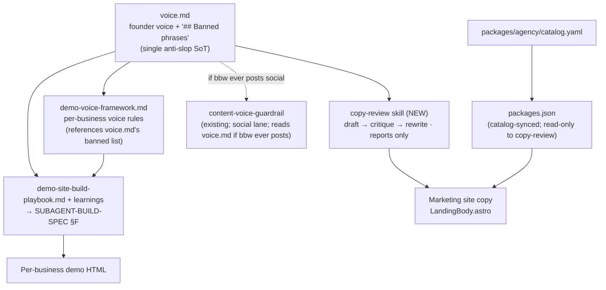

# ✨ feat: Better Business Web Copy Voice System

## Enhancement Summary

**Deepened on:** 2026-06-05 · **Agents used:** 3 content-drafting (knowledge base, skill scaffolding, demo diffs) + 5 adversarial reviewers (code-simplicity ×2, architecture-strategist, kieran-python, DHH-taste), on top of the original repo-research / learnings / spec-flow passes.

The deepening **simplified** the plan and **corrected two source-grounded errors**. Net: 3 knowledge files → **2**; one invented taxonomy → **0**; one invented CI drift-test → **0**; 4 fixtures → **3**. No capability lost.

### Key changes from v1
1. **Single banned list, living in `voice.md`** (not a separate `banned-phrases.md`). The existing `content-voice-guardrail` already reads the banned list from `voice.md`'s `## Banned phrases` heading (catchbook precedent), so a second file + a drift test was managing a split we created. **Cut the drift test and the `scope:`/`check:` tag syntax**; scope is now two plain subsections inside `voice.md`.
2. **Corrected the fail-closed risk.** The guardrail is a *skipped scaffold* (`apps/worker-gtm/gtm/runner.py` emits `content-voice-guardrail:skipped:scaffold`) and bbw has no GTM coupling — a lone `voice.md` cannot "block GTM content." The real `voice.md` consumer is `gtm_chain.validate_gtm_chain` (6-file requirement, **no callers**). Risk + sequencing rationale rewritten; a *partial* `gtm/` dir is now noted as the actual latent hazard.
3. **Zero-drift registry wiring** — `project_skill` is omitted from the agent-landed entry and added together with the operator-created pointer (avoids a `dangling_project_skill` drift window per `registry_drift.py`).
4. **Dropped the `<!-- founder-authored -->` marker** (decorative — `gtm-artifact-refresh` keys on section *names*, and the real catchbook template has no such marker); **trimmed fixtures to the precedent's 3**; **resolved `owner_agent: gtm`**.
5. Added **ready-to-commit appendices** (A–E): the full `voice.md`, `demo-voice-framework.md`, the `copy-review` skill (canonical + contract + 3 fixtures + adapter + pointer + registry), and the exact demo-pipeline diffs.

### Technical review corrections (v3 — 2026-06-05)
Kieran (code) + Simplicity + DHH (taste) review. Decision: **keep the full plan, fix the errors.**
1. **Fixtures re-grounded (Kieran M1–M4).** v2 wrongly said to "mirror `content-voice-guardrail`'s fixtures" — those are orphaned **I/O-replay** fixtures with no test. The repo's working pattern is **contract-freeze** (`gtm-artifact-refresh`): a single `fixtures/happy_path.yaml` holding a *list* of named cases, each with `input.skill_file` + `expected.<required_* keys from `_GROUP_LABELS`>`, consumed by a ~20-line parametrized test. Appendix C3 rewritten to that model.
2. **Honest fixture claim (Kieran M2).** A contract-freeze fixture can't *behaviorally* prove "guarantee passes" — it freezes the carve-out **clause text** verbatim so it can't be silently deleted. AC restated.
3. **`fixture_status: passing` gate named (Kieran S4):** `tests/python/unit/test_skill_reconciliation.py` fails CI unless the fixtures land (non-empty `input` per case) in the same commit as the `passing` flag.
4. **Cut `generic` from the `surface` enum** → `{marketing|demo}` (Simplicity — it was a synonym for `demo`). Added an optional `language` input (Kieran N3) so the caller declares language rather than the skill guessing.
5. **Trimmed the vendored banlist (DHH).** The 40-word GPT-isms list was itself the "slop-by-committee" Appendix E warns against. Cut to the ~7 words a model actually reaches for in local-business copy + kept the *constructions* and em-dash-as-count (the real structural tells). The say-this-not-that table does the teaching.
6. **Fix the input, not just the output (DHH).** The say-this-not-that + genre tables are now injected at demo **generation** time (the content-brief step), not only at the verify gate. The §F grep is the real gate; the LLM self-critique is the secondary pass.
7. **Block-style `contract.yaml`** (Kieran S1); read-is-file-I/O + case-sensitive whitelist noted (Kieran N1–N2); the "guardrail fixtures still pass" AC downgraded to a note (it's vacuous — those fixtures inline their own voice text; Kieran N5). **Marketing hard-gate hook closed as "no"** (DHH).

---

## Overview

Make AI-assisted website copy for **Better Business Web** (`bbw`) stop sounding like AI, across **both** copy surfaces:

1. **The agency marketing site** — hand-authored copy in `LandingBody.astro` (+ its JSON data files) that closes customers.
2. **The client demo sites** — per-business copy generated by an LLM subagent for every prospect.

We add a small **copy knowledge base** (a founder voice spec that *contains* the shared anti-slop list + a per-business voice framework) and wire a **draft → critique → rewrite** loop into both pipelines: a new on-demand `copy-review` skill for the marketing surface, and a self-critique verify step in the (tracked) demo build playbook for the generated surface.

This is **Approach B** from the brainstorm: reuse the established `docs/products/<id>/gtm/voice.md` convention; author a **standalone `copy-review` skill** rather than re-scope the social-shaped `content-voice-guardrail`.

## Problem Statement

- The agency's copy is hand-authored and decent, but there's no documented voice, no banned-phrase discipline, and no repeatable critique step — so any AI-assisted edit drifts toward generic "AI voice."
- The **client demos are the high-volume, genuinely AI-written surface.** Their pipeline enforces *grounding* (no invented facts, paraphrase reviews) but has **no voice/anti-slop gate** — the verify step only greps literal template ghosts (`Northwind`, `{{`). AI-tell phrasing ("unlock", "elevate", "it's not just X, it's Y") ships unchecked, and on a small-business demo that directly costs sales.
- Infrastructure is half-built: `content-voice-guardrail` exists but is **social-only, internal-only, and not a live gate** (`runner.py` → `skipped:scaffold`). No `voice.md` exists for `bbw`.

## Proposed Solution

Two checked-in knowledge artifacts under `docs/products/better-business-web/gtm/`, one new skill, and tracked edits to the demo playbook — sequenced so nothing dangles.

### Architecture



**Reading the diagram:** `voice.md` is the single source of truth — it carries the founder voice *and* the `## Banned phrases` list (two subsections: banned-everywhere + agency-site-only). `copy-review` reads `voice.md` and critiques the marketing copy. `demo-voice-framework.md` references `voice.md`'s banned-everywhere list and adds per-business rules; the demo playbook applies them inline in the subagent's verify step. `packages.json` copy is downstream of `catalog.yaml`, so it is read-only to `copy-review` (fixes route upstream).

## Technical Approach — Key Design Decisions

| # | Decision | Rationale |
|---|----------|-----------|
| D1 | **`copy-review` is a standalone skill, not a wrapper around `content-voice-guardrail`.** | The guardrail requires a social `platform` enum {tiktok,instagram,threads,x} and bakes in fishing-specific hard-fails ("guarantee applied to fishing results", ≥3 emoji, all-caps) — which would reject bbw's *core* guarantee copy. It is also internal-only (`target_runtimes: []`) and not a live gate. A purpose-built skill applies website-appropriate checks without re-scoping a contract-frozen skill. |
| D2 | **One banned list, inside `voice.md` — no separate `banned-phrases.md`, no drift test.** | `content-voice-guardrail` already reads the banned list from `voice.md`'s `## Banned phrases` heading, and catchbook's `voice.md` keeps it inline. A second catalog file + a CI mirror-test (no such test pattern exists in the repo) was machinery to manage a split we'd have created. `copy-review` reads the same one section. |
| D3 | **Scope = two plain subsections in `voice.md` ("Banned everywhere" / "Agency-site only"), not a `scope:`/`check:` tag syntax.** | The section a phrase lives under already encodes its scope; a human and an LLM both read `## Agency-site only` correctly with zero tag vocabulary. Whether a phrase is caught by literal grep vs. LLM judgment is the *skill's* internal business, not metadata in the doc. `copy-review`'s `surface` input decides whether the agency-only subsection applies. |
| D4 | **Marketing critique is advisory-by-default; the demo critique is a real gate.** | The marketing site is human-authored — `/copy-review` runs on-demand before committing; a hard gate would need an operator-owned hook (flagged, optional follow-up). The demo subagent runs autonomously, so its verify step (`§F`) *is* a real iterate-on-fail gate. Stated honestly rather than implying the marketing surface is auto-gated. |
| D5 | **`packages.json` copy is read-only to `copy-review`; fixes route to `packages/agency/catalog.yaml`.** | `packages.json` descriptions are catalog-synced; rewriting them in place is silently reverted on the next sync. |
| D6 | **AI-tell list is English-only; the demo grep whitelists the business's own name tokens first.** | A business named "Elevate Fitness" must not trip the banned verb "elevate" (the existing `§F` gate already special-cases `nail`). Non-English source copy (e.g. the Spanish-market coffee demo) must not be grepped against an English slop list. |
| D7 | **Tracked SoT for demo rules is the playbook + learnings; the gitignored build-spec is a regenerated mirror (hand-synced — no generator script exists).** | `state/prospects/batch/SUBAGENT-BUILD-SPEC.md` is gitignored (`state/prospects/*`). Durable edits land in `docs/demo-site-build-playbook.md` + `docs/demo-site-learnings.md`; an explicit operator step re-syncs the spec. The fail-loudly guard is best-effort (lives in the mirror) until a tracked generator exists — noted as a follow-up. |
| D8 | **Zero-drift skill wiring:** the agent lands canonical + adapter + registry entry **without** `project_skill`; the operator creates the `.claude/skills/copy-review.md` pointer **and** adds the `project_skill` key in the same follow-up. | `registry_drift.py` skips entries with a falsy `project_skill` but flags a `project_skill` pointing at a missing file. Omitting it until the pointer exists avoids a self-inflicted `dangling_project_skill` finding. The loader resolves the adapter via `adapters.claude` without `project_skill`. |
| D9 | **Banned list stays markdown reference text now; a typed `banned-phrases.yaml` is deferred.** | The architecture review flagged markdown-as-data as a repo anti-pattern. But the *only* machine consumers today are `content-voice-guardrail` (already markdown) and the new `copy-review`; introducing YAML now would either fork the format (re-creating the drift problem) or force a change to the frozen guardrail. `voice.md` is treated as *opaque reference text* by both — the same way the guardrail already treats it. Revisit if a third structured consumer appears. |

### Implementation Phases

#### Phase 1 — Copy knowledge base *(two artifacts)*

Create `docs/products/better-business-web/gtm/` and author:

- **`voice.md`** — founder voice in the catchbook schema, with the anti-slop list inline as `## Banned phrases` split into **"Banned everywhere"** and **"Agency-site only"** subsections, plus `## Preferred vocabulary` (say-this-not-that). Full draft in **Appendix A**. Note: "guarantee" is deliberately **not** banned (it's bbw's core promise).
- **`demo-voice-framework.md`** — per-business voice rules: derive-from-the-business principle, an 8-genre lead-with table, restated grounding rules, the new paraphrase-attribution rule, the name-token whitelist, and the English-only language note. It references `voice.md`'s "Banned everywhere" list (no second list). Full draft in **Appendix B**.
- **Calibration gate:** before locking `voice.md`, commit **3 before/after rewrites** of real `LandingBody.astro` sections as evidence the voice reads as bbw (60/30/10). Store at `docs/products/better-business-web/gtm/voice-calibration.md`.

#### Phase 2 — `copy-review` skill *(standalone)*

| Artifact | Path | Notes |
|----------|------|-------|
| Canonical | `skills/canonical/copy-review/skill.md` | Owns inputs/outputs/steps/boundaries. **Appendix C1.** |
| Contract | `skills/canonical/copy-review/contract.yaml` | Machine I/O surface. **Appendix C2.** |
| Fixtures | `skills/canonical/copy-review/fixtures/happy_path.yaml` (one file, **list of 3 named cases**) | Contract-freeze (freezes the canonical body, not I/O-replay) — mirrors `gtm-artifact-refresh`, not the orphaned `content-voice-guardrail` I/O fixtures. The `boundary` case **freezes the "NOT hard fails" carve-out clause verbatim** (so it can't be silently deleted). **Appendix C3.** |
| Adapter | `skills/adapters/claude/copy-review.md` | **Thin** — quick-ref + steps + boundaries; defers to canonical. **Appendix C4.** |
| Pointer | `.claude/skills/copy-review.md` | Strict WIRING template. **Operator-created (D8).** **Appendix C5.** |
| Registry | `skills/registry.yaml` | New entry **without `project_skill`** (D8). **Appendix C6.** |

**Contract surface:** inputs `copy` (pre-extracted prose — the caller does extraction), `surface` {marketing\|demo}, `voice_guide_path`, `proper_nouns[]`, `language` (optional, default `en` — the caller declares it; the skill doesn't guess); outputs `verdict` {pass\|fail}, `off_voice[]` of `{phrase, reason}`, `suggested_rewrite` (str\|null). Reports only — **reads `voice_guide_path`, writes nothing**. Fail-closed if `voice.md` is missing/unparseable.

#### Phase 3 — Pipeline wiring + backfill

**Marketing surface (insertion #1):**
- Document the workflow: run `/copy-review` over `LandingBody.astro` (+ `portfolio.json` prose; `packages.json` **read-only** — fixes go to `catalog.yaml`) **before committing** copy edits.
- *(Optional follow-up, operator-owned)* a git pre-push / `.claude/settings.json` hook scoped to the copy files to make it a hard gate.

**Demo surface (insertion #2) — edit tracked docs only (full diffs in Appendix D):**
- `docs/demo-site-build-playbook.md`:
  - **At generation (content-brief step) — fix the input, not just the output (DHH):** inject `demo-voice-framework.md`'s genre lead-with table + the say-this-not-that examples *into the build prompt* so the subagent writes on-voice the first time. Good examples up front beat an after-the-fact critique.
  - **At verify (§5 gate):** the **grep is the real gate** — whitelist name tokens → literal-grep `voice.md`'s "Banned everywhere" words. Then a secondary **LLM self-critique** pass for the judgment tells (constructions / em-dash budget / rhythm / clichés / unbacked claims) → **iterate on fail**. (Honest framing: the grep is mechanical and reliable; the self-critique is a fresh-eyes pass, not a second wall.) Preserve the existing literal-ghost grep verbatim.
- `docs/demo-site-learnings.md`: add a `[COPY]` rule (0 builds, graduates at ≥3) + a Graduation-log line.
- **Regenerate** `state/prospects/batch/SUBAGENT-BUILD-SPEC.md` from the updated tracked docs: add `demo-voice-framework.md` to "Read first"; extend **§F** with the AI-tell iterate step; add a fail-loudly STOP guard if the framework is absent. Document the regen trigger in the playbook (D7).

**Backfill (one-time remediation):**
- Run `/copy-review` over current marketing copy; log the verdict; hand-fix or grandfather.
- Run the AI-tell grep + self-critique over all **8 published demos** (`products/better-business-web/site/public/work/<slug>/index.html`); **triage all 8 (logged verdict + recorded decision)**; "grandfather with a tracked follow-up" is a valid decision so the backfill can't balloon into a demo-rebuild project.

## Alternative Approaches Considered

- **Separate `banned-phrases.md` + automated drift test** (plan v1). **Rejected on review:** the guardrail already reads the banned list from `voice.md`; the second file existed only to be policed by an invented CI test and tag taxonomy — Approach-C machinery. Collapsed into `voice.md` (D2).
- **Typed `banned-phrases.yaml` as SoT.** **Deferred (D9):** no third structured consumer yet; would fork the format or force a change to the frozen guardrail.
- **B1 — extend `content-voice-guardrail` for web copy.** **Rejected:** re-scopes a contract-frozen social skill; its single-doc input + fishing hard-fails are wrong for a web agency.
- **A — docs only, no skill.** **Rejected** (brainstorm): drifts; the loop never becomes real.
- **C — full critic-agent + eval harness.** **Deferred** (YAGNI).
- **4-fixture matrix (incl. `json_input`).** **Trimmed to 3** to match the `content-voice-guardrail` precedent; JSON prose-extraction is the caller's job, noted in the contract rather than a fixture.

## Acceptance Criteria

### Functional
- [x] `docs/products/better-business-web/gtm/{voice.md, demo-voice-framework.md}` exist; `voice.md` parses and has a non-empty `## Banned phrases` with "Banned everywhere" + "Agency-site only" subsections.
- [x] `copy-review` skill exists (canonical + contract + `fixtures/happy_path.yaml` with 3 cases + adapter + registry). _Invocable as `/copy-review` once the operator creates the pointer (D8) — the only remaining manual step._
- [x] `copy-review` reads `voice.md`, honours `surface`, whitelists `proper_nouns`, returns `{verdict, off_voice[], suggested_rewrite}` **without writing files**, and fails closed if `voice.md` is missing. _(Specified in `skills/canonical/copy-review/skill.md`.)_
- [x] Demo playbook §5 + `§F` include the AI-tell self-critique iterate step; `demo-voice-framework.md` is in the subagent "Read first"; the subagent STOPs if it's absent.
- [x] Backfill: current marketing copy + all 8 demos each have a logged verdict + recorded decision (`gtm/copy-backfill-2026-06-05.md`).

### Non-Functional / Quality Gates
- [x] `copy-review` fixtures (3 cases: `happy_path`, `boundary`, `adversarial`) pass → `fixture_status: passing`; the `boundary` case **freezes the "NOT hard fails" carve-out clause verbatim** (so "guarantee" + a single em-dash can't be silently dropped from the canonical body — a clause freeze, not a behavioral assertion). _(3/3 pass; full suite 1142 passed.)_
- [x] **Fixtures land in the same commit as `fixture_status: passing`** — `tests/python/unit/test_skill_reconciliation.py` passes (non-empty `input` per case).
- [x] `copy-review` adapter contains no duplicated canonical logic (defers to canonical).
- [x] Calibration evidence (3 before/after rewrites) committed (`gtm/voice-calibration.md`). _Founder on-voice sign-off pending in that doc._
- [x] Registry entry omits `project_skill` until the operator pointer exists (no `dangling_project_skill` drift).
- *(Note, not a gate)* `voice.md` is authored in the guardrail's schema for forward-compat, but `content-voice-guardrail`'s own fixtures inline their voice text and have no consuming test, so they are unaffected by `voice.md` landing.

## Edge Cases

- **Already-shipped copy** — live marketing site + 8 pre-framework demos remediated in the backfill (triage-all, fix-worst).
- **JSON vs `.astro`** — caller extracts prose from `portfolio.json` (ignoring keys/ids/hex/prices); `packages.json` read-only (D5).
- **Surface-specific allowances** — two `voice.md` subsections (D3): "guarantee" stays legal; "AI-powered"/tech-speak are agency-only.
- **Paraphrase attribution** — `demo-voice-framework.md` forbids attaching a real name to a paraphrase.
- **Non-English / proper-noun collisions** — English-only list + name-token whitelist (D6).
- **Em-dash** — a *budget* (~1/500 words), never a flat grep for `—`.

## Sequencing (no dangling refs, no false fail-closed)

1. `voice.md` (complete, parseable; `## Banned phrases` with both subsections)
2. `demo-voice-framework.md` (references `voice.md`'s banned-everywhere list)
3. `copy-review` canonical + adapter + **`fixtures/happy_path.yaml` (3 cases)** + `test_copy_review_fixtures.py`
4. registry entry (`fixture_status: passing`, **no `project_skill`**) — must land in the **same commit** as step 3 or `test_skill_reconciliation.py` fails
5. *(operator)* create `.claude/skills/copy-review.md` pointer **and** add `project_skill` to the registry entry (D8)
6. tracked playbook §5 + learnings `[COPY]` rule + subagent "Read first" entry + AI-tell step
7. regenerate `SUBAGENT-BUILD-SPEC.md`
8. **backfill** over live marketing copy + 8 demos

Steps 6–8 must follow 1–3 (they reference `voice.md` + `demo-voice-framework.md`). **Why `voice.md` first:** `copy-review` and the demo gate reference it — *not* because a live guardrail fails closed (it doesn't; see Risks).

## Risks & Mitigations

| Risk | Mitigation |
|------|------------|
| **(corrected)** ~~A half-built `voice.md` blocks existing `gtm-artifact-refresh` content.~~ It can't — the guardrail is a skipped scaffold and bbw isn't in GTM scope. The real hazard: a *partial* `gtm/` dir could later fail `gtm_chain.validate_gtm_chain` (6-file requirement) if bbw is ever registered with it. | Treat `voice.md` here as consumed only by `copy-review` + the demo gate. Registering bbw with `gtm_chain` is a separate, deliberate step requiring all 6 files (or a `REQUIRED_FILES` change) — out of scope here. |
| `copy-review` rewrites `packages.json` → reverted by catalog sync. | `packages.json` read-only to the skill; fixes route to `catalog.yaml` (D5). |
| "Advisory" marketing review = slop still ships. | Accepted (D4): one author (Kashane) edits his own copy; `/copy-review` before commit is a habit, not a gate. Hard-gate hook dropped (see Open Questions). |
| Operator forgets to regenerate the build spec → subagent runs voiceless. | Explicit regen step (7) + fail-loudly STOP guard; regen trigger documented in the playbook (D7). Best-effort until a tracked generator exists. |
| English slop list misfires on non-English demos / business names. | English-only scoping + name-token whitelist (D6). |
| `dangling_project_skill` drift between registry merge and operator pointer. | Omit `project_skill` until the pointer exists (D8). |

## Dependencies & Prerequisites

- `content-voice-guardrail` contract + `catchbook/gtm/voice.md` schema (templates).
- `skills/WIRING.md` strict pointer template; `skills/registry.yaml` loader + `registry_drift.py` rules.
- External banned-list sources (Appendix E) — prefer our own curated list + links over vendoring text (license + the "extract patterns, don't copy" finding).

## Open Questions

- **(resolved — no)** The optional marketing **hard-gate hook** is dropped. A git-push hook to lint a one-person studio's own landing page is governance for its own sake (DHH); the on-demand `/copy-review` + the demo gate are enough. Revisit only if multiple authors start editing the marketing copy.
- **(resolved)** `owner_agent: copy-review` → **`gtm`** (precedent: all voice/content skills are gtm-owned; the loader does not gate invocation on `owner_agent`). Record the cross-lane rationale in `docs/agent-model.md` at merge.

## References & Research

### Internal
- Brainstorm: `docs/brainstorms/2026-06-05-bbw-copy-voice-system-brainstorm.md`
- Guardrail: `skills/canonical/content-voice-guardrail/{skill.md,contract.yaml,fixtures/}`; **skipped scaffold:** `apps/worker-gtm/gtm/runner.py`
- `voice.md` template: `docs/products/catchbook/gtm/voice.md`
- Wiring: `skills/WIRING.md`; `skills/registry.yaml` (guardrail `:371-383`; `gtm-artifact-refresh` `:502-517`); `packages/tools/primitives/registry_drift.py` (`:147`); `packages/tools/skills/loader.py`
- `gtm_chain` (real `voice.md` consumer, no callers): `packages/tools/product_artifacts/gtm_chain.py`
- Marketing copy: `products/better-business-web/site/src/components/LandingBody.astro` (+ `src/data/packages.json`, `portfolio.json`)
- Demo pipeline (tracked SoT): `docs/demo-site-build-playbook.md` (Hard rules `:22-34`, §5 `:94-106`), `docs/demo-site-learnings.md` (graduation log `:185-190`); mirror: `state/prospects/batch/SUBAGENT-BUILD-SPEC.md` (§F `:94-98`)
- Published demos: `products/better-business-web/site/public/work/<slug>/index.html` (8)
- Learnings: `docs/solutions/architecture/skill-estate-adapter-mirror-and-batch-todo-resolution.md`, `docs/solutions/integration-issues/content-intelligence-skill-pair-design.md`, `docs/solutions/architecture/agency-layer-reuse-and-repo-mechanism-footguns.md`

### External (Appendix E)
anti-ai-slop-writing & stop-slop · Mailchimp Content Style Guide · GOV.UK Style Guide A–Z · Shopify Polaris Voice & Tone · Copyhackers (PAS/AIDA/BAB) · NN/g tone-of-voice study (52% trust vs 8% friendliness).

---

# Appendices — Ready-to-Commit Drafts

> These are drafted content for the `/workflows:work` phase. They reflect the simplified 2-file / 3-fixture / no-drift-test design.

## Appendix A — `docs/products/better-business-web/gtm/voice.md`

```markdown
# Better Business Web — Brand Voice

Source of truth for `copy-review` (and `content-voice-guardrail` if bbw ever
posts social). Treated as opaque reference text by the skills; edits here require
re-running their fixtures. The `## Banned phrases` heading is read
programmatically — it is the single anti-slop list for both surfaces.

## Who we are

Better Business Web is a one-person web studio run by Kashane. I design and build
clean, modern websites for small businesses — roofers, dentists, landscapers, the
shop on Main Street. I sell risk reduction, not technology. The whole pitch: you
see a real preview of your site before you pay a cent, so hiring me is a decision
you can't lose on. I write in the first person ("I build it, you review it").

## Voice pillars

<!-- posture: ~60% plain-friendly / 30% facts & risk-reduction / 10% light personality. No satire. -->

- **Plain.** Short words, short sentences, contractions. ~7th-grade reading level.
- **Specific over adjectives.** "Live preview in ~48 hours" and "$0 until you
  approve" beat "fast" and "affordable."
- **Calm confidence.** State the facts; let the preview do the selling. No hype.
- **Risk-reducing — lead with it.** "Previewed before you pay" is the first thing
  a visitor should understand. Every section reinforces that they're never exposed.
- **Light personality, only in low-stakes corners** (footer, 404, empty states) —
  never on price or the guarantee.
- **Light upsell, only after the core promise.** Get the site live first; mention
  add-ons as "I can do that too," never instead of the core offer.

## Banned phrases

### Banned everywhere (marketing site + demos)

The list is deliberately short. The `## Preferred vocabulary` table below teaches
the voice by example, which does far more work than fencing off words — and a
short list gets obeyed where a 40-word listicle gets skimmed. These are only the
words a model actually reaches for when writing *local-business* copy:

Single words (any inflected form):
- elevate, unlock, leverage, streamline, supercharge, seamless, robust, transform

Openers that signal AI on sight:
- "In today's fast-paced world", "In today's competitive landscape", "Look no further".

Constructions (LLM-judged, not grep) — the real structural tells that survive into
otherwise-clean copy: "It's not just X, it's Y" / "This isn't X, it's Y" /
"Forget X. Focus on Y" / "Stop X. Start Y" / "Say goodbye to X". Hype crutches:
"We're thrilled/excited to", "rest assured", "the world of".

Structural tells (counted, not banned): em-dash BUDGET ~1 per 500 words (count,
don't ban); rule-of-three on everything; uniform sentence length; emoji bullets.

### Agency-site only (NOT applied to client demos)

- "AI-powered", "AI-driven", "AI-generated" — never frame the studio's work as AI.
- Tech-speak: HTML, CSS, Webflow, WordPress, "responsive", "mobile-first",
  "widgets", "the stack".
- Studio-of-one honesty: no "our team", "our experts", "world-class",
  "industry-leading".

<!-- NOTE: "guarantee" is intentionally NOT banned — it is bbw's core promise.
     Do not add it. -->

## Preferred vocabulary

Say this, not that — tuned for roofers / dentists / landscapers:
- "elevate your brand" → "make your business look professional on a phone"
- "digital transformation journey" → "a new website, live by Friday"
- "leverage cutting-edge technology" → "a fast, clean site that works on every phone"
- "bespoke digital experiences" → "a website built for your business, not a template"
- "responsive, mobile-first design" → "looks right on the phone, where your customers find you"
- "we craft / we deliver solutions" → "I build it"
- "boost your online presence" → "show up when someone searches for a roofer near them"
- "drive conversions" → "turn the people who look you up into the people who call"
- "robust, end-to-end solution" → "everything your site needs, in one flat price"
- "schedule a consultation" → "ask for a free review"
```

## Appendix B — `docs/products/better-business-web/gtm/demo-voice-framework.md`

```markdown
# Better Business Web — Per-Business Demo Voice Framework

Voice rules for the GENERATED client demos. The agency's own voice lives in
`voice.md`; this governs the surface where the page must sound like the
**business**, not the agency and not AI. Read alongside
`docs/demo-site-build-playbook.md` and `voice.md`'s `## Banned phrases`.

## Principle: derive the voice from the business, never a template
Before writing, read the brief: what does THIS business actually compete on? That
"lead-with" angle comes from its reviews, photos, and services — not a genre
default. Two businesses in the same genre should read as two different businesses.

## Genre lead-with table (start here, only if the data supports it)
| Genre | Lead with |
|---|---|
| Auto repair | Honesty, transparent pricing, no upsell |
| Nail salon / beauty | The work + the experience (let the gallery carry it) |
| Bakery / cafe | Signature items + the room's character |
| Barber | The craft + the regulars |
| Coffee | Atmosphere + locals (neighborhood third place) |
| Dog grooming | Trust with your pet + gentleness |
| Gun store | Expertise + compliance / safety (calm authority) |
| Plumbing | Reliability + fast response (licensed, same-day, upfront quotes) |
For genres not listed, derive the angle the same way: the one thing reviews repeat.

## Grounding (restated hard rules)
- Copy comes only from the data. No invented services, prices, awards, dates, superlatives.
- No "lowest price / cheapest" unless evidence supports it — read negative reviews first.
- Reviews are INPUT → paraphrase, never quote verbatim.
- Named staff are a real trust signal: you may name a person the reviews name.

## Attribution rule (closes a gap)
Do NOT attach a real reviewer's name to a paraphrase you wrote. Use unattributed
("Customers regularly mention…") or aggregate ("Multiple Google reviewers note…").
You may name a person the reviews praise; you may not invent a reviewer.

## Anti-slop (apply the shared list)
Apply `voice.md`'s "Banned everywhere" subsection (skip "Agency-site only" — those
are about the studio, not a local business). Order of operations in verify:
1. **Whitelist the business's own name tokens first** ("Elevate Fitness" → keep "Elevate").
2. Literal-grep the remaining prose against the banned-everywhere words/openers.
3. LLM self-critique for constructions, em-dash budget (~1/500), rhythm, clichés, unbacked claims.
4. **Iterate on fail.** This is a real gate, not advisory.

## Language (English-only)
The banned list is English-only. For non-English markets: decide the output page
language from the business's own evidence; keep proper nouns verbatim; do NOT run
the English grep against non-English body text. Grounding rules apply in every language.
```

## Appendix C — `copy-review` skill

### C1 — `skills/canonical/copy-review/skill.md`
```markdown
# Skill: copy-review

Kind: agentic
Owner: gtm
Runtimes: claude

## Purpose
Critique a block of website copy against Better Business Web's documented voice
and the `## Banned phrases` list in `voice.md`, then propose an on-voice rewrite.
Runs a draft → critique → rewrite loop over already-extracted prose. Reports only
— makes no file writes. Standalone; does not wrap the social-shaped
`content-voice-guardrail`.

## Contract
Inputs:
- `copy`: str — prose under review, already extracted from its source (the caller
  extracts; this skill judges prose, not markup).
- `surface`: "marketing" | "demo" — `marketing` applies the whole banned list;
  `demo` skips the "Agency-site only" subsection.
- `voice_guide_path`: str — path to docs/products/<product>/gtm/voice.md.
- `proper_nouns`: list[str] — brand/business name tokens to whitelist before any
  literal match (e.g. ["Elevate Fitness"]).
- `language`: str (optional, default "en") — the caller declares it; the skill does
  not auto-detect (unreliable on short fragments).

Outputs:
- `verdict`: "pass" | "fail".
- `off_voice`: list of {phrase, reason}. Empty on pass.
- `suggested_rewrite`: str or null (null on pass, or when language != "en").

## Procedure
1. **Load** voice.md as opaque text (read-only file I/O); parse its
   `## Banned phrases` subsections. If missing/empty/unparseable → fail closed (below).
2. **Scope** by `surface` (marketing = all; demo = skip "Agency-site only").
3. **Whitelist** `proper_nouns` before any literal match — match only the
   proper-noun (capitalized) occurrences; a lowercased standalone use of the same
   token (e.g. the verb "elevate") is still flagged.
4. **Language gate** — if `language` != "en": skip the literal lists (English-only),
   run only structural judgment, return suggested_rewrite = null.
5. **Critique — literal:** flag in-scope banned words / openers that survive the whitelist.
6. **Critique — judgment:** banned constructions; em-dash budget (~1/500 — count,
   never grep for `—`); clichés / unbacked claims; uniform rhythm / rule-of-three.
7. **Verdict:** fail if any finding; else pass.
8. **Rewrite:** on fail (English), produce one rewrite that removes every finding,
   preserves all claims, and invents nothing.

## Banned patterns (hard fails)
- Any in-scope phrase from voice.md's `## Banned phrases`, after whitelisting.
- Any banned construction; em-dash density over budget; a claim with no concrete fact.
- **Explicitly NOT hard fails** (these are the social guardrail's fishing rules,
  not inherited here): the word "guarantee", a single legitimate em-dash, emoji/all-caps limits.

## Fail-closed rule
If voice.md is unparseable/empty/missing its `## Banned phrases`, return
verdict=fail, off_voice=[{phrase:"", reason:"voice guide unparseable"}],
suggested_rewrite=null.

## Boundaries
- May edit: nothing. Reports only — writes no file, including the copy under review.
- Must not touch: products/, packages/, apps/, infra/, state/.
- packages.json copy is read-only even as a target — route fixes to packages/agency/catalog.yaml.
- Never attach a real reviewer's name to a paraphrase (demo attribution rule).
```

### C2 — `skills/canonical/copy-review/contract.yaml`
Block style, matching the checked-in contracts (`content-voice-guardrail`, `documentation-lookup`). Input names intentionally differ from the guardrail (`copy` vs `draft`, `voice_guide_path` vs `voice_guide`); the skills share no caller, so no alignment is required.
```yaml
inputs:
  - name: copy
    type: string
  - name: surface
    type: enum
    values: [marketing, demo]
  - name: voice_guide_path
    type: string
  - name: proper_nouns
    type: list
  - name: language
    type: string
outputs:
  - name: verdict
    type: enum
    values: [pass, fail]
  - name: off_voice
    type: list
  - name: suggested_rewrite
    type: string_or_null
```

### C3 — fixtures (contract-freeze)
**Model:** mirror `gtm-artifact-refresh`, **not** `content-voice-guardrail` (whose fixtures are orphaned I/O-replay with no test). The repo harness (`tests/python/unit/_skill_contract_freeze.py`) reads a **single file** as a **list of cases**; each case has `input.skill_file` + an `expected` block whose keys must come from `_GROUP_LABELS` (`required_section_headings`, `required_input_fields`, `required_output_fields`, `required_verdict_values`, `required_safety_clauses`, `required_failure_modes`, `required_forbidden_areas`, `required_allowed_edit_paths`) — **any other key silently no-ops.** It substring-asserts each string against the canonical `skill.md` body. There is **no LLM run and no `copy`/`verdict` I/O** — a contract-freeze fixture freezes *clause text*, it does not exercise behavior.

One file `skills/canonical/copy-review/fixtures/happy_path.yaml`, a list of 3 cases, run by a ~20-line parametrized `tests/python/unit/test_copy_review_fixtures.py` (copy `test_gtm_artifact_refresh_fixtures.py`):
```yaml
- name: happy_path
  input: { skill_file: canonical/copy-review/skill.md }
  expected:
    required_section_headings: ["## Purpose", "## Contract", "## Procedure", "## Banned patterns (hard fails)", "## Fail-closed rule", "## Boundaries"]
    required_input_fields: ["`copy`", "`surface`", "`voice_guide_path`", "`proper_nouns`", "`language`"]
    required_output_fields: ["`verdict`", "`off_voice`", "`suggested_rewrite`"]
    required_verdict_values: ["pass", "fail"]
- name: boundary   # freezes the carve-out so guarantee/em-dash can't be silently re-banned
  input: { skill_file: canonical/copy-review/skill.md }
  expected:
    required_safety_clauses:
      - 'the word "guarantee", a single legitimate em-dash'
      - "em-dash budget (~1/500 — count,"
- name: adversarial   # freezes the checks that catch slop
  input: { skill_file: canonical/copy-review/skill.md }
  expected:
    required_failure_modes:
      - "It's not just X, it's Y"
      - "Any banned construction; em-dash density over budget"
```
*(Reconciliation requires only a non-empty `input` per case — it does not check `expected` — so the file must also land in the same commit as `fixture_status: passing`; see Sequencing step 4.)*

### C4 — `skills/adapters/claude/copy-review.md` (thin)
```markdown
---
description: Critique website copy against Better Business Web's brand voice and banned-phrase list, then propose an on-voice rewrite. Run on-demand before committing marketing copy edits, or as the demo build's voice self-critique step. Reports only — writes no files.
canonical_source: skills/canonical/copy-review/skill.md
---

# Copy Review
You are running the copy-review skill from `skills/canonical/copy-review/skill.md`.
Follow the canonical definition — it owns the inputs, outputs, the draft →
critique → rewrite procedure, the scope/whitelist/em-dash rules, and the
fail-closed and boundary contracts. This adapter is a quick reference only.

## Quick reference
- Inputs: `copy` (extracted prose), `surface` {marketing|demo}, `voice_guide_path`, `proper_nouns[]`, `language` (opt, default en).
- Outputs: `verdict`, `off_voice[]` of {phrase, reason}, `suggested_rewrite` (str|null).
- The caller extracts prose first — you judge prose, not markup.

## Steps
1. Load voice.md; if missing/empty/no `## Banned phrases` → fail closed.
2. Scope by `surface`; whitelist `proper_nouns`.
3. `language` != en → structural judgment only; suggested_rewrite = null.
4. Literal pass → judgment pass (constructions, em-dash budget ~1/500, clichés, rhythm).
5. fail on any finding; produce one rewrite that keeps all claims and invents nothing.

## Boundaries
- May edit: nothing (reports only). Must not touch products/, packages/, apps/, infra/, state/.
- packages.json read-only — route fixes to packages/agency/catalog.yaml.
- Do NOT inherit the social guardrail's fishing rules ("guarantee", single em-dash, emoji/caps).
```

### C5 — `.claude/skills/copy-review.md` *(operator-created — D8)*
```markdown
---
description: Critique website copy against Better Business Web's brand voice and banned-phrase list, then propose an on-voice rewrite. Reports only — writes no files.
canonical_source: skills/canonical/copy-review/skill.md
adapter_source: skills/adapters/claude/copy-review.md
---
<!-- This is a Claude Code project skill. It routes to the canonical skill via its adapter. -->
<!-- Do not add skill logic here. Edit the adapter or canonical source instead. -->

Read and follow the skill instructions at `skills/adapters/claude/copy-review.md`.

That adapter implements `skills/canonical/copy-review/skill.md` — the canonical source of truth for this skill.
```

### C6 — `skills/registry.yaml` entry *(no `project_skill` until the operator pointer exists — D8)*
```yaml
  - id: copy-review
    name: Copy Review
    path: canonical/copy-review/skill.md
    owner_agent: gtm
    target_runtimes: [claude]
    stage: active
    kind: agentic
    # Contract-freeze fixtures at skills/canonical/copy-review/fixtures/happy_path.yaml
    # (list of 3 cases) via tests/python/unit/test_copy_review_fixtures.py.
    fixture_status: passing
    source: internal
    adapters:
      claude: adapters/claude/copy-review.md
    # project_skill added by the operator together with .claude/skills/copy-review.md (D8).
```

## Appendix D — Demo-pipeline diffs (full diffs were drafted; key inserts summarized)

**`docs/demo-site-build-playbook.md`** — Hard rules: add a "Voice is per-business, never templated" bullet pointing at `demo-voice-framework.md` + `voice.md`'s "Banned everywhere" list. **Content-brief step (generation):** inject the genre lead-with table + the say-this-not-that examples into the build prompt so the subagent writes on-voice the first time. **§5 verify:** insert the AI-tell step *after* the existing template-ghost grep (preserve that grep verbatim): (1) **the gate** — whitelist name tokens → literal-grep the banned-everywhere words (English-only); (2) secondary LLM self-critique for constructions / em-dash budget / rhythm / clichés / unbacked claims; (3) rewrite + re-run until clean.

**`docs/demo-site-learnings.md`** — add a `[COPY]` rule (per-business voice + anti-slop gate, "0 builds — graduates at ≥3") next to the existing genre-lead-with rule; add a Graduation-log line.

**`state/prospects/batch/SUBAGENT-BUILD-SPEC.md`** (regenerated mirror) — add `demo-voice-framework.md` to "Read first" with a **STOP-if-absent** guard; extend **§F** with the same AI-tell iterate step (after the existing exemplar-name grep); optionally echo the guard in HARD RULES.

**Regen trigger** — one sentence folded into the playbook (not a separate deliverable): *"The build-spec is a gitignored hand-synced mirror; after editing Hard rules / §5, re-port the deltas into `SUBAGENT-BUILD-SPEC.md` and confirm Read-first + §F before the next batch."* (No generator script exists yet; promoting the spec to a rendered template is a deferred follow-up.)

## Appendix E — External sources
anti-ai-slop-writing & stop-slop (droppable skills) · Mailchimp Content Style Guide ([GitHub](https://github.com/mailchimp/content-style-guide)) · GOV.UK Style Guide A–Z · Shopify Polaris Voice & Tone · Copyhackers / Copy School (PAS, AIDA, Before-After-Bridge) · NN/g "Tone of Voice & Brand Perception" (52% trustworthiness vs 8% friendliness; humor reduces trust in high-stakes). Prefer our own curated list + links over vendoring text (license + "extract patterns, don't copy").
