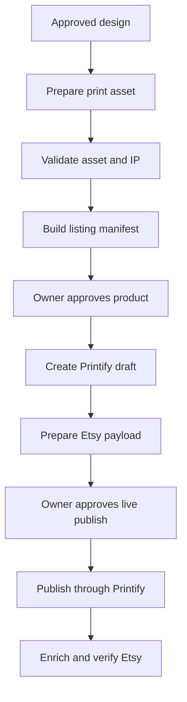

> **Reference provenance:** The original supplied document follows unchanged.
> Instructions, sample configurations, completed-design claims, and commands below
> are source material. Follow the [current direction](../2026-09-02-home-from-working-pod-design.md)
> for scope. This copy grants no artwork, product, or publication approval.

# HomeFromWorking POD Listing Automation

## Codex implementation handoff

Version: 1.0  
Date: 2026-09-02  
Owner/shop: HomeFromWorking  
Primary channels: Printify and Etsy

---

## 1. Assignment

Build a repeatable workflow that takes an **approved shirt design** and turns it into a complete Printify product and an Etsy-ready listing with minimal additional work from the owner.

The owner remains responsible for the creative decision: choosing the main idea and approving the final artwork. Once the artwork is approved, Codex should automate file preparation, product configuration, SEO copy, pricing recommendations, mockup selection, compliance fields, Printify product creation, and Etsy listing creation or updating.

The safe default is to create a Printify draft and an Etsy payload preview. Publishing through Printify may create an active Etsy listing, so no Printify publish/sync call may occur without one final explicit approval. If the live integration is proven to support a linked-but-inactive Etsy draft, Codex may use it, but it must not assume that capability.

Do not treat this document as proof that the existing repository uses any particular framework, endpoint wrapper, database, or command structure. Inspect the repository first and adapt this workflow to the code that already exists.

---

## 2. Desired owner experience

The ideal interaction is:

1. The owner provides a shirt idea and iterates on the design.
2. The owner marks one design file as approved.
3. Codex asks only for material decisions that are still missing, such as product profile, shirt colors, target margin, or whether the listing should remain a draft.
4. Codex prepares and validates the production asset.
5. Codex generates the product title, description, tags, price table, variant selection, mockup selection, production-partner information, and Etsy compliance fields.
6. Codex shows a concise preflight report.
7. The owner approves or requests changes.
8. Codex creates or updates the Printify draft and prepares the exact Etsy changes.
9. The owner gives a separate explicit approval before Codex calls Printify’s publish/sync operation. Codex then enriches and verifies the resulting Etsy listing.

The owner should not have to manually copy fields between ChatGPT, Printify, and Etsy.

---

## 3. Non-negotiable workflow rules

### 3.1 Human approval gates

Codex must stop at these gates:

| Gate | Human decision | Automation allowed before approval |
| --- | --- | --- |
| Design approval | Is this the final artwork? | Generate variants and validate candidate assets |
| Product approval | Are the garment, colors, variants, placement, copy, and prices acceptable? | Create a local/durable manifest and preview report |
| Live-publish approval | Should Codex call Printify publish/sync, which may make the Etsy listing searchable and purchasable? | Create/update Printify draft and prepare the Etsy payload preview |

No phrase such as “looks good” from an earlier design conversation should be interpreted as authorization to publish a live listing. Require a specific publish confirmation tied to the product manifest or revision hash.

### 3.2 Printify is the fulfillment source of truth

When the Printify shop is already connected to Etsy:

1. Create the product as a Printify draft.
2. Complete preflight and obtain explicit live-publish approval.
3. Publish/sync it from Printify to the connected Etsy channel.
4. Capture the external Etsy listing ID returned by Printify or discovered through the publish status/webhook.
5. Use the Etsy API to enrich or correct the resulting Etsy listing.

Do **not** independently create the same listing in Etsy and Printify. That can produce duplicate listings or an Etsy listing that is not connected to Printify fulfillment.

If the repository intentionally uses a custom Printify API shop rather than a connected Etsy sales channel, Codex must detect that and produce an integration-specific plan before creating anything.

### 3.3 Draft-first behavior

- Default pre-approval state: Printify draft plus Etsy payload preview.
- Use an actual linked Etsy draft only after verifying that the connected-channel integration supports it without briefly making the listing public.
- Default personalization: disabled.
- Default visibility: all approved in-stock variants visible.
- Never silently substitute a different print provider, blueprint, garment, or fulfillment location.
- Never silently enable free shipping, international sales, off-site ad assumptions, or personalization.

### 3.4 Idempotency

Every run needs a stable `project_slug` and a content hash. Re-running a stage should update the existing draft or return “no change,” not create another product.

Store at least:

- local project ID
- approved artwork SHA-256
- manifest revision
- Printify shop ID
- Printify product ID
- Etsy shop ID
- Etsy listing ID
- current workflow state
- timestamps and last successful stage

---

## 4. Initial repository audit

Before implementing the pipeline, Codex should inspect the existing repository and report:

1. Language, framework, package manager, and test runner.
2. Existing Printify and Etsy clients, wrappers, types, retry logic, and authentication flow.
3. Existing environment-variable names and secret-management approach.
4. Whether the Printify shop is a connected Etsy shop or a custom API shop.
5. How shop IDs, product IDs, listing IDs, shipping profiles, and production-partner IDs are currently stored.
6. Existing database/storage model, job queue, CLI, and user interface.
7. Available image tooling for alpha inspection, resizing, color-profile conversion, trimming, and metadata extraction.
8. Test coverage around external writes.

Reuse existing API clients and conventions. Do not introduce a second client library unless the current one cannot support a required operation.

Never print access tokens, refresh tokens, API keys, or complete authorization headers in logs, fixtures, test snapshots, or error messages.

---

## 5. Pipeline state machine



Recommended machine-readable states:

```text
IDEA
DESIGN_CANDIDATE
DESIGN_APPROVED
ASSET_VALIDATED
MANIFEST_READY
PRODUCT_APPROVED
PRINTIFY_CREATED
LIVE_APPROVED
PRINTIFY_PUBLISHING
ETSY_LISTING_CREATED
ETSY_LISTING_ENRICHED
LIVE
FAILED_RETRYABLE
BLOCKED_HUMAN_REVIEW
```

Every mutation should record the state before and after the operation.

---

## 6. Canonical input: listing manifest

Create one manifest per product. YAML is convenient for human review; JSON or a typed database record is also acceptable.

Example:

```yaml
schema_version: 1
project_slug: shrimp-fried-this-rice-gildan-5000
shop_name: HomeFromWorking

design:
  approved_asset: assets/shrimp-fried-this-rice/master.png
  asset_sha256: GENERATED_BY_PIPELINE
  ai_assisted: true
  text_exact:
    - "YOU’RE TELLING ME"
    - "SHRIMP FRIED THIS RICE?"
  background: transparent
  placement: front
  visual_style: photorealistic food image with clean typography

product_profile: gildan_5000_heavy_cotton

variants:
  colors: [REQUIRES_OWNER_OR_PROFILE_DEFAULT]
  sizes: [S, M, L, XL, 2XL, 3XL]
  hide_out_of_stock: true

placement:
  anchor: center
  target_width_ratio: 0.78
  target_height_ratio: null
  x: 0.5
  y: 0.5
  rotation_degrees: 0

listing:
  locale: en-US
  currency: USD
  personalization: false
  publish_mode: printify_draft_until_live_approval
  free_shipping: false
  ai_disclosure_required: true

pricing:
  target_margin: 0.35
  minimum_profit_usd: 8.00
  rounding: end_in_99
  offsite_ads_scenario: calculate_but_do_not_assume

approvals:
  design_approved_at: null
  design_approved_by: null
  product_approved_at: null
  product_approved_by: null
  live_approved_at: null
  live_approved_by: null

external_ids:
  printify_product_id: null
  etsy_listing_id: null
```

Do not accept arbitrary user-facing text directly as API payloads. Normalize it into this manifest, validate it, and show the normalized values in preflight.

---

## 7. Product profiles

Product IDs and provider IDs can change or become unavailable. Store chosen IDs in configuration, but verify them against the live Printify catalog before each product creation.

### 7.1 Gildan 5000 Heavy Cotton profile

This profile was used for the photographic Earth shirt and the shrimp fried rice shirt.

Known product copy supplied during the design process:

- Product: Gildan 5000
- Fit: classic unisex fit; not oversized and not boxy
- Fabric: medium weight, 180 g/m²
- Solid colors: 100% cotton
- Tubular knit/no side seams
- Ribbed collar
- Shoulder tape
- Tear-away label
- OEKO-TEX certified
- Ethically sourced US cotton
- Printing: detailed DTG/DTF support, depending on provider/print area
- Care: machine wash cold, maximum 30°C/90°F; non-chlorine bleach as needed; tumble dry low; do not iron; do not dry clean
- Printify-provided safety copy previously shown: for adults; made in Nicaragua; two-year EU/Northern Ireland warranty language

Do not claim that every color is 100% cotton. Query the selected variants and use exact fiber content when available, or say that fiber content varies by color.

### 7.2 Oversized boxy tee profile

This was the initial product considered for the solar-system design. It is a separate garment and provider profile. Do not reuse Gildan 5000 fit claims or product specifications for it.

The profile must contain:

- Printify blueprint ID
- print provider ID
- allowed colors and sizes
- print areas and decoration methods
- cost by variant
- shipping profiles/rates
- garment-specific title fragment
- garment-specific description/specification template

If the exact prior oversized product/provider cannot be identified from repository history or Printify, block and ask the owner to select it once. Save the selection for future runs.

---

## 8. Artwork preparation and validation

### 8.1 Required production asset

Produce a print-ready PNG unless the selected provider explicitly supports and prefers another format.

Requirements:

- true transparent alpha background when the design does not contain a background
- no checkerboard pattern baked into RGB pixels
- tightly cropped to visible content, with a small configurable safety margin
- sRGB color space
- no accidental semi-transparent halo around the design
- no hidden mockup, shirt, wall, shadow, or background layer
- no upscaling beyond the configured quality threshold without warning
- dimensions sufficient for the selected Printify print area
- correct orientation and aspect ratio
- exact approved wording, punctuation, capitalization, and line breaks

The Printify catalog exposes placeholder dimensions and decoration methods by blueprint/provider/variant. Use the live placeholder dimensions rather than assuming every shirt has the same canvas.

### 8.2 Transparency validation

The earlier workflow exposed a common failure: a visible gray-and-white checkerboard imported as part of the design. Codex must distinguish a real alpha channel from an image of a checkerboard.

Automated checks should include:

1. PNG has an alpha channel.
2. At least one meaningful region has alpha `0` when transparency is requested.
3. Border pixels are mostly transparent.
4. RGB pixels in transparent areas do not form a repeated checkerboard grid.
5. A composite preview on white, black, and mid-gray backgrounds shows only the intended design.

Generate these three composite previews for preflight; do not upload them as print assets.

### 8.3 Line-art validation

For minimal line drawings:

- intended black strokes should be fully opaque
- no planet rings, Jupiter bands, orbital lines, or text strokes may fade toward an endpoint
- detect unexpectedly low alpha within connected black-line components
- warn about components or gaps below a configurable printable-feature threshold
- compare rendered previews at actual intended print size

The solar-system design specifically required the Jupiter lines to remain solid and not fade.

### 8.4 Photographic-art validation

For Earth and food photographs:

- preserve appetizing/natural color and local contrast
- check for clipping, halos, malformed objects, duplicated food pieces, or illegible typography
- make sure the primary subject remains readable at Etsy thumbnail size
- ensure dark text has enough contrast on every selected shirt color
- if one asset cannot work on both light and dark garments, create explicit light-shirt and dark-shirt artwork variants rather than adding an unintended box behind the art

### 8.5 Text validation

Use OCR plus an exact string comparison. OCR is a warning mechanism, not the sole authority. The source manifest remains authoritative.

Block the pipeline for:

- missing words
- changed punctuation
- misspellings
- unwanted extra articles or words
- wrong line break when line break is part of the approved design

---

## 9. Intellectual-property and policy preflight

Before product creation:

1. Search for exact and confusingly similar trademarks, especially in apparel-related classes.
2. Check that the design contains no third-party logos, characters, celebrity likenesses, copied illustrations, watermarks, or recognizable branded packaging.
3. Record the search terms, sources, date, and outcome.
4. Assign `low`, `review`, or `block` risk.
5. Require human review for anything ambiguous.

Automated searching is not legal clearance and should not be represented as such.

For AI-assisted art, preserve the owner’s original prompt/brief, generated asset provenance, edits, and approval history. Etsy allows seller-prompted AI creations but requires disclosure in the listing description. Use a plain disclosure such as:

> Artwork for this design was created with the assistance of an AI image-generation tool and arranged into the finished shirt design by HomeFromWorking.

Reference: https://www.etsy.com/legal/creativity/

---

## 10. SEO generation rules

Generate title, description, and tags only after the final product profile and artwork are known.

### 10.1 Title

- Etsy hard limit: 140 characters.
- Aim for fewer than 15 readable words when practical.
- Put the literal product/search phrase near the beginning.
- Clearly say what the product is.
- Avoid repetitive keyword chains.
- Avoid unverifiable superlatives such as “best” or “perfect.”
- Do not include price or shipping claims.
- Mention recipient/occasion only when materially relevant.
- Do not call the Gildan 5000 oversized.

### 10.2 Tags

- Generate exactly 13 useful tags unless fewer are genuinely relevant.
- Maximum 20 characters per tag.
- Use buyer-language phrases, not a list of isolated adjectives.
- Use diverse intents: subject, joke/phrase, product, audience, occupation, gifting, and style.
- Do not waste tags repeating attributes already represented well in Etsy category/attribute fields unless testing data supports it.
- Validate allowed characters before calling Etsy.

### 10.3 Description structure

1. First two sentences: exact design concept and primary keyword in natural language.
2. Who it is for and why it is funny/interesting.
3. Garment-specific product features.
4. Fit and sizing warning.
5. Care instructions.
6. Made-to-order/production-partner explanation.
7. AI disclosure when applicable.
8. Optional color/placement variation note.

Never copy specifications from one garment profile to another.

Current Etsy guidance references:

- Listings: https://help.etsy.com/hc/en-us/articles/115015628707-How-to-Create-a-Listing
- Tags: https://help.etsy.com/hc/en-us/articles/360000336307-How-to-Use-Tags-to-Get-Found-in-Search

---

## 11. Pricing engine

Do not hard-code one retail price for all future products.

For each enabled variant, retrieve or calculate:

- base production cost
- print-area/additional print cost
- buyer shipping cost
- seller-paid shipping subsidy, if any
- Etsy listing fee
- Etsy transaction fee
- Etsy payment-processing fee based on shop country
- regulatory operating fee where applicable
- optional off-site advertising fee scenario
- desired minimum profit
- desired target margin

Produce at least two profit scenarios:

1. standard Etsy sale
2. sale attributed to off-site ads

Use configuration for fee rates because Etsy and Printify pricing can change. Label estimates clearly. Round recommended retail prices using the configured strategy, normally to `.99`.

If a proposed free-shipping price is above a recent category benchmark, show both buyer-paid-shipping and free-shipping options rather than automatically choosing one.

If size-dependent production costs materially differ, use tiered prices. Keep the visible spread understandable and avoid needless per-size micro-pricing.

---

## 12. Mockup selection

Select mockups after the design is rendered on the final garment colors.

Preferred listing-image order:

1. clean, straight-on front mockup with the full design readable at thumbnail size
2. worn/person front mockup
3. close-up of print detail
4. alternate garment color
5. back view only if it prevents confusion or the back is intentionally blank
6. size chart
7. color chart
8. fit/product-details graphic
9. production/shipping information graphic, if useful

Rules:

- do not select near-duplicate mockups merely to fill slots
- do not use a close-up as the first image if it hides the overall shirt
- ensure the design is not obstructed by folds, hair, hands, or cropping
- make the first image’s design readable on a small mobile thumbnail
- use actual Printify renders for the selected blueprint/provider/variant
- do not represent one garment with a mockup of another garment

If the Printify API or existing wrapper does not expose the same mockup-camera selection available in the UI, generate a ranked candidate report and make mockup selection the one remaining UI step. Do not silently claim it was automated.

---

## 13. Production partner and “How it’s made” defaults

The owner creates the original concept/design. A print-on-demand partner prints the garment, packages it, and ships it to the buyer.

Reuse an existing Etsy production-partner record. Retrieve available production partners and store the selected partner ID in shop configuration. If no suitable partner exists and the API client cannot create one, stop for a one-time owner setup in Etsy rather than omitting disclosure.

Buyer-facing general description:

> A print-on-demand production partner prints my original designs on apparel, packages each made-to-order item, and ships it directly to the customer.

Private Etsy partnership answers:

| Question | Default answer |
| --- | --- |
| Why work with this partner? | I don’t have the technical ability or equipment to make it entirely by myself. |
| Owner’s role in design | I design everything myself. |
| Partner’s production role | They do everything for me. |

Etsy “How it’s made” defaults for these POD shirts:

| Field | Default |
| --- | --- |
| Who made it? | Another company or person |
| What is it? | A finished product |
| When was it made? | Made to order |
| Production classification | Designed by seller and produced by a production partner |
| UI production-method choice, if required | It’s an item that my shop alters/customizes |
| Tools | Computerized tools or machines; AI generator when AI-assisted |

Do not mark the physical shirt as personally handmade by the owner. Do not omit the production partner.

The production partner’s fulfillment location and the listing’s shipping origin must be accurate for the provider used. Do not guess one location for a globally routed product.

---

## 14. Printify integration sequence

Use the repository’s existing client. The current public API documentation describes these relevant resources:

- retrieve shops
- retrieve blueprints
- retrieve providers for a blueprint
- retrieve provider variants and printable placeholders
- retrieve shipping information
- upload an image
- create a product
- update a product
- publish a product to a connected sales channel
- inspect products and publishing state

Reference: https://developers.printify.com/

Expected high-level sequence:

1. Resolve configured Printify shop.
2. Verify its sales channel and expected Etsy connection.
3. Resolve and verify blueprint/provider profile.
4. Fetch current variants, costs, print areas, decoration methods, availability, and shipping.
5. Validate selected color/size variants.
6. Prepare print file for the live placeholder dimensions.
7. Upload the approved print asset and retain the returned upload ID.
8. Create or update the Printify product with title, description, blueprint, provider, variants, print-area placement, image ID, tags, and prices.
9. Wait for product/mockup processing to finish.
10. Retrieve and rank generated mockups.
11. Present preflight or update product with owner-approved mockups where supported.
12. After explicit live-publish approval, publish/sync the requested fields to the connected Etsy channel.
13. Capture the external Etsy listing ID and URL, then immediately run Etsy enrichment and verification.

The Printify documentation currently lists:

- `POST /v1/uploads/images.json`
- `POST /v1/shops/{shop_id}/products.json`
- `PUT /v1/shops/{shop_id}/products/{product_id}.json`
- `POST /v1/shops/{shop_id}/products/{product_id}/publish.json`

The publish request can select fields including title, description, images, variants, tags, key features, and shipping template. Verify the live documentation and the existing client before coding against endpoint details.

Respect Printify rate limits, use bounded exponential backoff with jitter for retryable responses, and never retry validation failures blindly.

---

## 15. Etsy integration sequence

When Printify creates the Etsy listing through its connected channel after live approval:

1. Resolve the Etsy listing ID from Printify’s external mapping, webhook, or a deterministic lookup.
2. Retrieve the Etsy listing and confirm its title/design/product identity before editing.
3. Update fields that Printify did not set correctly or cannot set:
   - title and description, if necessary
   - 13 tags
   - taxonomy/category
   - attributes
   - production-partner IDs
   - who/when made fields
   - processing/readiness profile
   - shipping profile
   - return policy where applicable
   - GPSR/product-safety data where applicable
   - inventory/variant visibility and pricing
4. Upload supplemental listing images such as size/color charts if approved.
5. Retrieve the listing again and compare it with the manifest.
6. Confirm the final intended state. The Printify publish operation may have created an active listing.
7. Verify that an approved active listing is visible and purchasable with the correct variants. If enrichment fails after the listing becomes active, deactivate it when safely supported and flag immediate human review.

If the current connected-channel implementation demonstrably supports creation of a linked Etsy draft without any public interval, Codex may create and enrich that draft before live approval. Treat this as a detected capability, not a default assumption.

If the architecture requires direct Etsy draft creation, Etsy’s current listing tutorial describes a draft listing body containing at least quantity, title, description, price, `who_made`, `when_made`, and `taxonomy_id`; physical listings also need shipping/readiness configuration, and an active listing needs at least one image. Use this route only when it does not break Printify fulfillment linkage.

References:

- https://developers.etsy.com/documentation/tutorials/listings/
- https://developers.etsy.com/documentation/reference/

---

## 16. Three completed design briefs

These are examples for tests, fixtures, and prompt behavior. They are not authorization to republish duplicate listings.

### 16.1 Minimal solar system — “It’s Nice Being Third”

```yaml
project_slug: nice-being-third-solar-system
concept: minimalist single-row solar-system line art above the phrase
text_exact:
  - "IT’S NICE BEING THIRD"
earth_treatment: implied by its position as the third planet
explicitly_avoid:
  - thick or dark outline around Earth
  - arrow pointing to Earth
  - separate highlight around Earth
  - fading lines
  - fading Jupiter bands
style:
  palette: black line art on transparent background
  layout: centered, compact, horizontal
  stroke: consistent and fully opaque
product_profile: oversized_boxy_tee_or_owner_selected_profile
```

Acceptance details:

- Earth is not called out; the joke works because its third position is implied.
- All planetary strokes remain solid.
- Jupiter’s horizontal bands must not fade.
- Output is a true transparent PNG, not a checkerboard image.

### 16.2 Photographic Earth — “It’s Nice Being Third”

```yaml
project_slug: nice-being-third-photographic-earth
concept: large classic photographic Earth centered above the phrase
text_exact:
  - "IT’S NICE BEING THIRD"
style:
  earth: recognizable, detailed, vivid blue oceans and natural clouds
  typography: clean, bold, readable
  background: transparent
  layout: large globe above centered text
product_profile: gildan_5000_heavy_cotton
```

Acceptance details:

- Earth is the unmistakable primary image.
- Globe edge is clean without a rectangular background.
- Fine cloud detail remains printable.
- Text remains readable on selected garment colors.
- Product copy must say classic fit, not oversized.

### 16.3 Photographic shrimp fried rice joke

```yaml
project_slug: shrimp-fried-this-rice
concept: delicious photographic bowl of shrimp fried rice above a two-line joke
text_exact:
  - "YOU’RE TELLING ME"
  - "SHRIMP FRIED THIS RICE?"
style:
  food: appetizing, photographic, abundant visible shrimp, fried rice, vegetables
  typography: bold, clean, highly readable
  background: transparent
  layout: large bowl above two centered text lines
product_profile: gildan_5000_heavy_cotton
```

Acceptance details:

- Use “fried,” never “friend.”
- Do not insert the word “a” unless the owner approves a text revision.
- Bowl should look appetizing rather than illustrated or plastic.
- Food should remain distinct on the garment color.
- Exact approved two-line wording must pass OCR/manual verification.

Recommended title seed:

> Shrimp Fried This Rice Shirt, Funny Food Pun Tee, Foodie Gift, Unisex Cotton T-Shirt

Recommended tag seed, subject to live SEO review and validation:

```text
shrimp fried rice
shrimp pun shirt
funny food shirt
funny foodie tee
food pun tee
shrimp lover gift
rice lover gift
takeout humor tee
chef humor shirt
cooking joke tee
meme graphic tee
dad joke tshirt
restaurant humor
```

---

## 17. Suggested code organization

Adapt naming to the repository, but keep responsibilities separated.

```text
pod/
  domain/
    listing-manifest.ts
    product-profile.ts
    workflow-state.ts
  assets/
    prepare-print-asset.ts
    validate-alpha.ts
    validate-text.ts
    render-previews.ts
  seo/
    generate-title.ts
    generate-description.ts
    generate-tags.ts
    validate-etsy-copy.ts
  pricing/
    calculate-variant-prices.ts
    etsy-fees.ts
  integrations/
    printify-adapter.ts
    etsy-adapter.ts
  workflow/
    preflight.ts
    create-printify-draft.ts
    prepare-etsy-payload.ts
    enrich-etsy-listing.ts
    publish-live.ts
  profiles/
    gildan-5000-heavy-cotton.ts
    oversized-boxy-tee.ts
  cli/
    pod-new.ts
    pod-preflight.ts
    pod-create-printify-draft.ts
    pod-publish-live.ts
```

Suggested adapter contracts:

```ts
interface PrintifyAdapter {
  getShop(shopId: string): Promise<PrintifyShop>;
  resolveProductProfile(profile: ProductProfileRef): Promise<ResolvedProductProfile>;
  uploadArtwork(asset: PreparedAsset): Promise<PrintifyUpload>;
  upsertProduct(input: PrintifyProductInput, idempotencyKey: string): Promise<PrintifyProduct>;
  waitForMockups(productId: string): Promise<PrintifyMockup[]>;
  publishToConnectedChannel(productId: string, fields: PublishFields): Promise<PublishJob>;
  resolveExternalListing(productId: string): Promise<ExternalListingRef>;
}

interface EtsyAdapter {
  getListing(listingId: string): Promise<EtsyListing>;
  updateListing(listingId: string, patch: EtsyListingPatch): Promise<EtsyListing>;
  updateInventory(listingId: string, inventory: EtsyInventoryInput): Promise<void>;
  uploadListingImage(listingId: string, image: ListingImageInput): Promise<EtsyImage>;
  listProductionPartners(shopId: string): Promise<ProductionPartner[]>;
  activateListing(listingId: string): Promise<EtsyListing>;
}
```

Use the real types supported by the repository and APIs. These contracts describe responsibilities, not exact wire schemas.

---

## 18. Commands and operator flow

Exact command syntax can follow the repository’s conventions. A useful CLI would support:

```bash
pnpm pod:new briefs/shrimp-fried-this-rice.yaml
pnpm pod:preflight shrimp-fried-this-rice
pnpm pod:approve-product shrimp-fried-this-rice --revision <hash>
pnpm pod:create-printify-draft shrimp-fried-this-rice --revision <hash>
pnpm pod:verify shrimp-fried-this-rice
pnpm pod:publish-live shrimp-fried-this-rice --revision <hash>
```

`pod:preflight` should make no external writes. `pod:create-printify-draft` may create or update only the Printify draft after product approval. `pod:publish-live` is the only command allowed to call Printify publish/sync and potentially make the Etsy listing live.

Every command should support `--dry-run`. The dry run should show redacted outbound payloads and a field-by-field diff without printing secrets.

---

## 19. Preflight report

Before any external write, generate a report containing:

- product/design name and manifest revision
- artwork thumbnail on light and dark backgrounds
- image dimensions, color profile, alpha status, crop bounds, and quality warnings
- exact OCR text versus manifest text
- selected Printify blueprint/provider and live availability
- selected variants and colors
- placement preview and print-area utilization
- title character/word count
- all tags with character counts
- full description
- production-partner and Etsy “How it’s made” values
- AI disclosure status
- IP/policy risk result
- price, estimated fees, shipping, profit, and margin per variant
- chosen and rejected mockups with reason
- intended external mutations
- unresolved blockers

The report should end with one of:

- `READY_FOR_PRODUCT_APPROVAL`
- `BLOCKED_HUMAN_REVIEW`
- `INVALID`

---

## 20. Verification after API writes

Do not treat a successful HTTP response as completion. Read both products back and compare them with the approved manifest.

Verify:

- one Printify product exists for the idempotency key
- one linked Etsy listing exists
- Printify product and Etsy listing IDs are cross-recorded
- correct provider, blueprint, decoration method, and print placement
- artwork hash/upload mapping
- title, description, tags, taxonomy, attributes, and production partner
- variant SKUs, colors, sizes, availability, prices, and quantities
- shipping/readiness/processing settings
- mockup ordering
- no Printify publish/sync occurs before live approval
- active Etsy listing is visible after approved publication

If verification fails, do not create a second listing. Mark the run `FAILED_RETRYABLE` or `BLOCKED_HUMAN_REVIEW` and retain the external IDs.

---

## 21. Tests and acceptance criteria

### Unit tests

- title limit and target word count
- exactly 13 unique tags, each at most 20 characters
- description uses the correct garment profile
- classic-fit Gildan copy never contains “oversized” unless it is explicit sizing advice
- pricing calculations and rounding
- alpha/checkerboard detection
- tight-crop calculation
- exact text/line-break validation
- idempotency-key generation
- API error classification and retry behavior

### Integration tests with mocked APIs

- connected Printify-to-Etsy publish flow
- existing draft update rather than duplicate creation
- publish polling/webhook completion
- Etsy enrichment and read-back verification immediately after Printify publication
- expired OAuth token refresh
- rate-limit retry
- partial failure after Printify creation but before Etsy enrichment
- production-partner missing block
- out-of-stock variant change

### End-to-end sandbox/dry-run acceptance

The pipeline is ready when it can take the three briefs in this document and produce:

1. valid print assets and composite previews
2. complete manifests
3. garment-correct SEO copy
4. validated tags
5. per-variant pricing estimates
6. ranked mockups
7. redacted Printify/Etsy payload previews
8. no external write during dry run
9. no duplicate product during a repeated draft run
10. no Printify publish/sync—and therefore no potentially live Etsy listing—without a revision-specific approval

---

## 22. Known one-time configuration decisions

Codex should resolve these from the repository/accounts when possible and ask the owner only when needed:

- Printify shop ID connected to HomeFromWorking Etsy
- Etsy shop ID
- Printify blueprint/provider ID for Gildan 5000
- exact oversized boxy tee blueprint/provider ID
- preferred shirt colors for each product profile
- default sizes to enable
- Etsy taxonomy ID and apparel attributes
- shipping profile and readiness/processing profile IDs
- Etsy return policy ID
- existing Etsy production-partner ID
- whether the production partner’s name is shown publicly
- target profit/margin and free-shipping strategy
- off-site ads enrollment/rate scenario
- default mockup preferences
- allowed sales regions and GPSR readiness

These belong in shop configuration, not scattered throughout prompts or source code.

---

## 23. Recommended first implementation milestone

Implement a pre-publication vertical slice for the Gildan 5000 profile:

1. accept an approved transparent PNG and YAML manifest
2. validate the asset and exact text
3. resolve live Gildan/provider variants
4. generate SEO copy and pricing
5. output preflight report
6. require product approval
7. create/update a Printify draft
8. prepare and validate the Etsy payload without publishing
9. stop before Printify-to-Etsy publication
10. in a separately approved live test, publish through Printify, then enrich and verify Etsy

Use the shrimp fried rice shirt as the first fixture because it exercises photographic artwork, transparency, two-line text, AI disclosure, Gildan 5000 specifications, SEO tags, and production-partner handling.

After the vertical slice is stable, add the minimal solar-system fixture to exercise line-opacity and fine-detail validation, then add the photographic Earth fixture to exercise dark/light garment contrast.

---

## 24. Definition of done

The project is complete when the owner can approve an artwork file, run one Codex workflow, review a single preflight package, receive a correct Printify draft, and then use one final explicit approval to trigger Printify-to-Etsy publication followed by automatic Etsy enrichment and verification.
