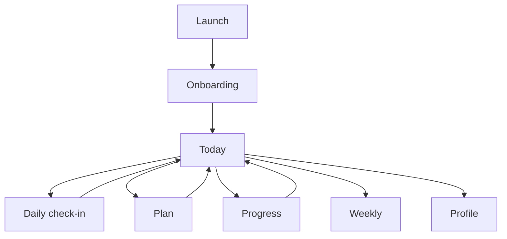

# Life Clock UX Audit

Date: 2026-04-30

Device and runtime:

- iPhone 17 simulator
- iOS 26.4
- `LifeClock` scheme
- simulator walkthrough plus code inspection

## Current Flow Map

## Biggest Friction Points

1. Onboarding framed the app like a game.
   Evidence: first-launch simulator copy included "healthspan game" and "earn time back."

2. Completed actions felt weak and disconnected.
   Evidence: completing a daily action only flipped a button state and added a ledger row; Today did not visibly celebrate or summarize the action.

3. The Health permission step felt broken in simulator.
   Evidence: onboarding showed a re-prompt state even on a fresh pass because the mock authorization path behaved as already requested.

4. Repeated disclaimer banners made core flows heavier than necessary.
   Evidence: Today, Plan, Progress, and Weekly all repeated the same caution card, reducing momentum after positive actions.

5. Naming did not teach a stable mental model.
   Evidence: user-facing surfaces mixed `Life Clock`, `clock moved`, `quests`, and `quick log`, which made the app feel more like a game than a grounded habit tracker.

## Recommended Flow

1. Onboarding teaches the product as a habit tracker and health-motivation tool.
2. Today shows current progress, one visible support moment, and a compact momentum summary.
3. Daily check-in remains the fastest primary action.
4. Plan provides a small set of supportive actions with honest "potential impact" language.
5. Progress acts as the history and proof surface.
6. Weekly stays more reflective and less transactional.

## Audit Notes For Next Pass

- Validate the revised onboarding in a fresh simulator state.
- Verify that action completion is still visible after relaunch.
- Check whether the new support moment card feels useful or too persistent.
- Expand accessibility identifiers if the next audit needs deeper profile and paywall coverage.
